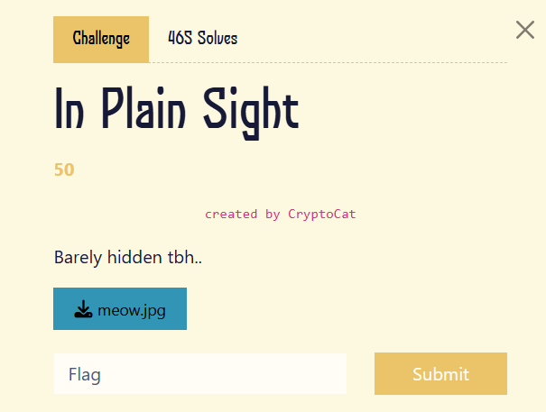
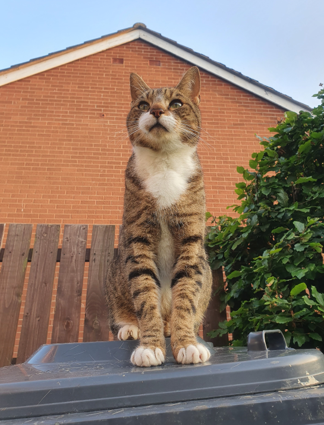
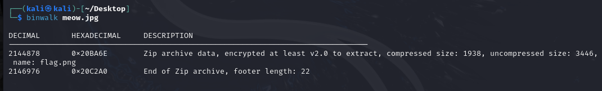
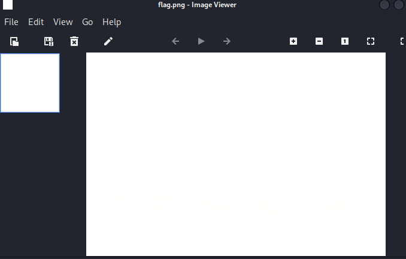
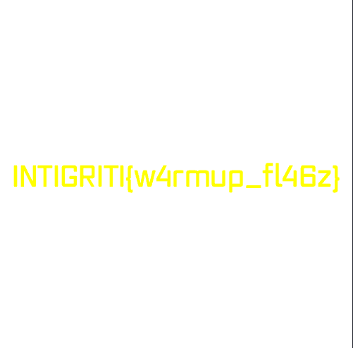

một bài làm nóng cơ thể, nhưng với mình thì là mới vì đây là lần đầu mình động tay với dạng này ngoài web và pwn

download về và dùng `binwalk` để xem có dữ liệu gì nhúng trong ko nhé ae

thấy có file flag.png và địa chỉ của nó ở dạng zip

mình dùng lệnh `binwalk -e meow.jpg` sẽ tạo ra được 1 file chứa zip nhúng, tuy nhiên cần pass để unzip. Cái này dùng burp upload lên để xem nội dung file nhé ae, mình làm rồi và tìm được pass là `YoullNeverGetThis719482`

được 1 file tên `flag.png` nhưng ko thấy gì ngoài trắng tinh =))

mình dùng tiếp lệnh `convert flag.png -auto-level output.png ` để điều chỉnh mức sáng và tương phản

và kết quả vỡ toác 

Doneee

