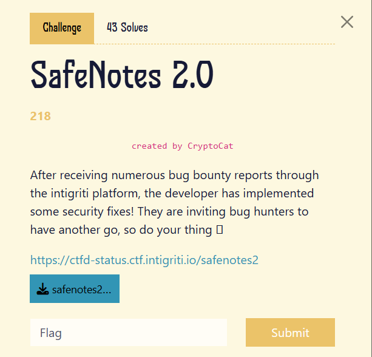

1 chall khá hay, mình sẽ viết theo cách hiểu của mình nhé
, có chỗ nào sai sót ae thông cảm và chỉ mình thêm

chall cho source, mình cũng đã dùng thử như người thường nhưng ko thấy gì đặc biêt, view source code nào

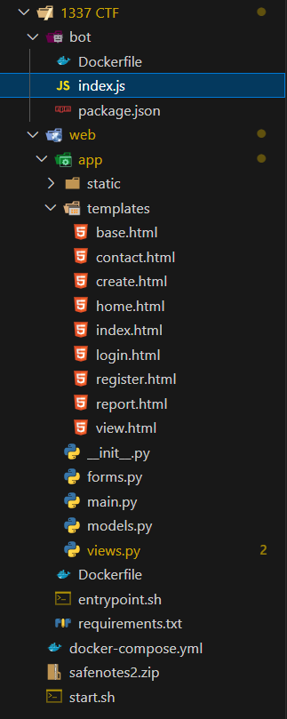


flag nằm ở cookie của admin/bot 
nó có chức năng report, có lẽ cái `/visit` cắm tới cái đó
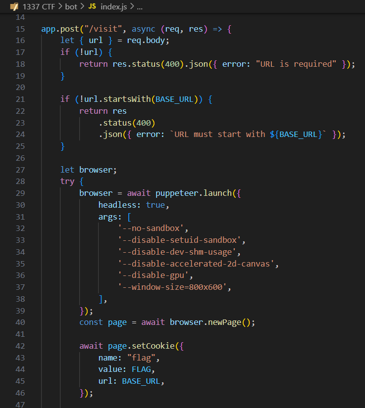


đây là route `/report` trong view.py
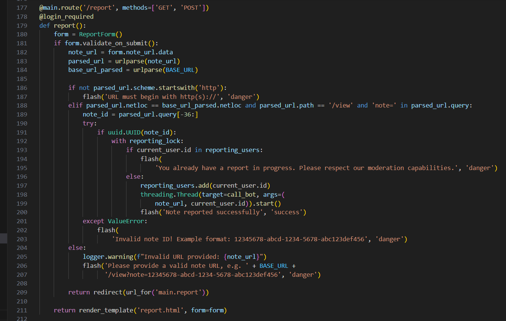

 chỗ này thì mình không thấy có gì nguy hiểm 
 
 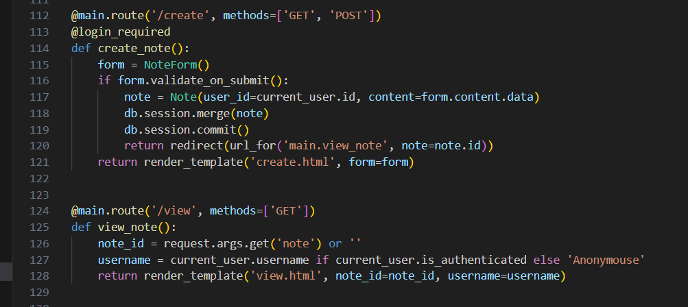

trong route `/create` và `/view`cũng vậy, ko có gì đâu ae

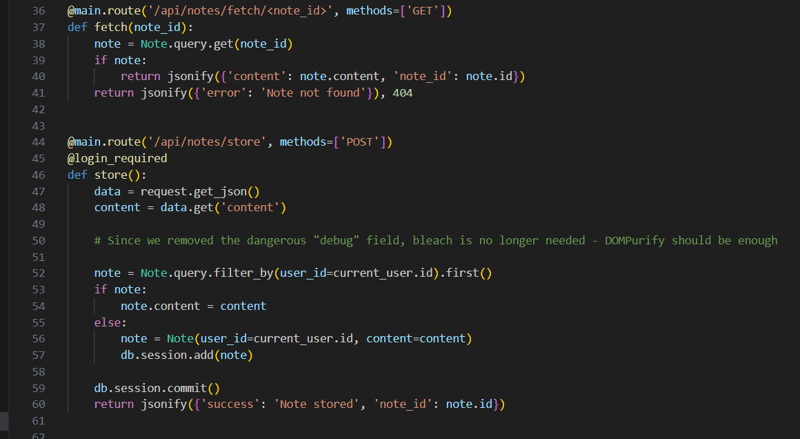
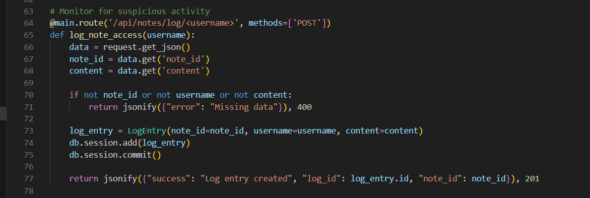

ở đây nó có gọi tới 3 API, mình cần tìm xem nó được gọi ở đâu trên FE

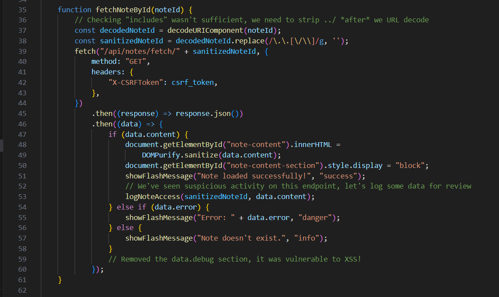

đây, tại đây nó gọi tới API `/api/notes/fetch/<note_id>` nhưng note_id đã được bằng cách replace `../`, cái này bypass dễ thôi vì nó ko đệ quy

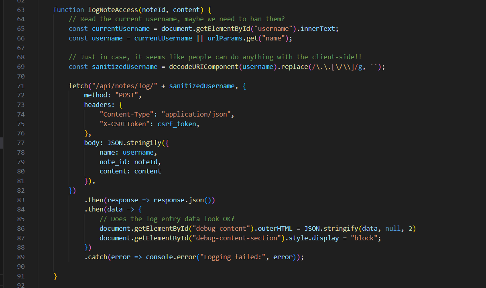

func này thì nó call tới api `/api/notes/log/<username>` với username được lấy từ id `username.innerText`, tức là lấy trong HTML trên FE

tiếp tục sử dụng replace `../`, bypass dễ dàng

mình chú ý đoạn JSON nó truyền vào tại dòng 77 đến 80, sau đó nó lại gán cho id `debug-content` và sử dụng ` outerHTML`, đây là 1 hàm có thể thay đổi DOM, nguy hiểm !!!


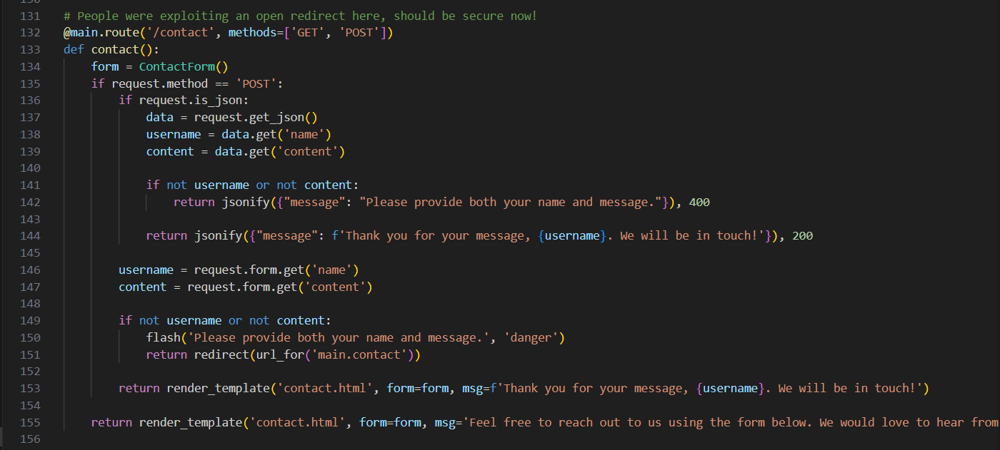

còn 1 route `/contact` này sẽ cần dùng tới nhé ae :v 


Tổng kết lại: Mình cần bypass replace `../` để thoát khỏi API, gọi tới view để inject param `name` vào và tìm cách thay thế id `username` trong DOM bằng param đó, sau đó XSS lấy cookie bot/admin

tiến hành tạo note
```
<div id="debug-content-section">
    <div id="debug-content"></div>
</div>

<div id="username"></div>
```
lấy note_id


OK, payload

```
https://safenotes2-2.ctf.intigriti.io/view?name=....//....//....//contact%23&note=ca5ec7d5-2d48-4c40-af34-b016636031fa
```

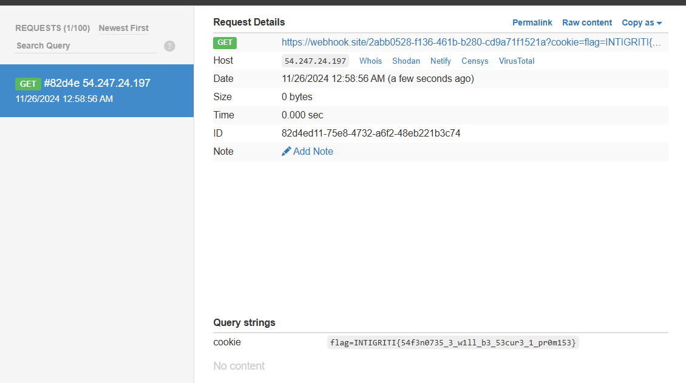

FLAG: `INTIGRITI{54f3n0735_3_w1ll_b3_53cur3_1_pr0m153}`
