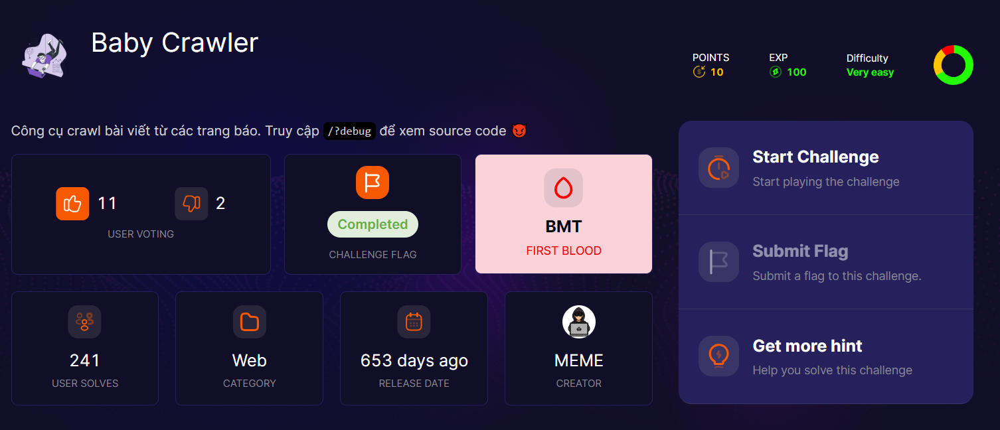
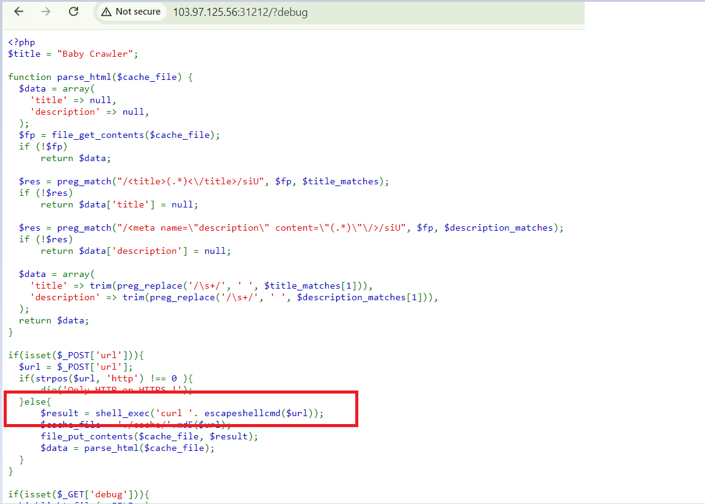
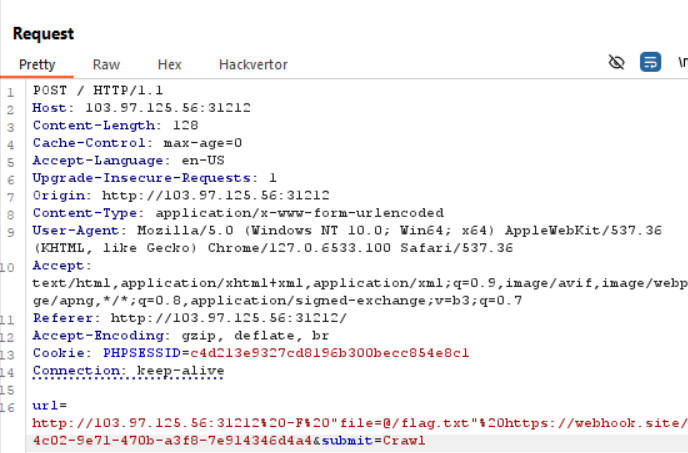
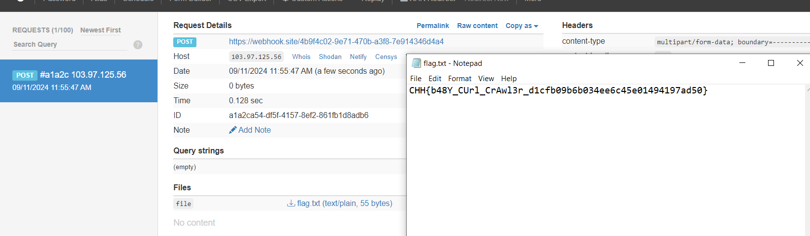

view source luôn nha ae

dùng shell_exec để curl là sai cmnr dev ơi =)), ae không cần để ý cái hàm `escapeashellcmd` lắm đâu

hướng exploit của ta ở đây là sẽ ra sao nếu chúng ta curl trực tiếp đến chính server này ?, chẳng phải là sẽ đọc được flag sao? `SSRF` chứ còn gì nữa!! . Nói là làm, chơi luôn nhé ae

down flag về

