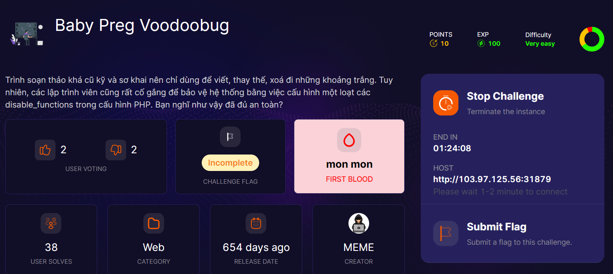
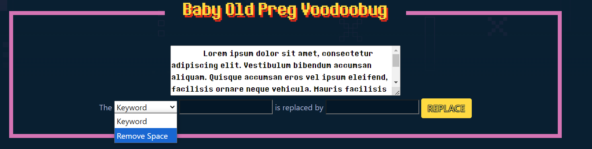
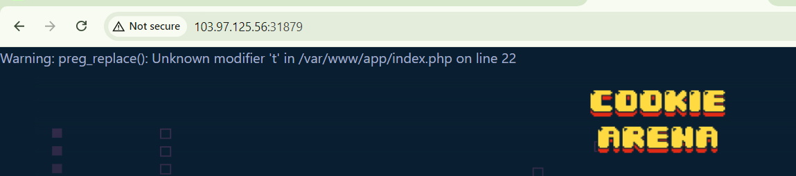
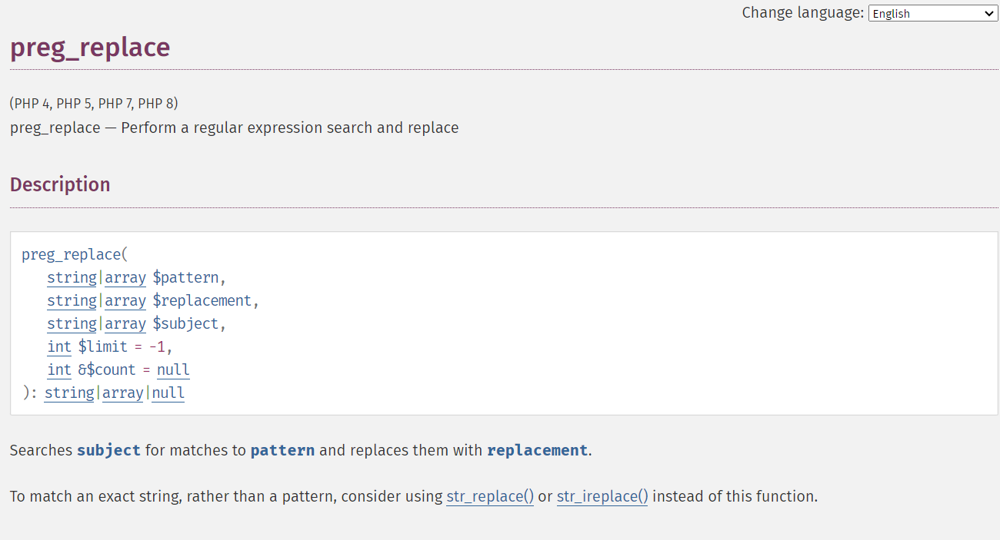
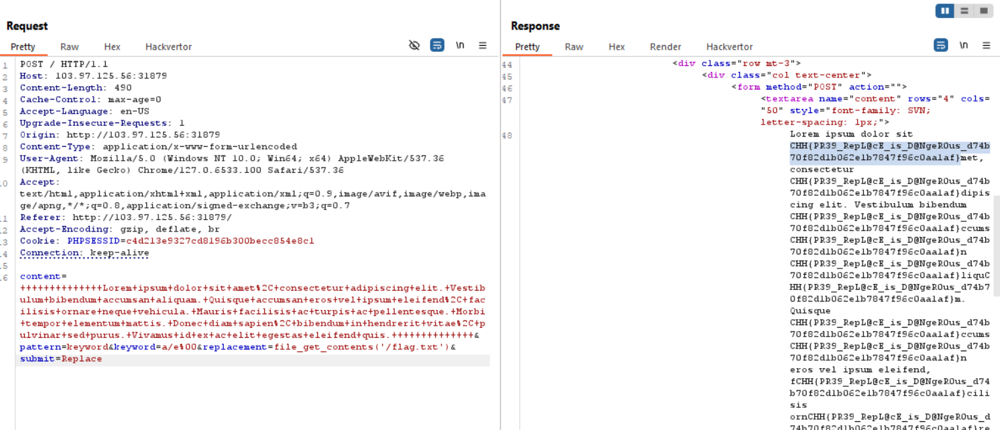

một chall blackbox mất khá nhiều thời gian của mình :) 

có 2 feature, 1 dùng để thay thế chứ, còn lại dùng để xóa khoảng trắng

mình truyền payload /t vào thì nhận được error, ngonn

bài này dùng preg_replace() để thay thế kí tự user nhập vào
. mng nhìn vào ảnh dưới mình lấy từ PHP sẽ hiểu preg_replace nó làm gì nhé

googl search mình tìm được exploit [này](https://bitquark.co.uk/blog/2013/07/23/the_unexpected_dangers_of_preg_replace)

rồi, exploit thôi

dùng file_get_contents vì system và shell_exec bị ban rồi ae nhé

