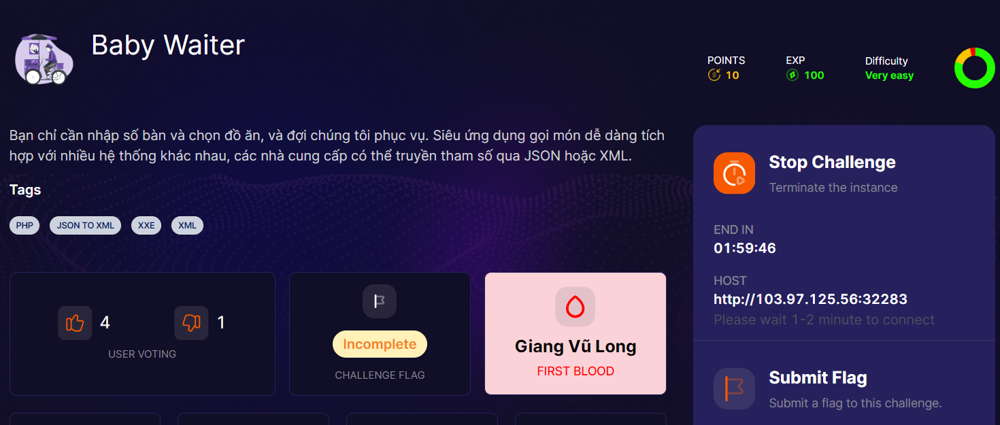
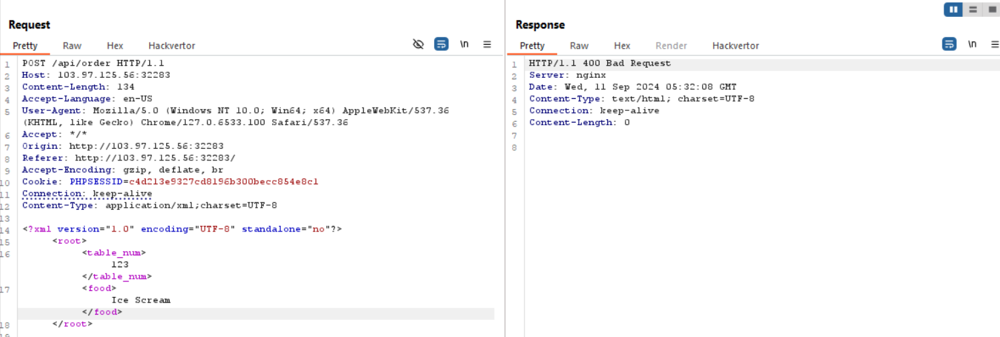
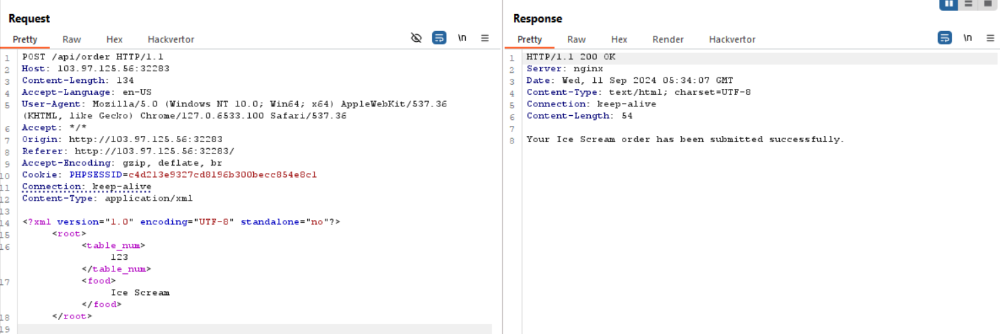
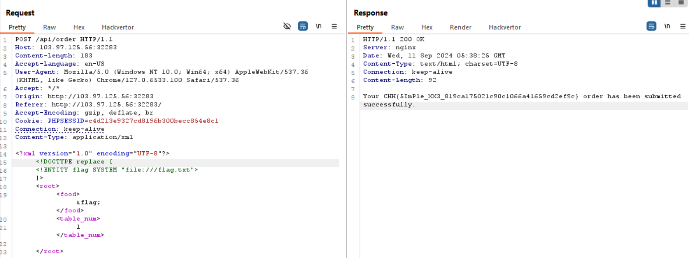

mình phải nói thật là nó xàm :))

sau khi chuyển qua xml thì nó return về status 400 như này đây. 

loay hoay 1 hồi mình thử xóa cái `Content-Type charset=UTF-8` đi thì lại được ? :)), không mã hóa thì đc à 

đến đây inject xxe để dọc file thôi

phải đổi thằng `food` lên trên vì `table_num` bị ẩn ?, mình khá cay chỗ này vì mất thời gian =))) 

