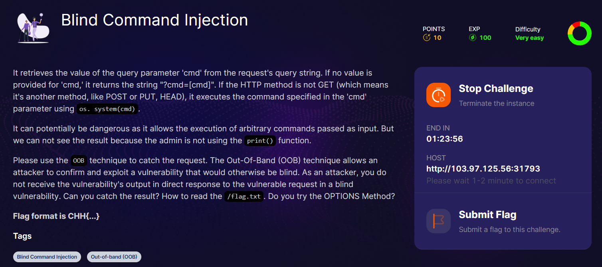
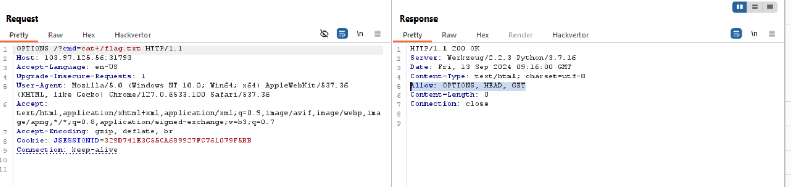
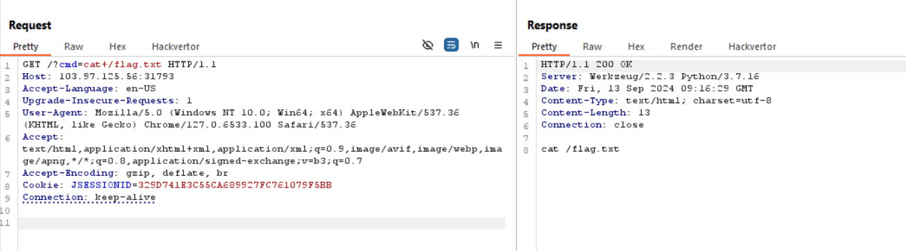
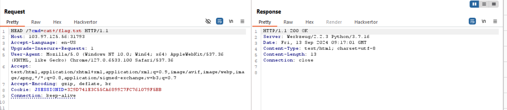
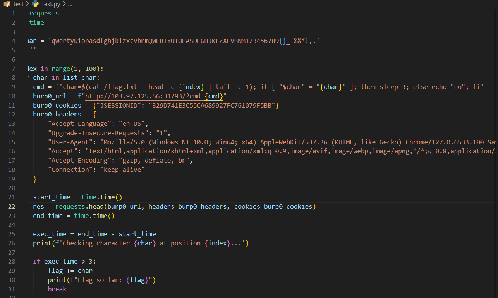
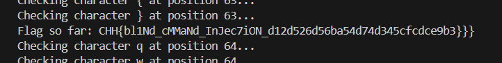

một bài khá tốt để luyện về blind OOB

dựa vào des thì mình thử change methods qua `OPTIONS` để xem có method nào được accept

có `HEAD, GET, OPTIONS`

nếu mình thử với `GET` thì

 nó sẽ trả về cmd
 
 còn khi dùng `HEAD`
 

nó return 200, chứng tỏ nó có accept, nhưng do flag không được nhảy vào hàm `print()` nên nó không in ra flag

tiến hành code python exploit, ae phải biết về `bin/bash, sh`

powww

