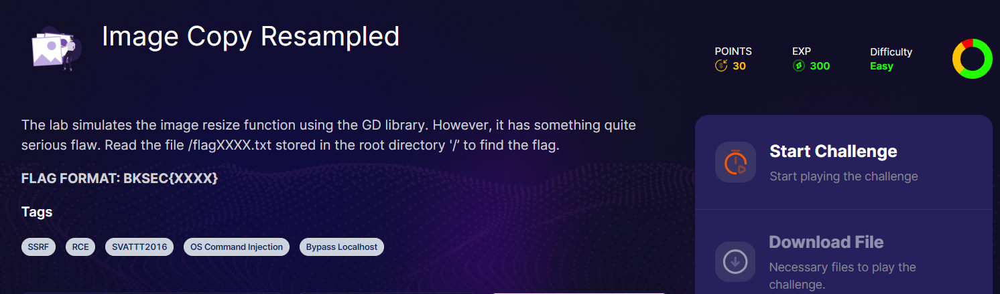
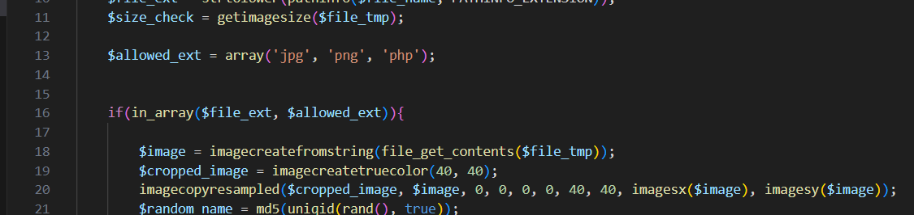
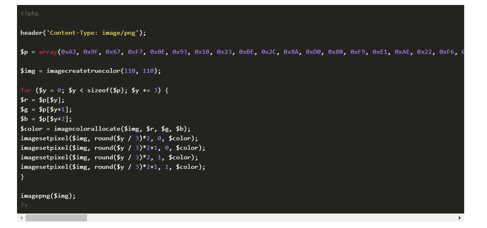
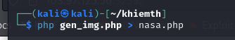
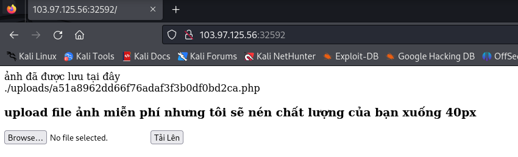
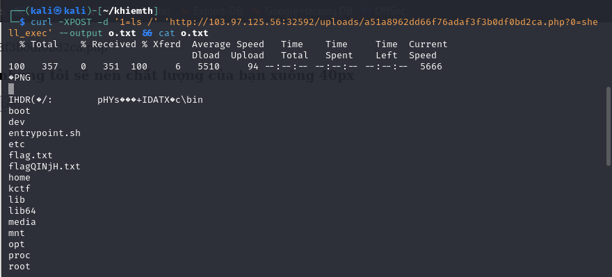
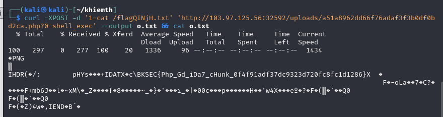

down source và xem luôn nhé ae, dùng thử chỉ có resize lại ảnh thôi

cho up lên file php là hiểu vấn đề rồi đấy, focus vào nó thôi, khi up file lên sẽ tạo md5 tên file rồi nối với extension file gốc, nghĩa là up file php lên sẽ lưu là file php

Câu hỏi đưa ra: làm thế nào để up file png chứa code php lên sau đó dù bị resize thì code php vẫn được giữ trong đó

mình tìm được bài này [link](https://www.synacktiv.com/publications/persistent-php-payloads-in-pngs-how-to-inject-php-code-in-an-image-and-keep-it-there.html)
ae đọc thêm trong link nhé

payload

ở đây sửa size thành 80x80 nhé mng

chạy code và upload lên thôi

và

và

và

FLAG: `BKSEC{Php_Gd_iDa7_cHunk_0f4f91adf37dc9323d720fc8fc1d1286}`