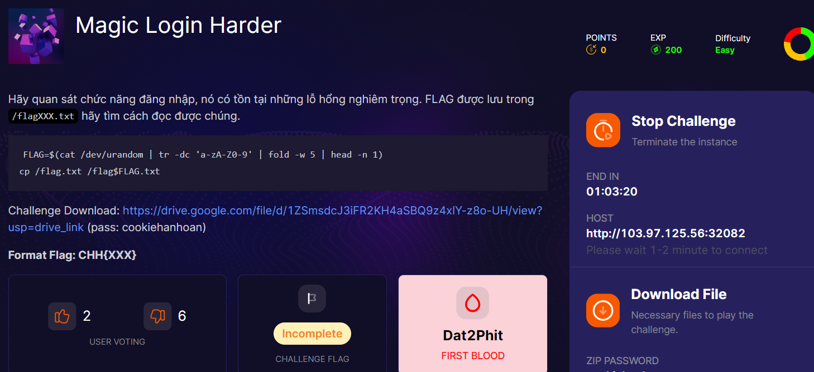

bài này hay nhé ae

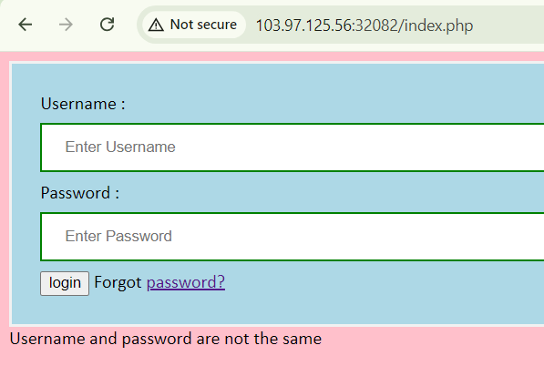
không có feature register, vô source coi xem có gì

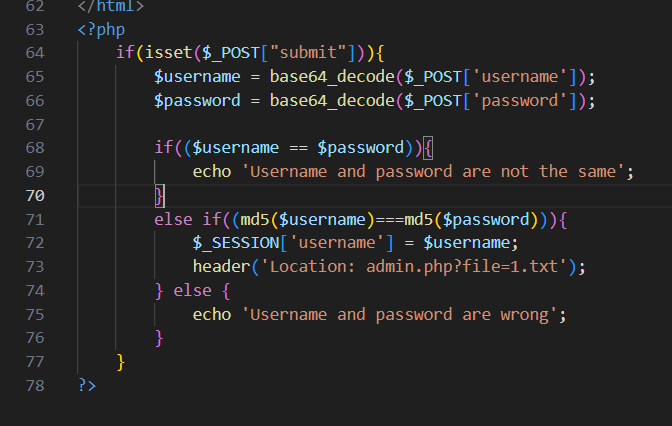
sử dụng 2 thằng `md5` để so sánh, cái này mình gặp trước đó rồi, là `MD5 collision`, ae nào chưa biết thì đọc về nó nhé

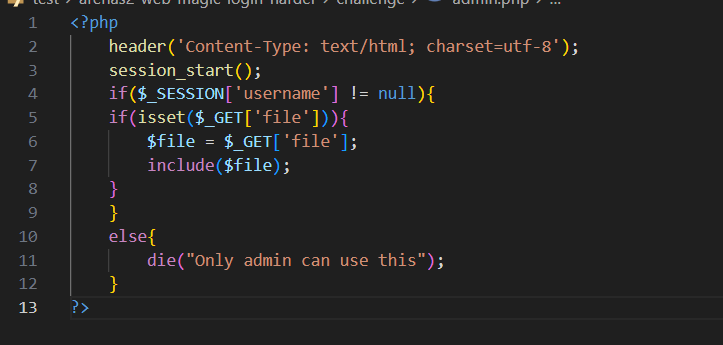
để vào đc `admin.php` thì cần phải login thành công, tức là cái điều kiện md5 kia xảy ra

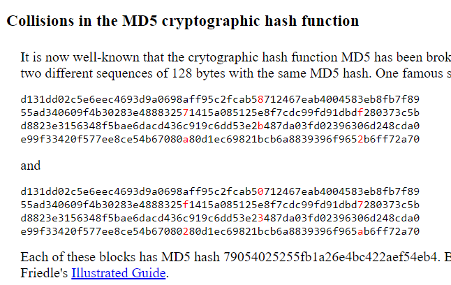

tài nguyên cho ae nhé

giờ thì code script exploit thôi

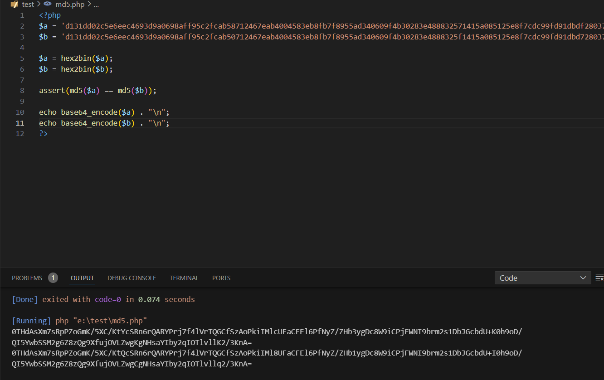

mình dùng để login
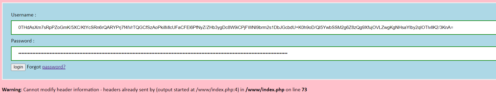

nó báo lỗi này vì dùng `header()` nhưng không `exit()`, không sao đâu vì nó cấp session cho chúng ta rồi

vô `admin.php?file=/etc/passwd`

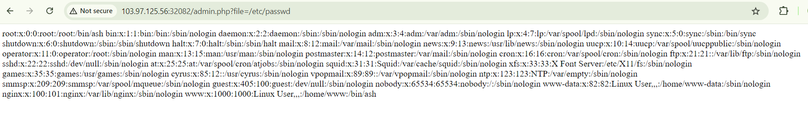

vấn đề là làm thế nào để RCE được vì flag chứa kí tự random

lợi dụng `include` mình nghĩ được các hướng: LFI (no hope vì không biết tên file), RFI(không được vì có thể server tắt `allow_url_include`), và cuối cùng là inject shell

Ở đây sẽ inject shell vào session vì nó nhảy vào `include` có thể exec. Ý tưởng của mình là inject vào luôn md5 vì khi nối 1 chuỗi giống nhau vào sau sẽ cho kết quả giống nhau sau khi md5

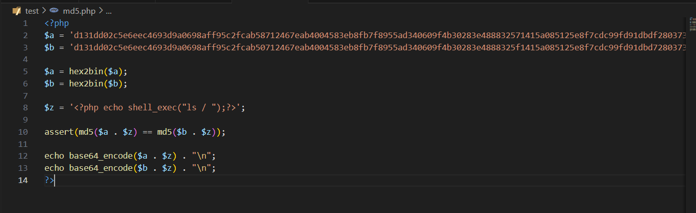

NOTE: ae để ý session thường nằm trong /tmp/sess_<sessionid> để còn vào trigger shell nhé

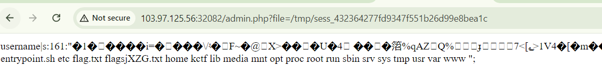
oke aeeee
    
lất flag thôi: 
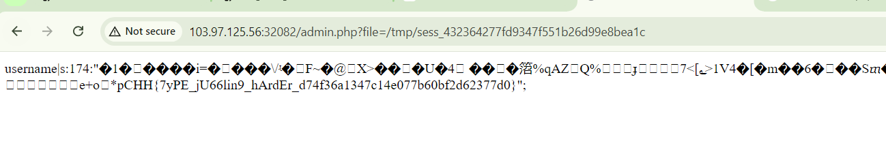

FLAG: CHH{7yPE_jU66lin9_hArdEr_d74f36a1347c14e077b60bf2d62377d0}
