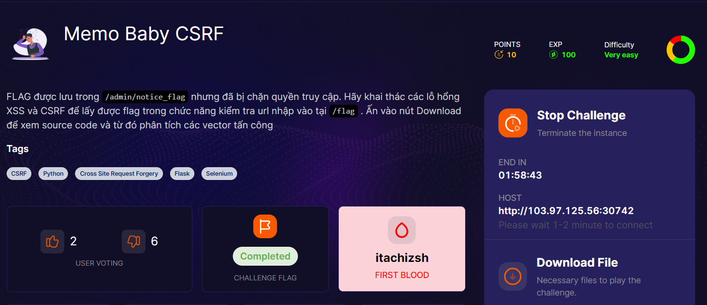
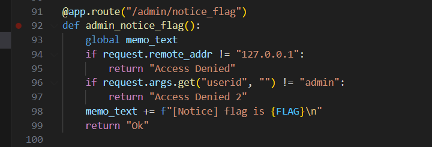
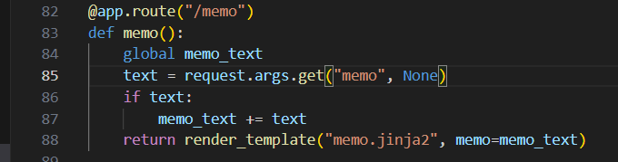
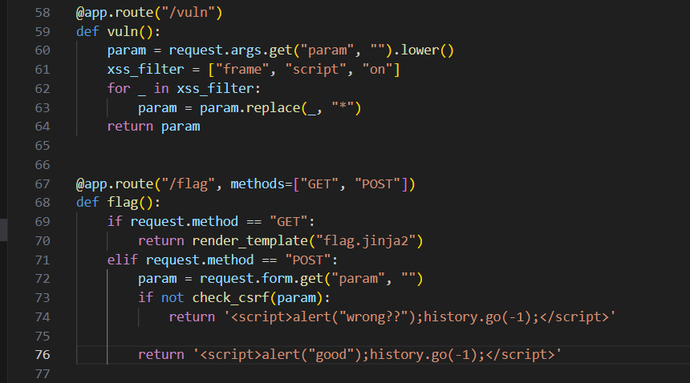
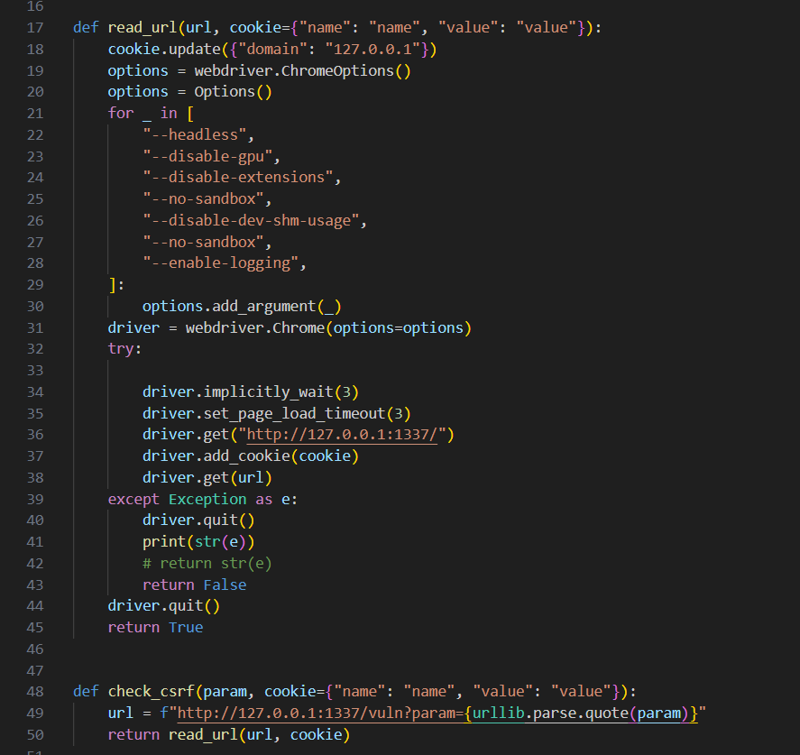
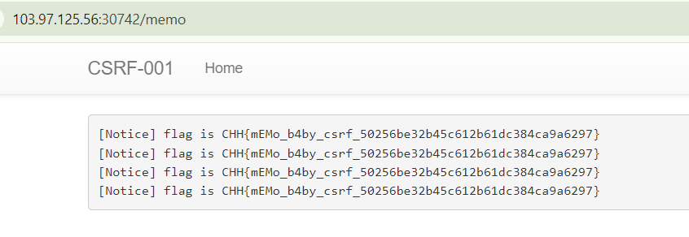

một bài có source code, mình đi phân tích nhanh luôn nha

flag nằm ở route `/admin/notice_flag` nhưng cần `addr = 127.0.0.1` và `userid = admin`. Với `userid` chúng ta có thể dễ dàng control được rồi. Còn `addr` mình thử sai với `X-Forwarded-For: 127.0.0.1` nhưng có vẻ không được, mình đoán là nó đã chặn header này hoặc sử dụng proxy hoặc một số filter khác

Cần lưu ý thêm về `global memo_text`, flag sẽ được lưu vào đó

route `/memo` để lưu memo_text

route `/vuln` xử lí para `param` để filter `XSS`

route `/flag` với method `POST` sẽ gọi đến `check_csrf` được code như sau

nó sử dụng `urllib.parse.quote(param)` để encode `param`, nhưng khoan chờ chút đã. kia có phải `127.0.0.1` không nhỉ =))

ngon rồi, đủ dữ liệu để exploit rồi

### exploit

1. truy cập `/flag` nhập vào `param` endpoint `/admin/notice_flag`
2. thêm `userid=admin` vào sau đó
3. truy cập vào `/memo lấy flag`

checkkk

bypass check XSS: ``

poww

