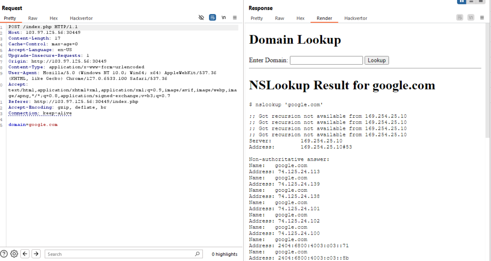
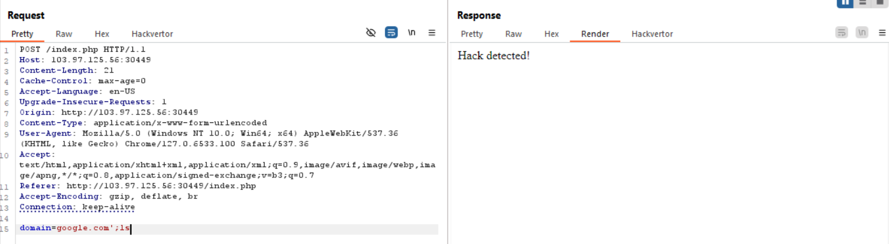
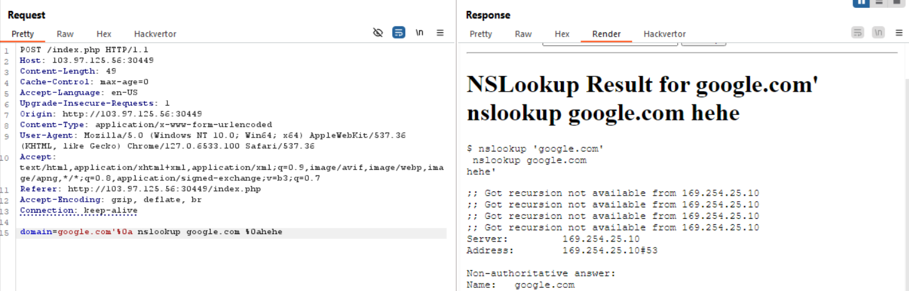
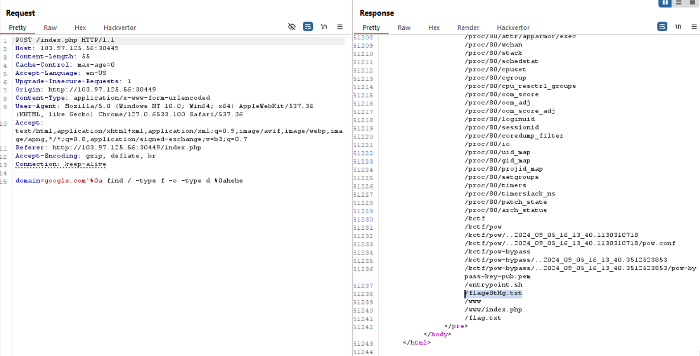
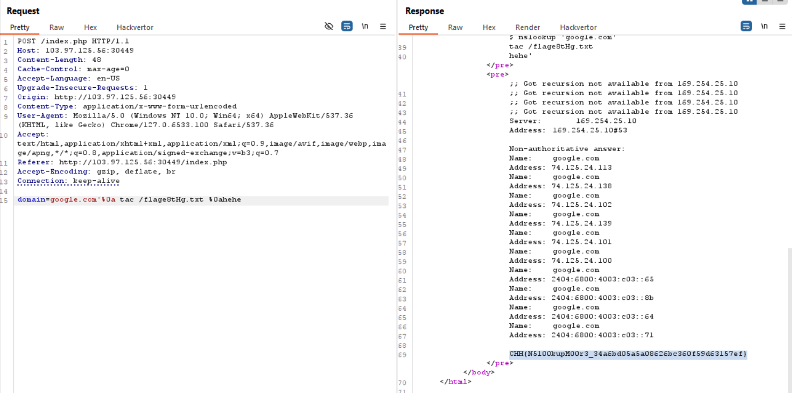

chức năng đọc ra ip

chỉ có nước exploit cmd injection thôi ae :v, mình thử inject một số payload

mình đã test một số payload: nó sẽ block `cat, ls, *,  ..` nên không thể đọc được filename tại / như thông thường được

thêm nữa là nên sử dụng %0a để xuống dòng mới thay vì sử dụng chấm phẩy, vì payload chúng ta truyền vào sẽ tự động được thêm nháy đơn

google tìm payload exploit mình tìm được bash script sau:
`find / -type f -o -type d
`

lệnh này hiển thị tất cả các file và folder trong /

vì nó ban cat nên chúng ta có thể sử dụng `head, tail, tac,...`, ở đây mình dùng tac

