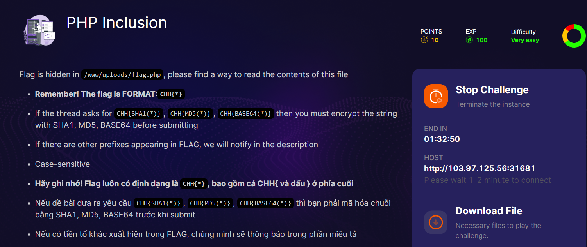
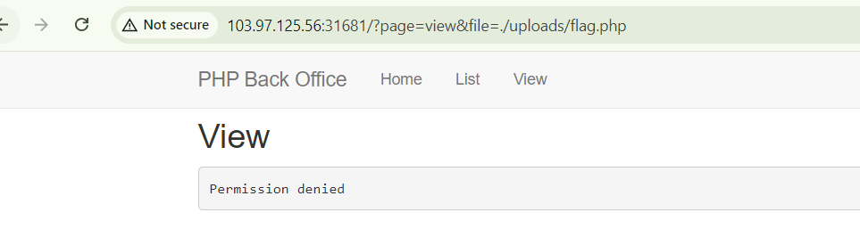
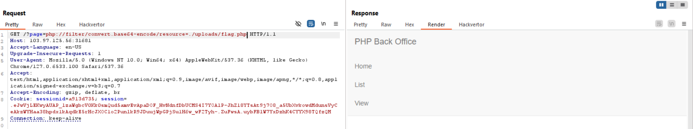
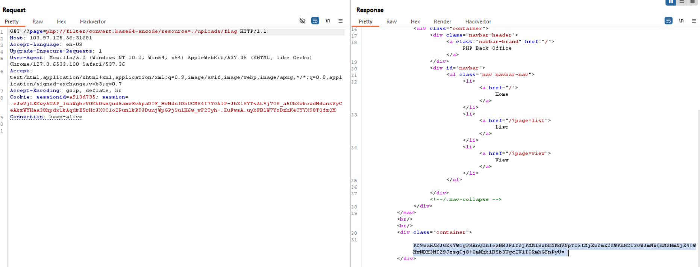
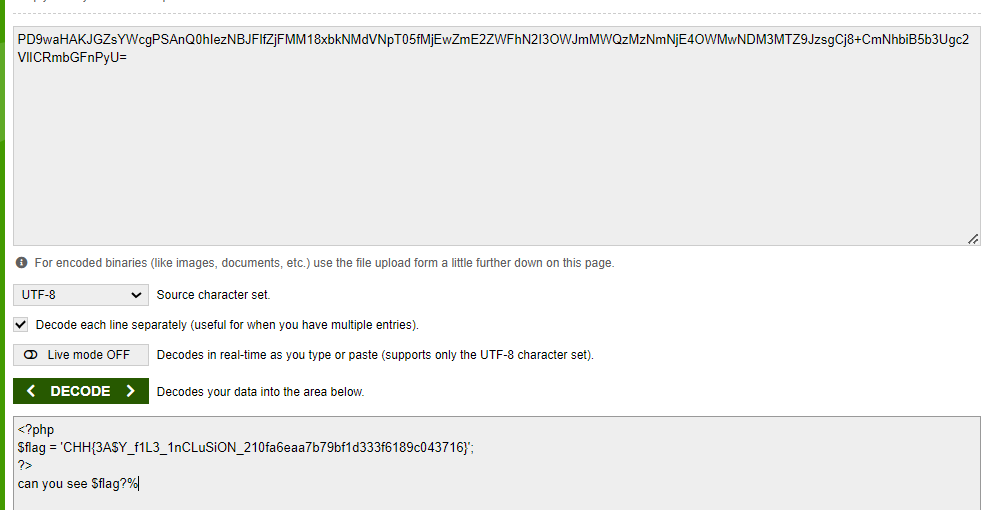

đù, thật sự thì mình mải làm mà quên mất nó cho source :) clm làm tốn thời gian thử sai quáa

sau một hồi thử sai với param `file` mình không thu được gì, mình quay sang với thằng param `page`

thử cái wrapper `php://filter/convert.base64-encode/resource=./upload/flag.php` xem sao ae nhé

mình mất thời gian ở đây để hỏi chat gpt xem payload của mình có sai chỗ nào không =)), vì mình kh down source mà @@

sau một lúc mình ngộ ra tên challange, với kinh nghiệm làm các bài trước đây thì khi `include` thường thường sẽ cho luôn đuôi `.php` vào cuối, chúng ta cần bỏ cái .php sau flag đi

decoce

bemm powww

