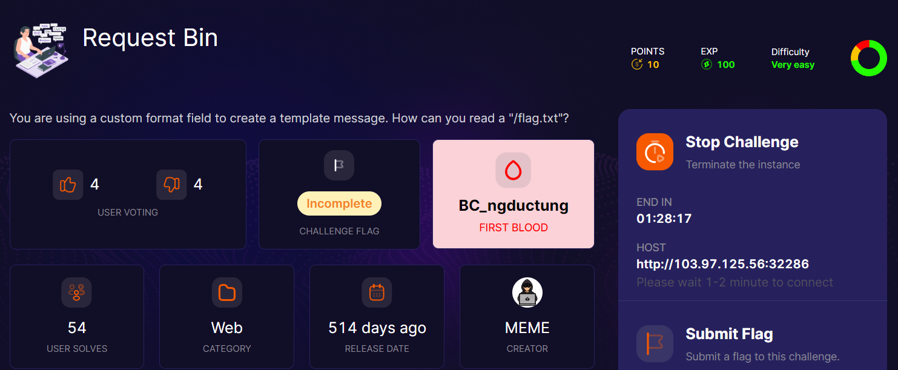
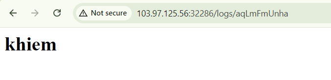
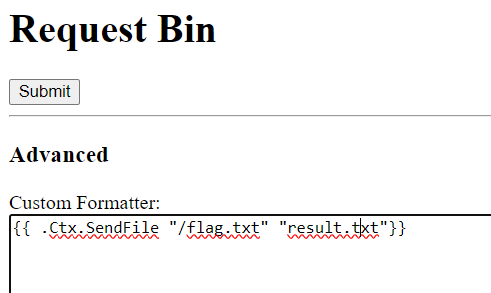
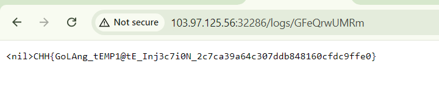

start chall lên nó cho chúng ta nhập vào form rồi submit sẽ hiển thị lại.Ở đây mình test nó dính XSS

nhưng sau đó qua 1 loạt payload để `LFI`, rồi là `fetch` tới webhook không có kết quả. Mình bắt đầu suy nghĩ tới SSTI, nếu không được check trước khi đưa vào template thì nó sẽ render 

sau khi research thì mình đọc được bài viết [này](https://ctftime.org/writeup/34359)

cuối cùng chúng ta có payload

và poww

một chall về SSTI trong Go mà lần đầu mình vấp phải, trước giờ gặp SSTI trong python là nhiều :< sẽ rút kinh nghiệm

