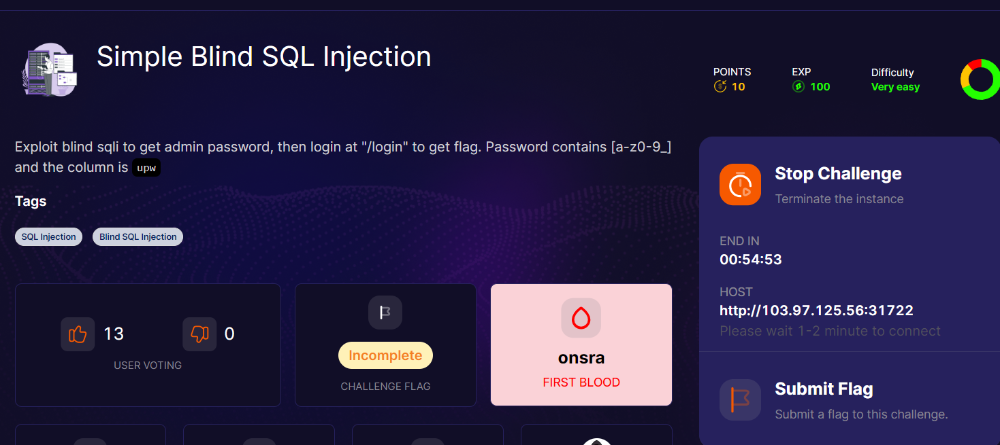
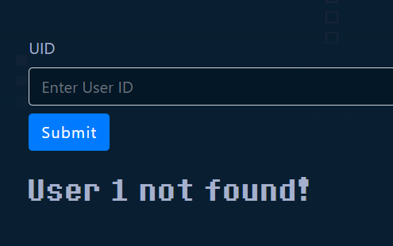
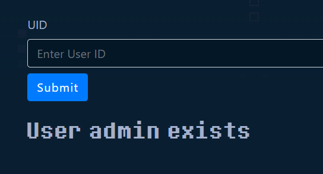
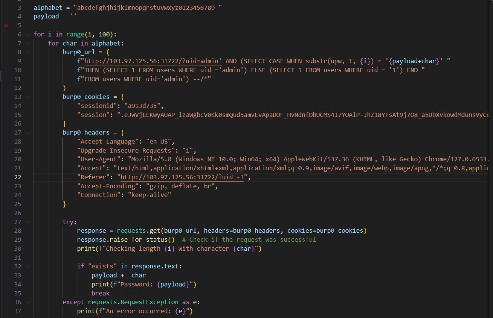
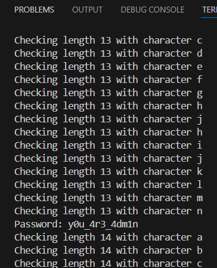
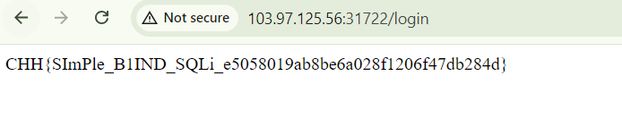

chúng ta cần lấy được password của admin để login
vì tiêu đề là blind sql injection nên chúng ta cần phải lấy được dấu hiệu trả về nếu đúng hoặc sai

nếu mình nhập vào 1


và nếu mình nhập vào admin


đến đây mình sẽ brute-force password dựa vào 2 trả về này, nếu password đúng thì trả về `exists`, còn nếu sai thì trả về `user [your_input] not found!`

mình viết được script sau:
```
admin' AND (SELECT CASE WHEN substr(upw, 1, {i}) = '{payload+char}' "
            f"THEN (SELECT 1 FROM users WHERE uid ='admin') ELSE (SELECT 1 FROM users WHERE uid = '1') END "
            f"FROM users WHERE uid='admin') --/*
```

khá là dễ hiểu nên chúng ta sẽ đi vào viết tool python luôn nha


kết quả sau khi chạy mình nhận được password của `admin`



vào endpoint `/login` và nhận flag nào




