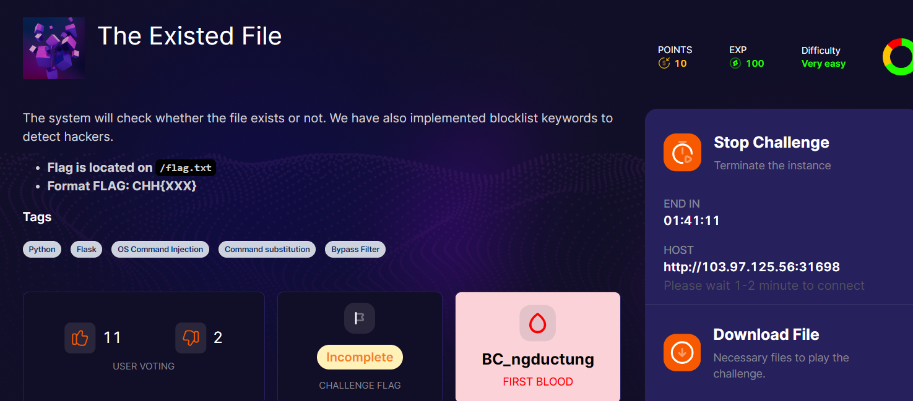
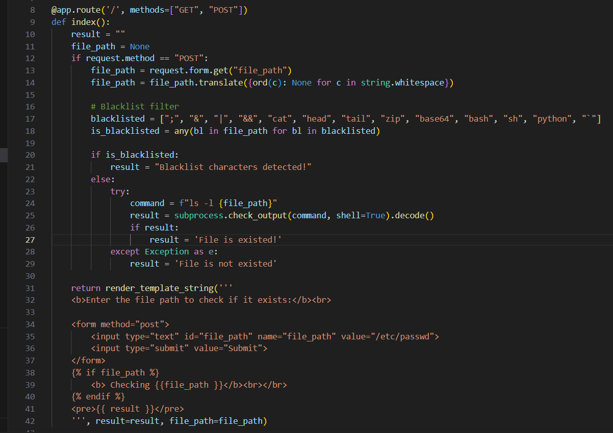
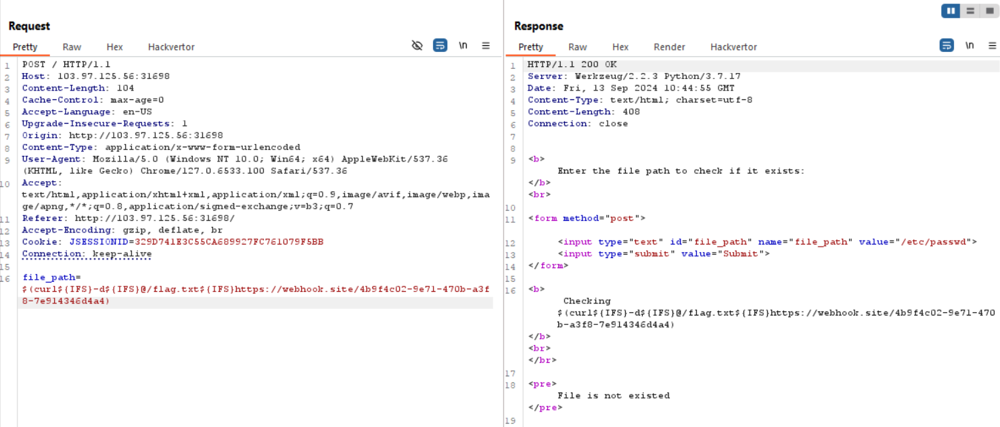

view source cùng mình

dòng 14 loại bỏ đi các khoảng trắng từ `file_path`
dòng 17 có backlist không cho nhập các kí tự đó
dòng 25 cho phép `shell=True` -> `CMD injection`

vì tại dòng 26 nó đi check `result` sau đó gán result mới là 1 chuỗi mà không nhả flag ra nên chúng ta phải leak flag ra `attacker.com`, ở đây mình dùng webhook

việc cần làm là bypass `blacklist,trigger cmd`, mình nghĩ tới `curl`

mình sử dụng `$( <command_injection> )` và `${IFS}` là biến env đại diện cho kí tự khoảng trắng

powww

