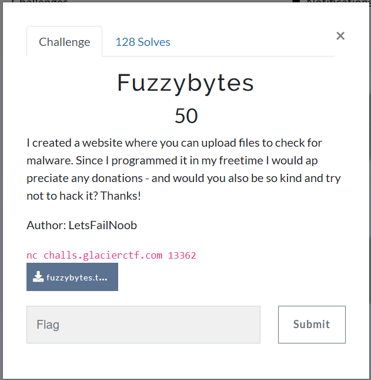

dùng thử thì mình thấy có 1 chức năng upload file thôi nhé ae, và phải là file đuôi extension `.tar.gz`

cùng mình view source

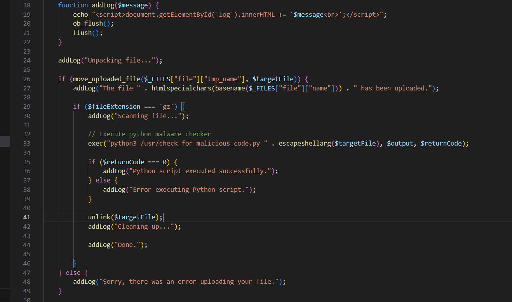

dòng 33 sử dụng hàm nguy hiểm là `exec`, mình nghĩ tới cmd to RCE 

xem qua file python xử lý check melicious code
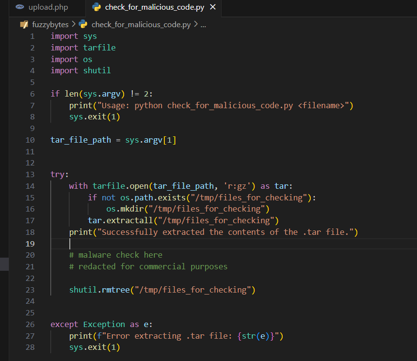

có thể thấy sau khi nó extracts file `.tar` ra nó sẽ check content của file, sau đó remove đi luôn mà không lưu

nhưng để ý, tại dòng 17 dev sử dụng hàm nguy hiểm là `extractall`, mình research thì phát hiện nó là func dính lỗi, dễ bị tấn công bởi kĩ thuật `path traversal`

thêm việc sử dụng nhiều file zip khiến mình có suy nghĩ tới lỗ hổng `Zip Slip`

tài liệu thêm cho ae đọc tham khảo
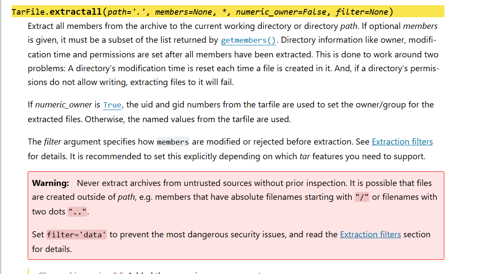

oke tiến hành check thôi, mình sẽ tạo script python

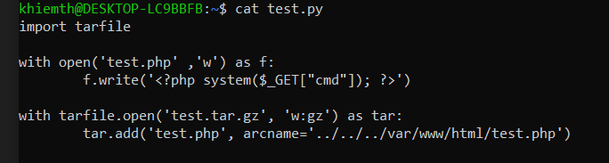

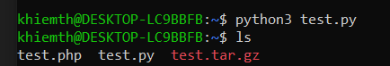

upload file tar này lên localhost

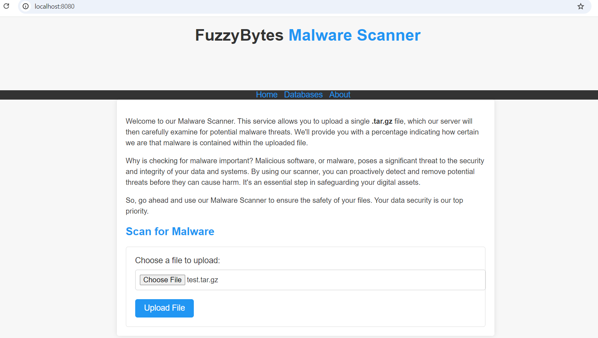

và đã upload thành công
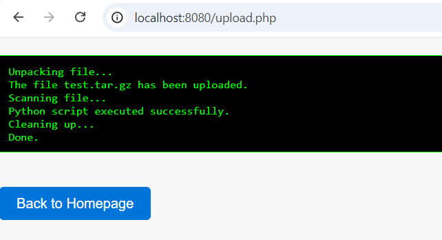

theo đúng lí thuyết thì sẽ có 1 file `test.php` nằm trong `/var/www/html/` trên server, mình thử xem nào

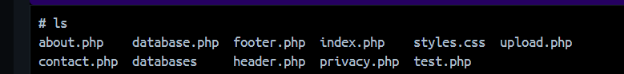

đúng là có, giờ truy cập vào và RCE thôi =))) 

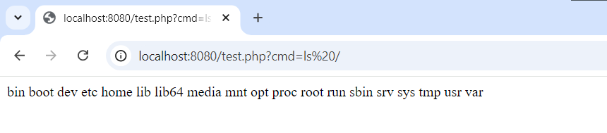
 thành công exec lệnh bằng hàm system()

flag nằm ở /root/flag.txt
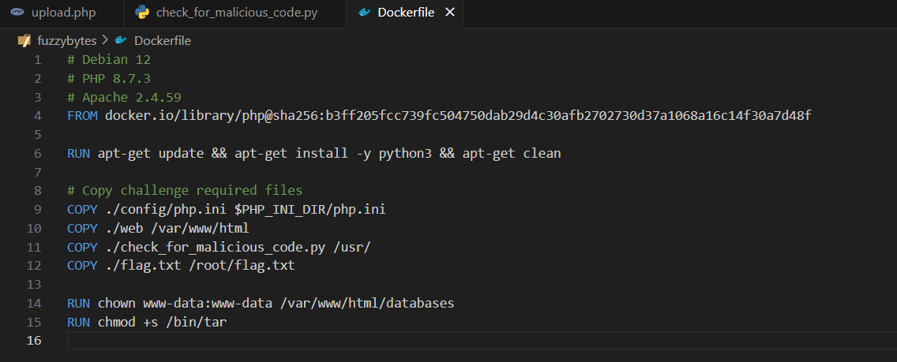

nhưng
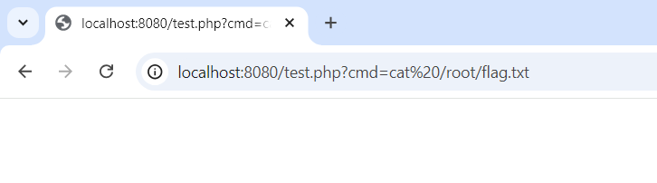
 có vẻ như chúng ta không có quyền đọc file này
 
 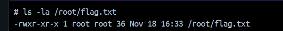
chuẩn cmn luôn, phải là root mới chạy đc lệnh

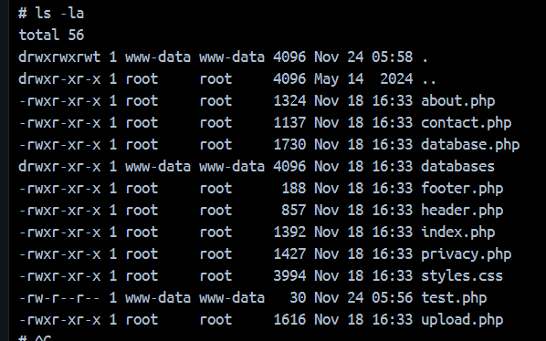
còn về lí do tại sao chạy được `test.php` thì do nó chạy với người dùng `www-data` chứ không phải `root` nhé mng

hmmmm, còn cách nào để lấy được flag nhỉ? 

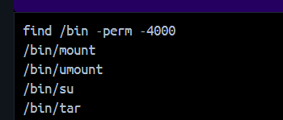

nếu chúng ta chạy được code php thì sẽ ra sao nếu chúng t zip mẹ nó file `/root/flag.txt` vào xong ném nó ra `/var/www/html` ??? hay vl

exploit lại nào
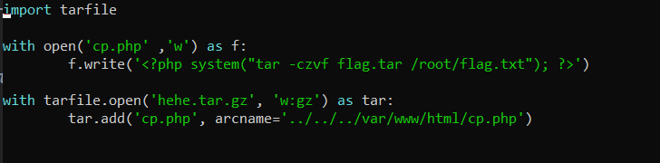

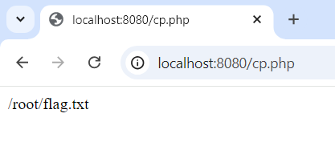

giờ truy cập vào flag.tar để tải về nàoo

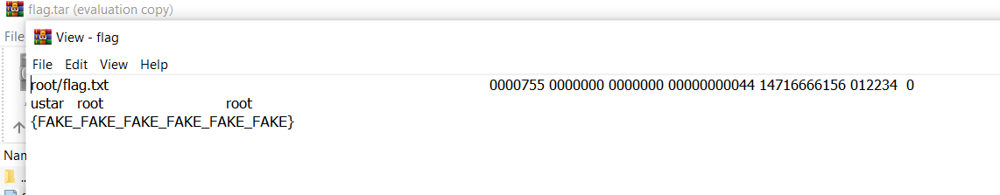

í sời í sời, zip slip takes you everywhere

lấy flag trên máy server thôi nào

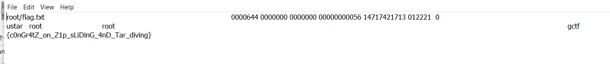

quẩy lên ae

