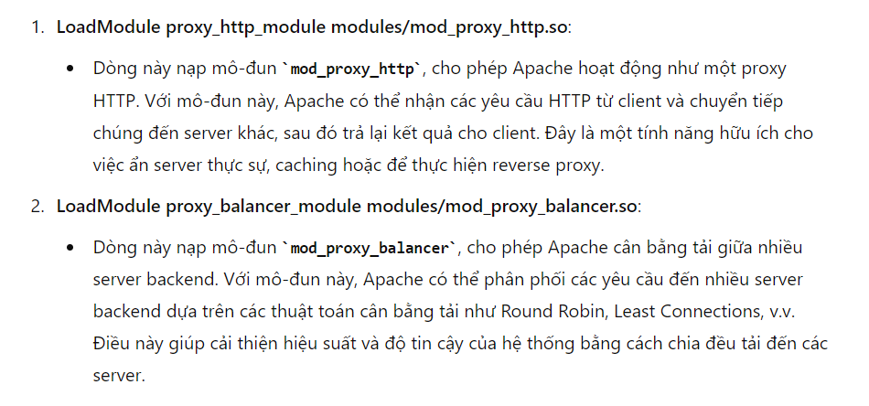

## ApacheBlaze


đọc des chả có gì để hiểu :))


click vào game 4 sẽ có message: `This game is currently available only from dev.apacheblaze.local`

mình view source


tại dòng 23 check header `X-Forwarded-Host`, nếu nó là `dev.apacheblaze.local` thì return FLAG


mình thử inject thêm nhưng kết quả vẫn không nhận được FLAG, nhận được thì dễ quá ;))

chall này có source nhưng mình đã thử build dockerfile để debug nhưng méo được, cayy, nên khi inject X-ForwarHost vào req mình không debug được nó có những máy chủ nào ngoài dev.apacheblaze.local. Cái này mình suy luận thôi vì nếu nó chỉ có 1 máy chủ dev.apacheblaze nó sẽ nhả ngay Flag ra cho mình

mình view source httpd-conf


ở đây mình thấy nó config dòng 13 và 14. 



tiếp file conf


```
Khi hoạt động ở chế độ reverse-proxy (ví dụ, sử dụng chỉ thị ProxyPass), mod_proxy_http thêm một số tiêu đề yêu cầu để truyền thông tin đến máy chủ gốc. Các tiêu đề này là: 

X-Forwarded-For 
    Địa chỉ IP của máy khách. 
X-Forwarded-Host 
    Máy chủ gốc được máy khách yêu cầu trong tiêu đề yêu cầu HTTP Host. 
X-Forwarded-Server 
    Tên máy chủ của máy chủ proxy.
```

mình dự đoán là trong X-Forwarded-Host ngoài dev.apacheblaze.local sẽ còn có 2 máy chủ khác là `reverse proxy và load balancer` hoạt động trên port 1337 và 8080

giờ mục tiêu của mình là làm thế nào để sao cho X-Forwarded-Host không chứa 2 máy chủ chạy trên port 1337 và 8080

Để ý ở dòng 26,27 của file conf, feature RewriteEngine được bật `on`, nó sẽ giúp viết lại url 

`
Quy tắc viết lại này chuyển hướng các yêu cầu với đường dẫn bắt đầu bằng /api/games/ đến http://127.0.0.1:8080/, với phần còn lại của đường dẫn (sau /api/games/) được gán cho tham số game trong URL mới.
Ví dụ: Yêu cầu đến /api/games/123 sẽ được chuyển đến http://127.0.0.1:8080/?game=123.
[P] là một flag cho biết yêu cầu này nên được xử lý bởi mod_proxy (proxy pass), tức là yêu cầu sẽ được chuyển tiếp đến URL mới mà không thay đổi URL hiển thị với người dùng.
`

đến đây mình search vulne của apache httpd-2.4.55 vì dockerFile sử dụng cái này


đây rồi, exploit by HTTP request Smuggling


server không báo lỗi gì, đến đây mình inject thêm `Host` vào req đầu tiền rồi CRLF cho req thứ 2 
```
GET /api/games/click_topia%20HTTP/1.1%0d%0aHost:dev.apacheblaze.local%0d%0a%0d%0aGET%20/chandoi HTTP/1.1
```


NOTE: giải thích lại, vì apache đóng vai trò như 1 proxy chuyển tiếp yêu cầu từ user nên không dùng X-Forwarded-Host được, thay vào đó mình chỉ định luôn Host để phân biệt với virtual Host mà apache proxy thêm vào