## Insomnia
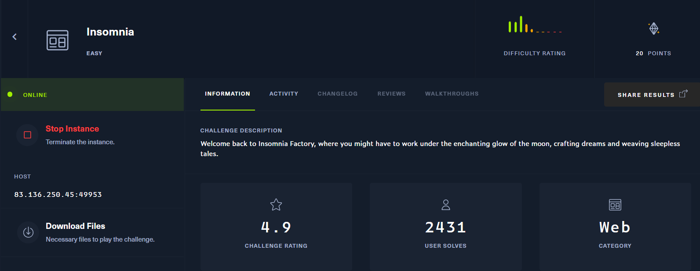

1 chall có source code
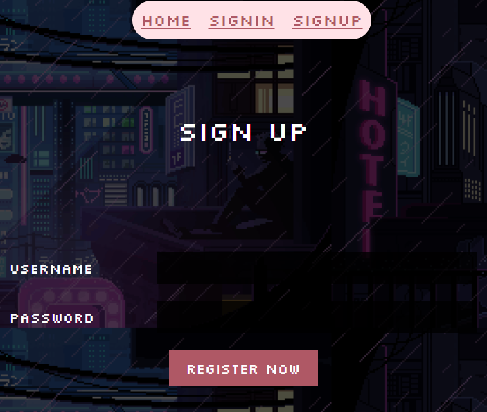

có các feature signup, signin. mình thử signup rồi dùng thử xem nó có gì bên trong 

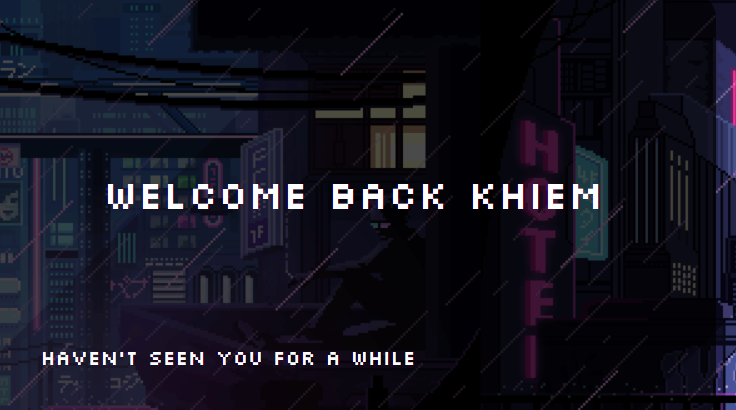

có vẻ như khi login với user bình thường sẽ không có gì xảy ra :))

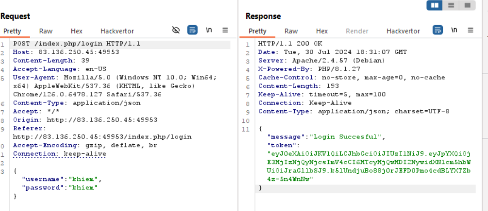

nhìn token khá quen mắt =)), là JWT, mình tiến hành decode base64

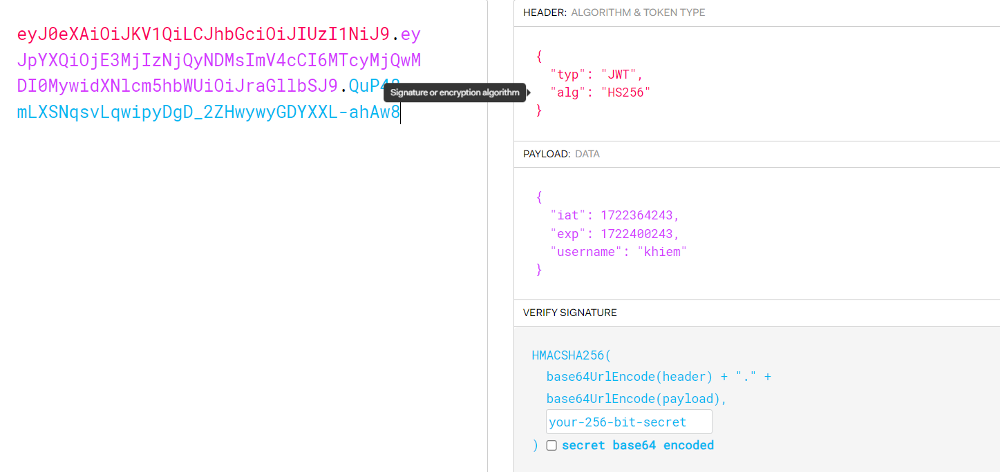

thuật toán khóa đối xứng HS256, giá trị timestamp, username trong data. mình đã thử change `HS256` to `none` nhưng không có kết quả gì xảy ra.

View source code
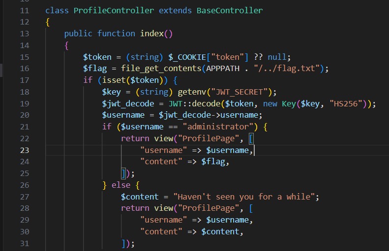

nếu đăng nhập được vào `administrator` thì sẽ có flag trả về

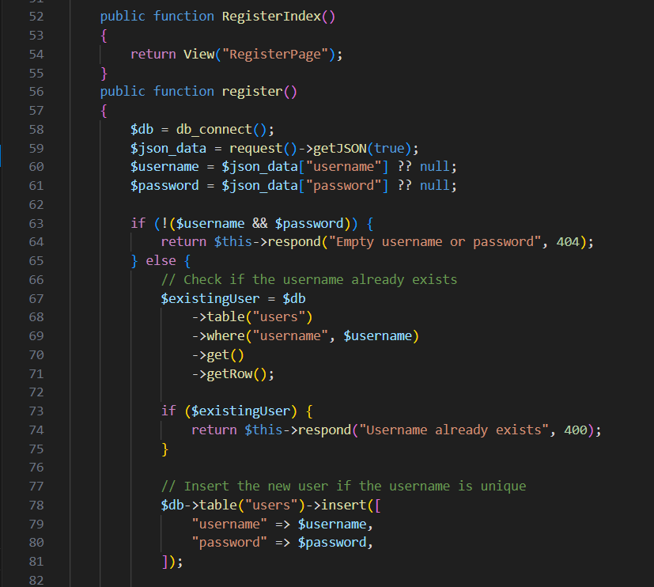

xem qua func regester mình có thêm hướng khai thác là sql injection khi đăng kí tài khoản, nhưng khi view qua func login thì mình thấy câu query như sau:

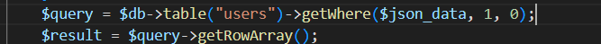

nó chỉ lấy value của users trong $json_data, sau đó check và gene token jwt

lướt lên trên mình thấy có điểm nghi ngờ

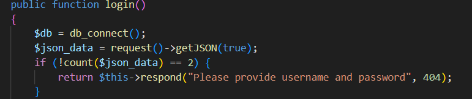

rõ ràng là $json_data sẽ có 2 tham số là username và password. Ở đây nó đang đếm số lượng tham số của $json_data sau đó lấy phủ định của count so sánh với 2.
Ví dụ nếu count($json_data) = 2, thì !2 sẽ không bằng 2 nên sẽ return FALSE
Điều này làm cho điều kiện luôn là FALSE, và message sẽ không được trả về. Nó chỉ xảy ra khi count($json_data) = 0, khi đó !0 = TRUE

Kết hợp lại mình tiến hành chỉ truyền 1 tham số cho $json_data trong burp repeater

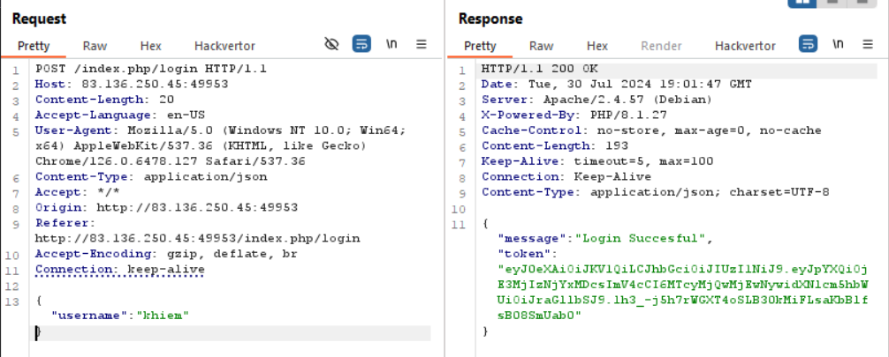

thay username = administrator, lấy token và BOOM

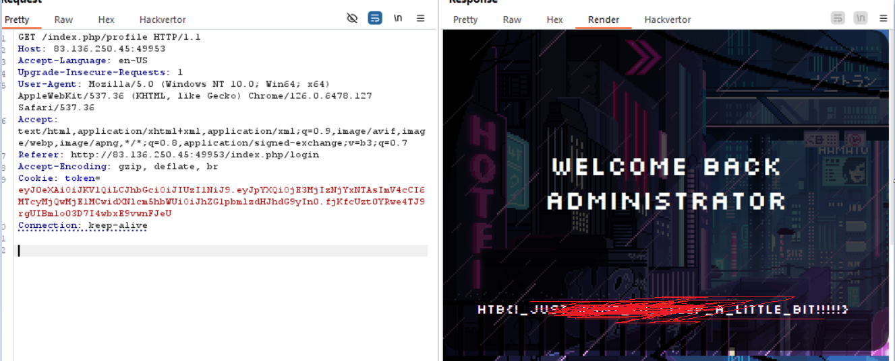