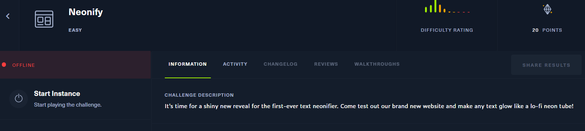
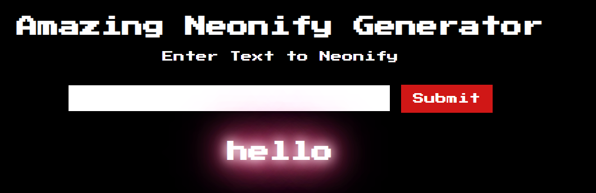
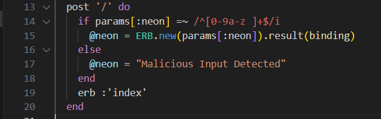
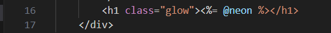
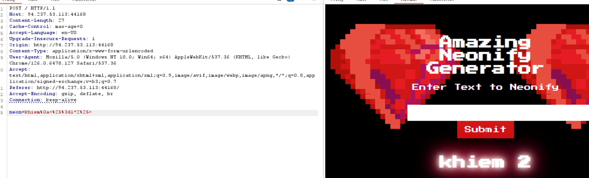
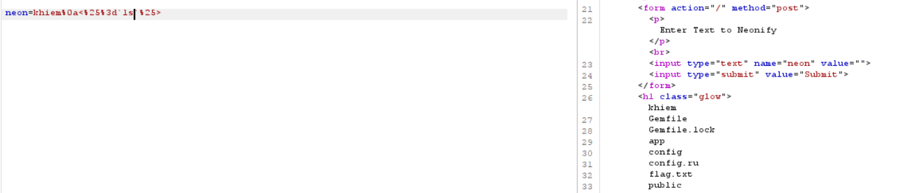
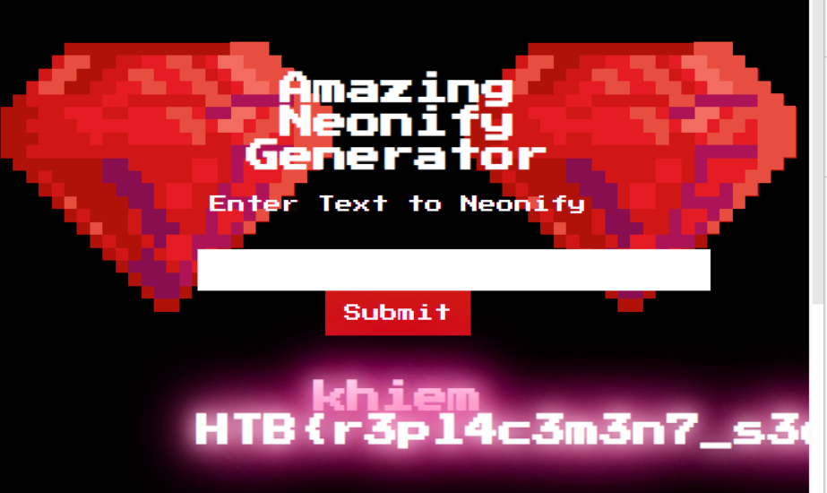

## Neonify

mình thử nhập payload test xss `<h1>khiem</h1>` thì:

view source:

mình cứ nghĩ là nó dính xss nhưng có vẻ không phải =)), khả năng cao là SSTI

mình thấy trong biểu thức regex chỉ có cờ i để không phân biệt chữ hoa, thường. nhưng lại không có cờ m (multi line)

mình thử inject `%0a` tương ứng với newline xem sao. Nhớ encode

payload: `khiem%0akhiem` thành công, xác nhận lỗi SSTI với regex thiếu cờ `m`

dựa luôn vào index.erb mình thử truyền payload: `khiem%0a<%= 1+1 %>` sau khi encode thành `khiem%0a<%25%3d1*2%25>`

list ls

đọc flag

