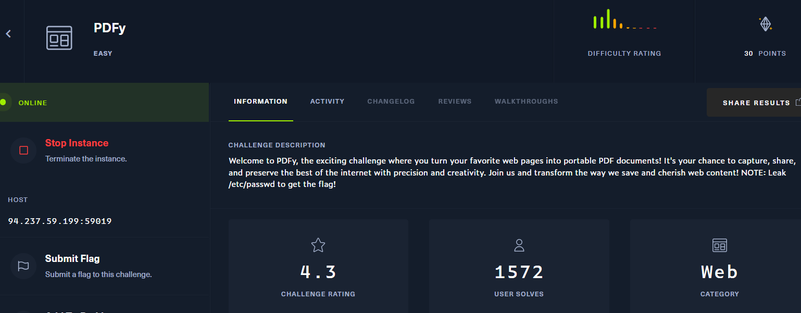
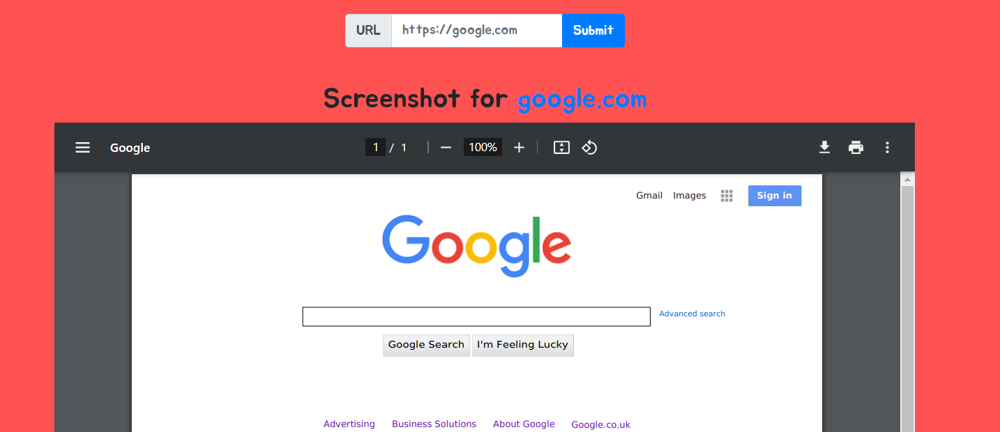
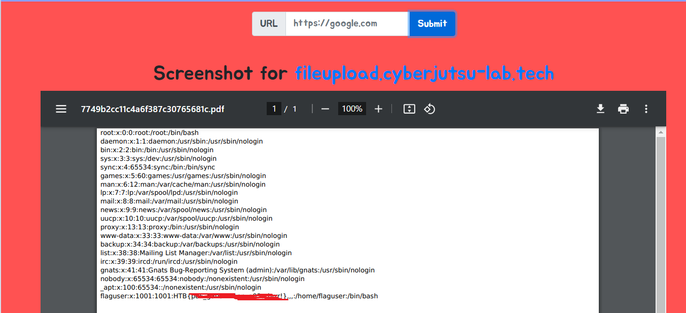

## PDFy


mục tiêu là cần đọc /etc/passwd của server



web cung cấp cho ta chức năng chuyển đổi 1 web thành pdf trả về cho user thông qua url user cung cấp

mình thử nhập http://127.0.0.1 thì thấy báo lỗi sử dụng wkhtmltopdf, dùng để chuyển html sang pdf


mình dự đoán các bước mà nó thực hiện như sau:
1. user nhập và gửi url tới server
2. server gửi resquest tới url đích 
3. url đích response trở về server
4. server convert to PDF
5. server response về user

câu hỏi mình đặt ra: liệu mình có thể yêu cầu chính server request tới chính nó không ?
Tới đây mình nghĩ tới SSRF

mình tiến hành code exploit như sau:
```
<?php
    header('location:file:///etc/passwd');
?>
```
up lên server của mình, sau đó gửi url cho server để nó trả về pdf file /etc/passwd



NOTE: khi upload exploit lên server hacker không được để script đó exec, nếu không server sẽ trả về /etc/passwd của server hacker