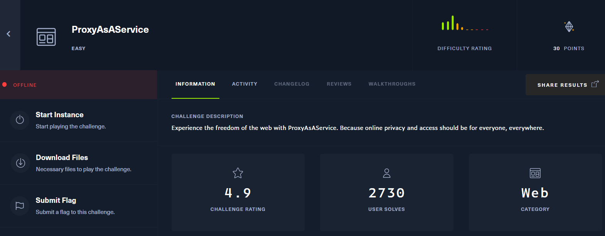
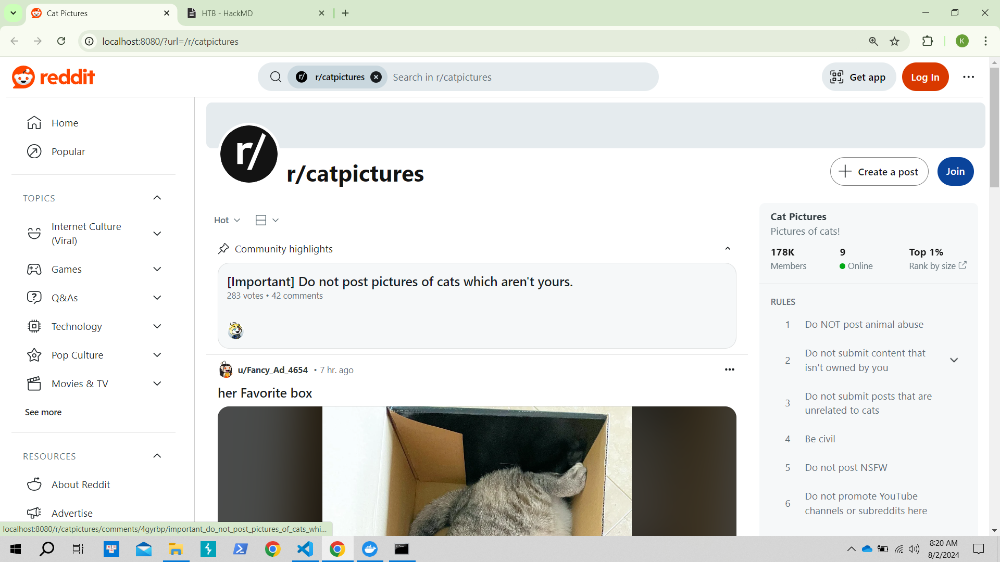
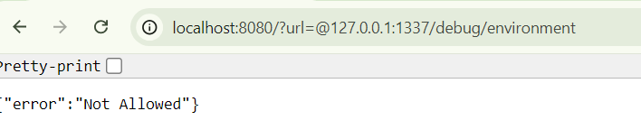
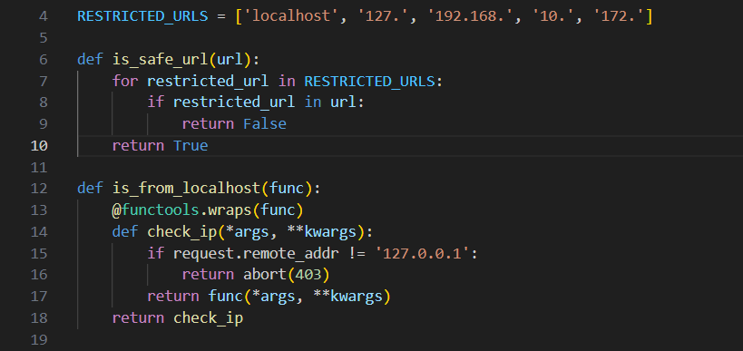
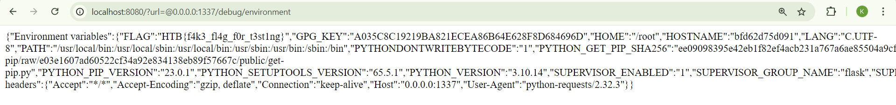

## ProxyAsAService


bài này mình build docker rồi làm trên local, vì trên server nó trỏ tới reddit mình kh có account nên không vô được


mình chú ý tới para url 
tiến hành view source

DockerFile
```
FROM python:3.10-alpine

# Install packages
RUN apk add --update --no-cache libcurl curl-dev build-base supervisor

# Upgrade pip
RUN python -m pip install --upgrade pip

# Install dependencies
RUN pip install Flask requests

# Setup app
RUN mkdir -p /app

# Switch working environment
WORKDIR /app

# Add application
COPY challenge .

# Setup supervisor
COPY config/supervisord.conf /etc/supervisord.conf

# Expose port the server is reachable on
EXPOSE 1337

# Disable pycache
ENV PYTHONDONTWRITEBYTECODE=1

# Place flag in environ
ENV FLAG=HTB{f4k3_fl4g_f0r_t3st1ng}

# Run supervisord
CMD ["/usr/bin/supervisord", "-c", "/etc/supervisord.conf"]

```

mình thấy FLAG nằm trong biến ENV

```
from flask import Blueprint, request, Response, jsonify, redirect, url_for
from application.util import is_from_localhost, proxy_req
import random, os

SITE_NAME = 'reddit.com'

proxy_api = Blueprint('proxy_api', __name__)
debug     = Blueprint('debug', __name__)


@proxy_api.route('/', methods=['GET', 'POST'])
def proxy():
    url = request.args.get('url')

    if not url:
        cat_meme_subreddits = [
            '/r/cats/',
            '/r/catpictures',
            '/r/catvideos/'
        ]

        random_subreddit = random.choice(cat_meme_subreddits)

        return redirect(url_for('.proxy', url=random_subreddit))
    
    target_url = f'http://{SITE_NAME}{url}'
    response, headers = proxy_req(target_url)

    return Response(response.content, response.status_code, headers.items())

@debug.route('/environment', methods=['GET'])
@is_from_localhost
def debug_environment():
    environment_info = {
        'Environment variables': dict(os.environ),
        'Request headers': dict(request.headers)
    }

    return jsonify(environment_info)
```
có 2 route là proxy_api và debug
mình chú ý tới route debug vì nó gọi hàm debug_environment list ra các biến env bằng os.environ với điều kiện req gọi từ localhost

mình thử payload sau: 
```
@127.0.0.1:1337/debug/environment
```



có vẻ như có gì đó bị filter



oke, nó đã filter một số address cho localhost, tuy nhiên vẫn còn cách bypass, đó là dùng` 0.0.0.0`

thay đổi payload : `@0.0.0.0:1337/debug/environment`
