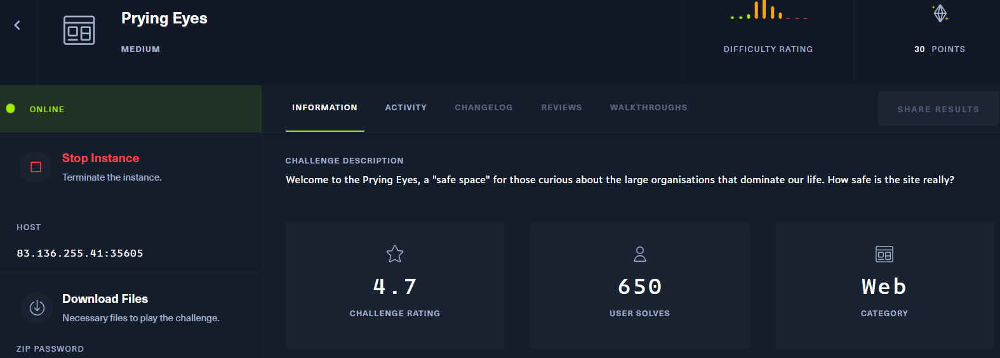
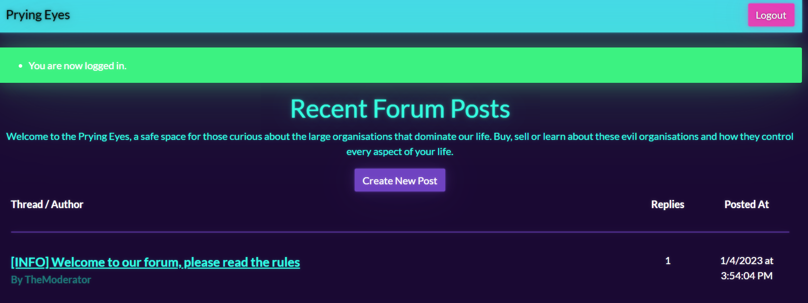
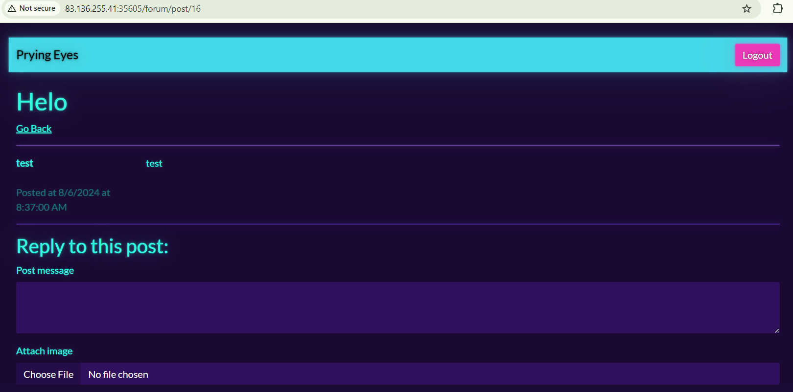
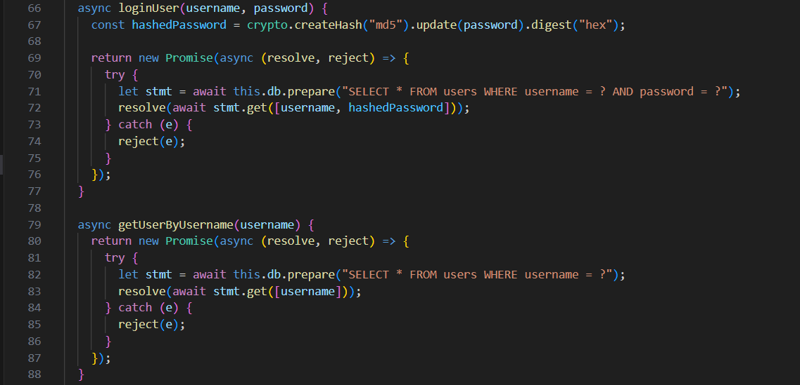
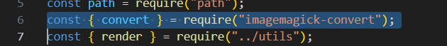
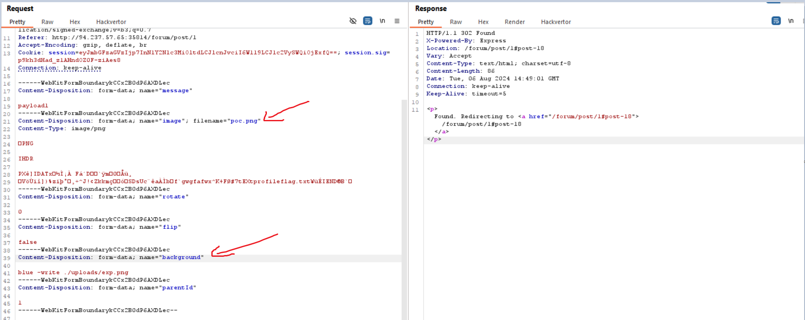
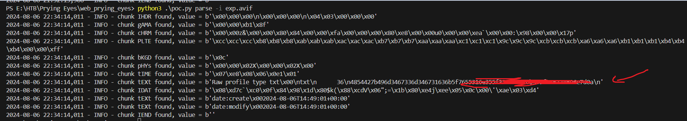
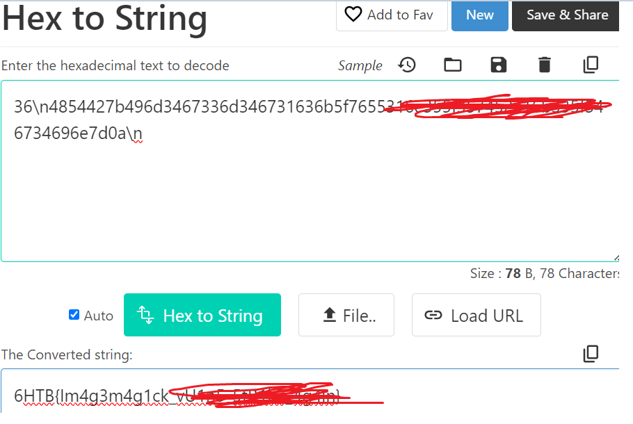

## Prying Eyes



muốn đọc blog phải login


có chức năng register, dùng thử như bình thường thôi nào

thêm feature `create new post`


click vào 1 post bất kì cho phép để lại message và attach image, mình nghĩ tới `XSS` và `Fileupload`, có thể tồn tại cả`SSTI`

để ý thêm url `http://83.136.255.41:35605/forum/post/1` có thể dính sql injection hoặc liên quan


mình tạo ra 1 bài viết mới, form được tạo ra giống với các bài viết trong web

view source


các câu query không nối trực tiếp các biến nên có thể sẽ không có khả năng bị SQL injection, mình sẽ không tập trung exploit nó nữa

```
router.post(
  "/post",
  AuthRequired,
  fileUpload({
    limits: {
      fileSize: 2 * 1024 * 1024,
    },
  }),
  ValidationMiddleware("post", "/forum"),
  async function (req, res) {
    const { title, message, parentId, ...convertParams } = req.body;
    if (parentId) {
      const parentPost = await db.getPost(parentId);

      if (!parentPost) {
        req.flashError("That post doesn't seem to exist.");
        return res.redirect("/forum");
      }
    }

    let attachedImage = null;

    if (req.files && req.files.image) {
      const fileName = randomBytes(16).toString("hex");
      const filePath = path.join(__dirname, "..", "uploads", fileName);

      try {
        const processedImage = await convert({
          ...convertParams,
          srcData: req.files.image.data,
          format: "AVIF",
        });

        await fs.writeFile(filePath, processedImage);

        attachedImage = `/uploads/${fileName}`;
      } catch (error) {
        req.flashError("There was an issue processing your image, please try again.");
        console.error("Error occured while processing image:", error);
        return res.redirect("/forum");
      }
    }

    const { lastID: postId } = await db.createPost(req.session.userId, parentId, title, message, attachedImage);

    if (parentId) {
      return res.redirect(`/forum/post/${parentId}#post-${postId}`);
    } else {
      return res.redirect(`/forum/post/${postId}`);
    }
  }
);
```
trong `forum.js` có route.post để upload 1 file định dạng ảnh lên với các value được lấy từ `req.body` như `title, message, parentId, ...convertParams` trong đó `...convertParams` đại diện cho các value khác nếu có trong req.body
Từ đó mình cofirm được rằng `convertParams` chính là unstrusted data mà mình có thể kiểm soát được

tiếp theo nó tạo random tên file với 16 byte rồi chuyển qua hex, lưu tại `./uploads/<hex>`

sau đó gọi const `convert`, lấy các giá trị từ req.body bao gồm cả `...convertParams` để chuyển ảnh sang định dạng `AVIF`. Trong đó `convert` đại diện cho lib `imagemagick-convert`


mình nghi ngờ nó bị lỗi ở đây, mình đã research ra được cve liên quan đến `imagemagick-convert` [này](https://www.npmjs.com/package/imagemagick-convert)

đồng thời mình tìm được PoC tại [đây](https://github.com/vulhub/vulhub/blob/master/imagemagick/CVE-2022-44268/poc.py)

tiến hành exploit flag, tạo `poc.png` chứa payload đọc file flag.txt


upload lên server


`exp.png` là ảnh đã được convert chứa nội dung của flag
download exp.png rồi chạy `poc.py` để lấy hex của Flag


1 chall không quá khó vì dễ dàng tìm đc PoC build payload