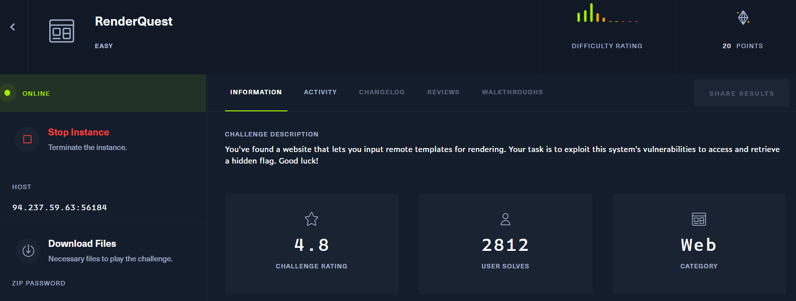
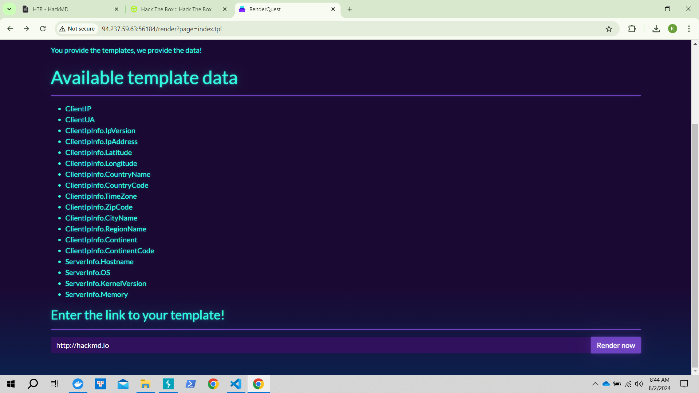
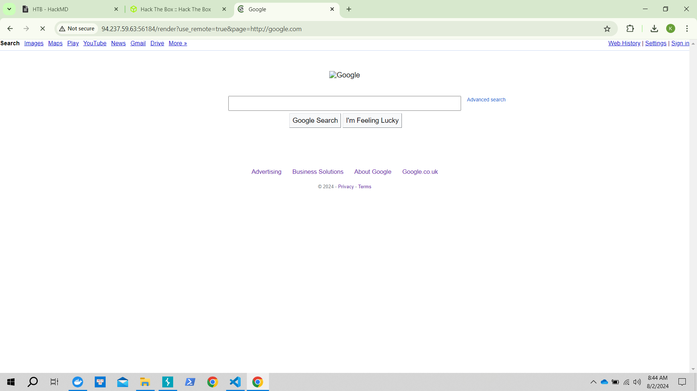
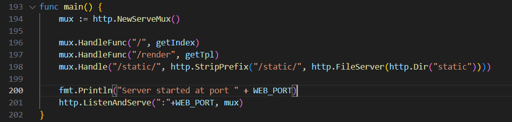
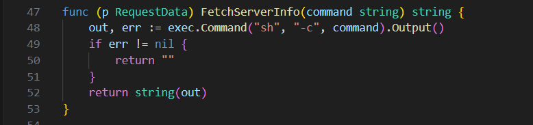
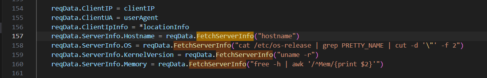
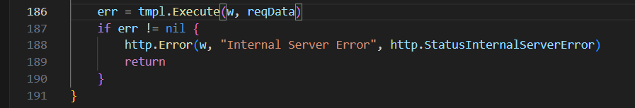
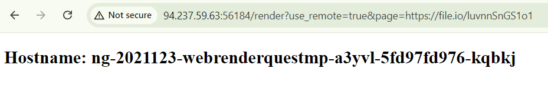
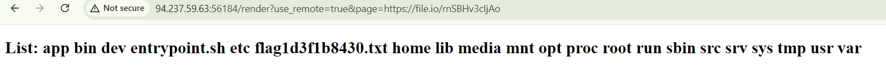
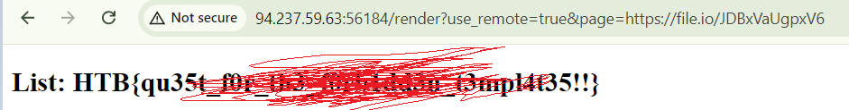

## RenderQuest



web cung cấp cho ta feature render link, mình thử nhập http://google.com


tuy nhiên không search được đâu nhé =)), vì nó có redirect đâu

có 2 para là user_remote và page được thêm vào url. Mình nghi ngờ tới SSRF

mình view source

hàm `main`


mình thấy có func `FetchServerInfo` chứa exec dùng thực thi command nguy hiểm, lưu ý chỗ này


mình tiếp tục xem hàm này được gọi ở đâu.


mấy thằng này được gọi trong func `getTpl`, mà trong main có thằng `/render` dùng tới th này, mình tập trung vào /render.

và khi gọi

các két quả trả về từ `FetchServerInfo` được in ra

Tóm lại: main định tuyền `/render` tới `getTpl`, trong func `getTpl` gọi tới `FetchSerserInfo` mà tại đó nó exec command

câu hỏi mình đặt ra là: làm thế nào để gọi được thằng `	reqData.ServerInfo.Hostname = reqData.FetchServerInfo("hostname")`
Sau khi gg search mình biết được là trong Go, giá trị như này được truyền vào qua template HTML và hiển thị thông qua template `.tpl`

tiến hành code exploit:
```
<!DOCTYPE html>
<html lang="en">
<head>
   <title>exploit</title>
</head>
<body>
    <h2>Hostname: {{.ServerInfo.Hostname}}</h2>
</body>
</html>
```


mình sẽ thay goi tới `FetchServerInfo` và truyền cmd là `ls /` 



lấy flag
