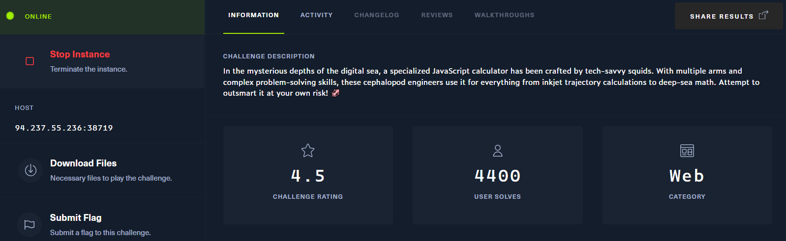
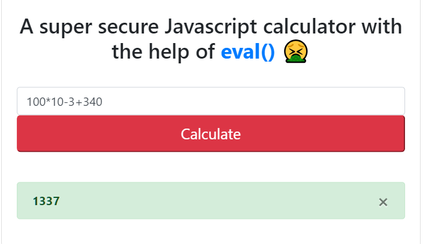
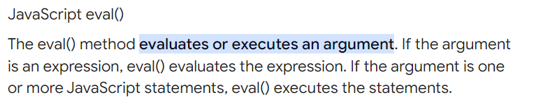
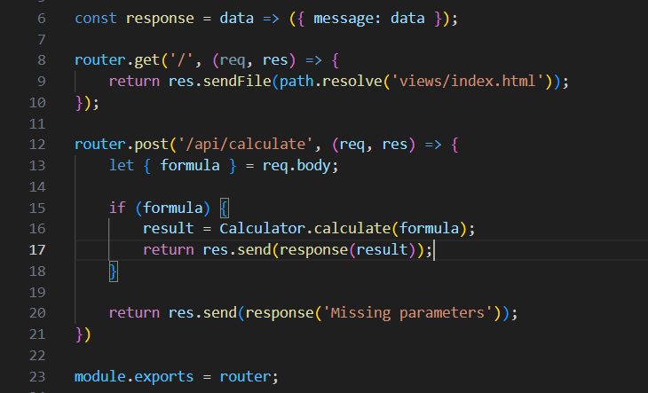
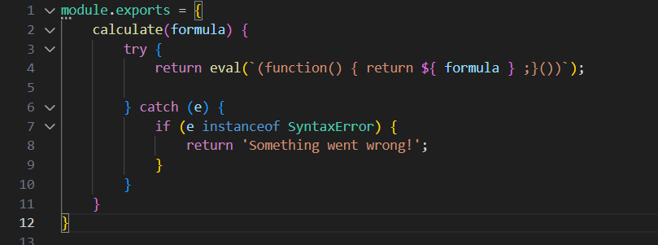
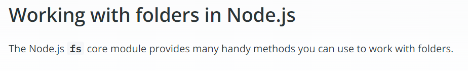
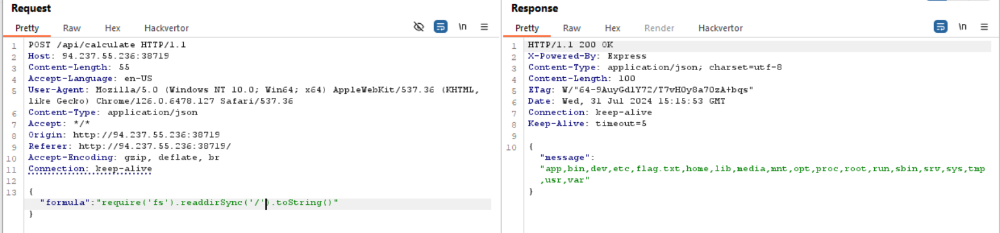
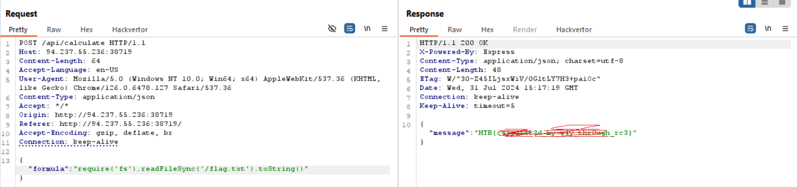

## jscalc





có vẻ như nó là 1 tool calc dùng `eval()` để đánh giá và exec



View source code:


 
nó có 2 router get và post xử lí yếu cầu tới path tương ứng

mình chú ý tới router.post, ở đây nó khởi tạo 1 biến `formula` lấy data từ req.body, đây là biến mà mình có thể kiểm soát được
Nếu có giá trị nó sẽ gọi method `Calculator` với value là `formula` truyền vào để tính toán rồi return ra result



dùng eval() để đánh giá và exec, all right. Theo kinh nghiệm, mình sẽ dùng eval() để đọc file trên server


`keyword search: how to read directory in nodeJS`



payload của mình như sau:
```
require('fs').readdirSync('/').toString()
```


giờ đọc flag.txt với `readFileSync()`

