## KCSC x Jujutsu Kaisen

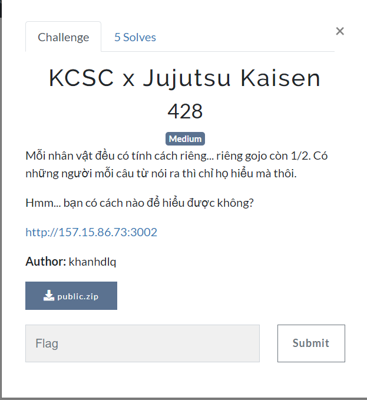

challange này mình không solve được, dưới đây là mindset của mình 

mình tiến hành build local để dump debug cho dễ quan sát. Dùng thử ứng dụng thì không có gì đặc biệt, trừ parameter `username=toge.jpg` sẽ trả về 1 chuỗi string nào đó, có vẻ đã bị encrypt, sau khi view source thì mình phát hiện đúng là thế thật. Sử dụng AES để mã hóa

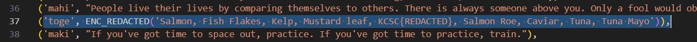

quan sát index.php, mình phân tích nhanh cách nó xử lí như sau:

`$key_decrypt` được đặt ở index.php
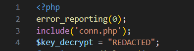

function `get_dialogue` sử dụng câu query truyền trực tiếp `$username` vào mà không qua kiểm tra. Chỗ này chắc chắn dính SQL injection
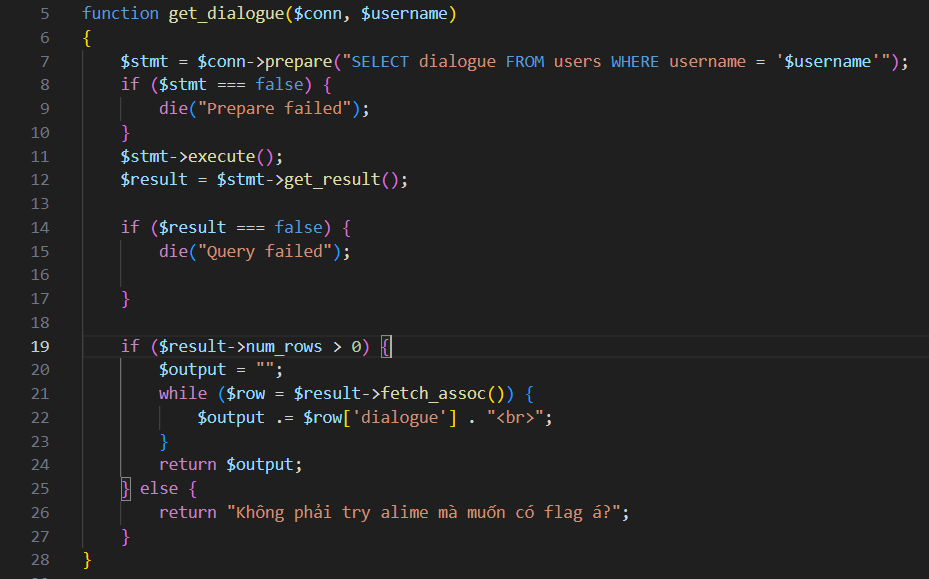

nếu không có para `username` thì sử dụng header location đặt para `username=gojo.jpg`
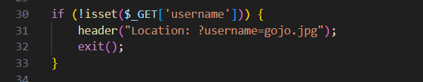

mình phân tích kĩ chỗ này 1 chút
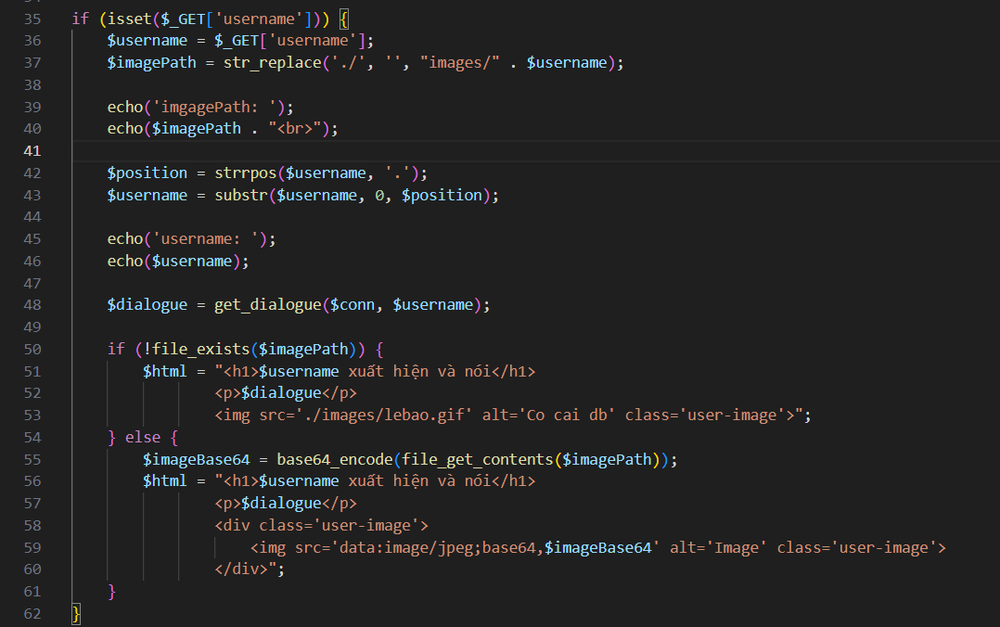

dòng 37 `$imagePath` được gán bằng cách sử dụng `str_replace()` để thay thế `./` bằng chuỗi rỗng nếu xuất hiện trong `images/$username` trong đó `images/` được nối cứng vào trước `$username`

dòng 42 sử dụng `strrpos` để tìm vị trí cuối cùng của dấu chấm trong `$username`, gán vào `$position`

dòng 43 gán lại `$username` bằng cách lấy chuỗi con từ vị trí 0 tới `$position`. Ví dụ mình nhập vào `?username=khiem.php.png` thì `$username` sau đó sẽ là `khiem.php`

dòng 48 gọi tới func `get_dialogue` với `$username` được truyền vào, ở đây mình có thể thao túng được `$username`

dòng 50 sau đó đi qua `file_exists($imagePath)`, nếu không tồn tại path thì trả về code trong if, ngược lại thì code trong else

Okey, tổng hợp lại thì mình sẽ bắt đầu đi tìm cách đọc file `index.php` để có thể lấy `$key_decrypt`. Sau đó tận dụng SQL injection dump lấy function_name và truyền vào để giải mã dialogue của toge

Trên là hướng mình exploit nhưng mọi chuyện chỉ dừng lại ở việc mình có thể lấy được `$key_decrypt` từ việc có thể lợi dụng filter ở dòng code này 
```
 $imagePath = str_replace('./', '', "images/" . $username); 
```

nó chỉ replace chuỗi `./`, không đệ quy nên có thể dễ dàng tận dụng path traversal để di chuyển tới `index.php`

đây là cấu trúc source
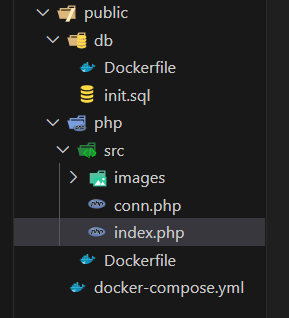

index.php nằm ngang hàng với images, mà `$username` mình có thể kiểm soát được để truyền vào `$imagePath`

payload để đọc base64 của index.php
`?username=...//index.php`

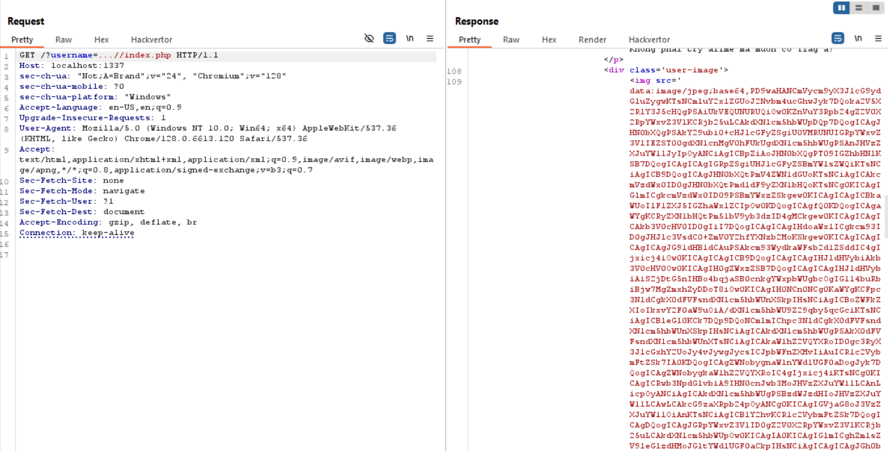

base64 decode mình lấy được `$key_decrypt`
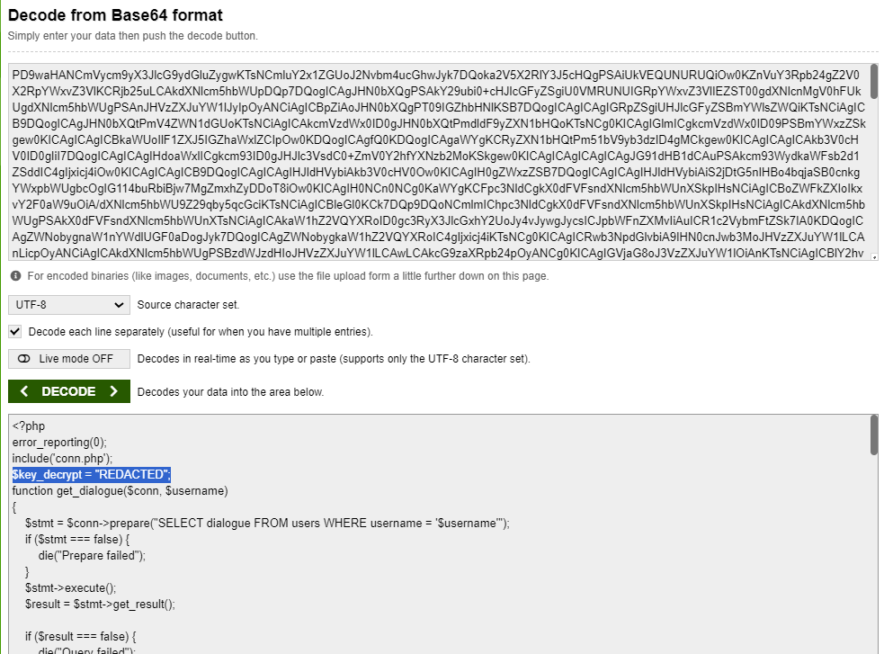

`(trên server mình lấy được $key_decrypt = "\$up3r_$3cr3t_4_$3cur3";)`

sau khi lấy được key_decrypt mình biết mình cần lấy được tên của function để có thể truyền key vào đọc ra flag, nhưng mất khá nhiều thời gian mình chưa tìm ra cách 


mình có sử dụng `information_schema.routines` nhưng nohope, choke quáaa

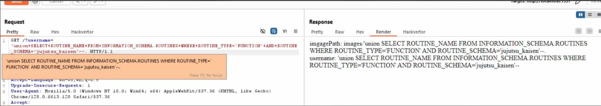


mình cũng đã thử với `and, or, ...` nhưng vẫn không có kết quả khả quan, có lẽ payload của mình chưa đúng

thử một số payload đơn giản hơn để check xem imagePath chấp nhận kí tự đặc biệt như sigle quote không, nhưng vấn đề mình gặp phải là 
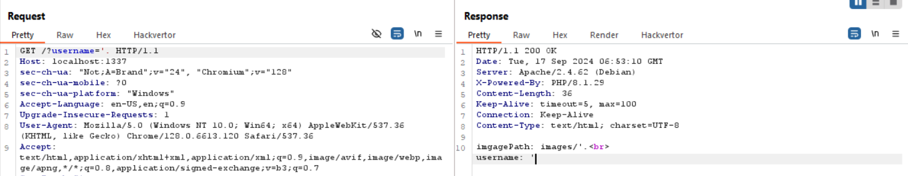

nó không chấp nhận cho mình inject signle qoute vào path :< , mình thử khá nhiều payload nhưng vẫn choke nohopee (chỗ này có thể payload của mình sai nên không thể exec)

Hướng exploit để đọc flag mình đã nói ở đầu, có key rồi việc cần làm là biết tên function để gọi đến nhưng mình chưa lấy được, nên mong sau khi đóng nộp WU mình có thể xin wu của author để ngộ ra chỗ ngoo của mình :<<