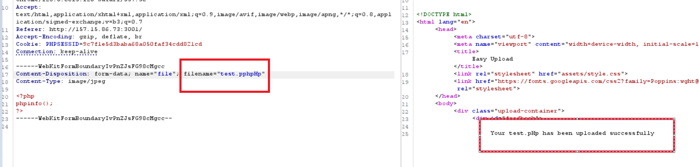

## easy-upload

Chall này trong thời gian thi mình không solve được, khá tiếc vì đã nhìn ra kết quả đến nơi rồi mà không biết đường lụm

2 hint của tác giả trong chall này đều ra sau khi mình bypass `filename` rồi, nên khi đọc hint mình hơi cay =)), hint chả có tác dụng chóa gì , sorri tác giả nháá :v 

app cho phép ta upload file lên, các extension của php đều bị filter hết


tuy nhiên với kinh nghiệm của mình, mình thử dùng cách như bài `x ec ec` thì bypass được luôn


thành công upload file php lên server. Cái mình mắc ở đây là cách truy cập vào file mình up lên. Và cũng chính phần mô tả của chall cũng nhắc tới :< 

Mình cố gắng sử dụng một số path hay gặp như `/uploads/[filename]` ,`/files/[filename]` kết hợp với path traversal nhưng vô vọng

Về sau mình cũng có thử tạo file zip với tên file là `../../../../[filename].php` bằng tool `evilarc` hi vọng vào đc nhưng vô vọng tiếp, open ticket mình được admin confirm không có feature unzip nên không sử dụng zip được

quay trở lại burp, dạo quanh một vòng, mình thấy có file `script.js`


nhìn vào file mình nảy ra ý tưởng sử dụng `race condition` để thử `làm loạn` server. Sorri ae vì có thể đây là lí do server sập vài lần... 

Mình sử dụng burp intruder để brute-force với payload NULL. Một dùng để upload file, và một dùng để truy cập tới file với việc tận dụng `path traversal ../../../[filename].php`

Và kết quả thì rõ rùi, không được gì chỉ tổ làm lag server :< (về sau mình có open ticket và được author bảo không sử dụng được path traversal truy cập vào file được đâu, mình mới đi tìm hướng khác)


sau đó mình quay lại với upload file, như mình đã nói mình nhìn thấy kết quả rồi mà không biết đường lấy. Vì lúc đó mình nghĩ thử truyền vào 1 file có tên dài qoãi chưởng xem nó có gì không?


trùng hợp thay, mình nhớ không nhầm thì sau một lúc hình như cũng có bạn hỏi author về cái này, và hình như bạn đó nói server full disk =))), mình trước đó cũng làm tới đây rồi, và có truy cập vào thử `/app/uploads/<chuỗi>/[filename].php` và cả `/uploads/<chuỗi>/[filename].php`
nhưng server vẫn báo về status 404


Tiếp tục ngồi mò mẫm sau giải thì mình biết được server sử dụng `PHP/8.2.12`


nó không chấp nhận việc filename có chứa %00 hay %0a hay vân vân mây mây

đến đây thì phải tìm cách bypass filename khác, không lâu sau đó mình bypass được với extension này `.pphpHp`



giờ thì vào file đó thui


vậy là có thể RCE được rồi.payload RCE
```
<?php
echo system($_GET['cmd']);
?>

```


FLAG: `KCSC{l000000000000n9_4ss_f1l3_n4m3_f0r_th3_3xpl01t}`