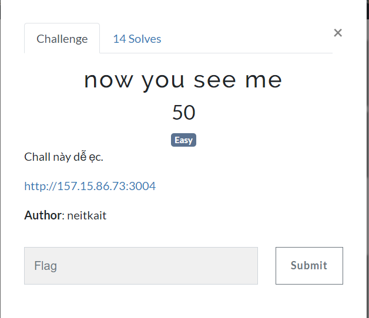
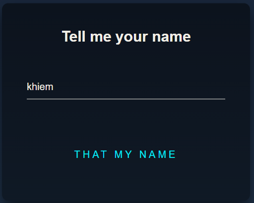
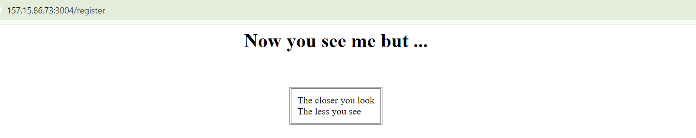
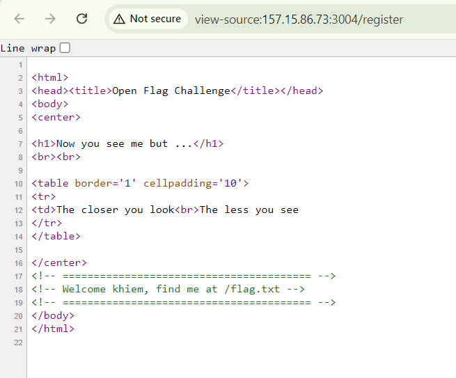
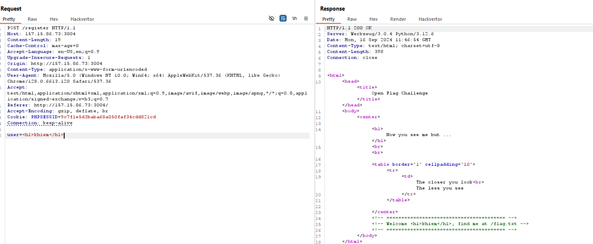
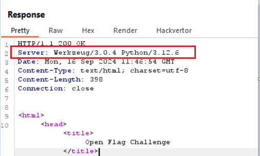
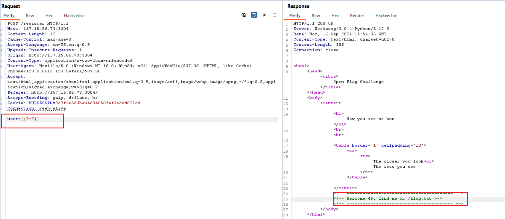
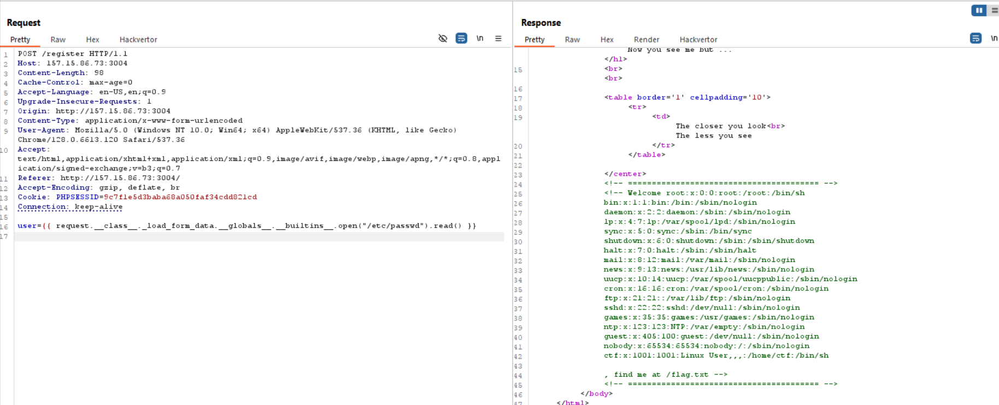
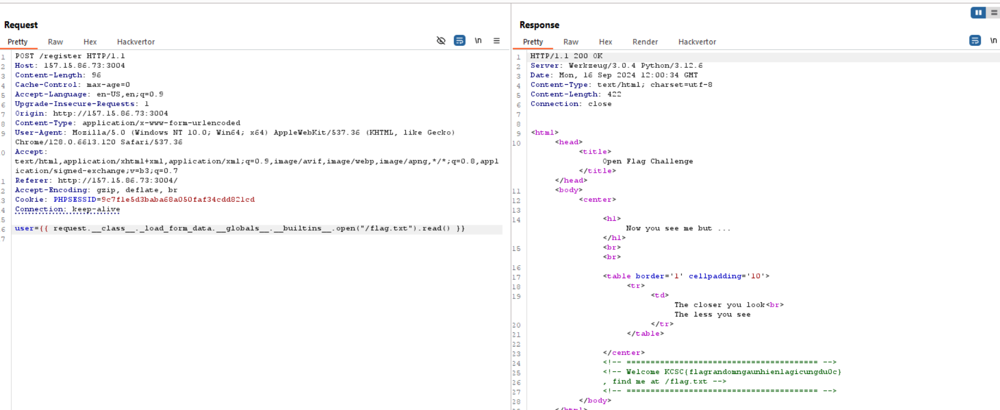

## now you see me

mình dùng thử xem có gì trong chall này trước

nhập vào bất kì thứ gì

nó redirect tới `/register`

tuy nhiên không reflect lại tên mình vừa input, nhưng ctr+U thì có 

mình nhận được hint flag nằm ở /

dùng burp suite để nhập input và quan sát dễ hơn
Mình có nghĩ tới XSS và SSTI

tuy nhiên thử payload đơn giản này thẻ h1 không được render nên mình chuyển qua exploit SSTI

quan sát respone trả về mình biết server là `Werkzeug/3.0.4 Python/3.12.6`

và python có một số template như : `Jinja2, Django, Mako, Chameleon,... `. Mình tiến hành check lần lượt, và may mắn mình confirm template sử dụng là Jinja2

việc cần làm là research payload, sau một lúc research mình tìm được payload ưng ý tại [hacktrick](https://book.hacktricks.xyz/pentesting-web/ssti-server-side-template-injection/jinja2-ssti)

thay đổi path để lấy flag

FLAG: `KCSC{flagrandomngaunhienlagicungdu0c}`