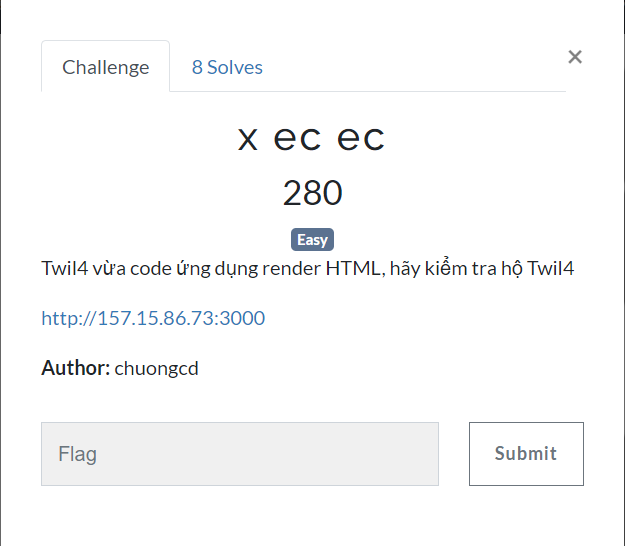
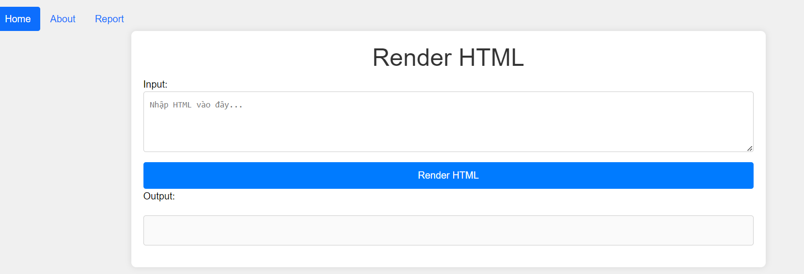
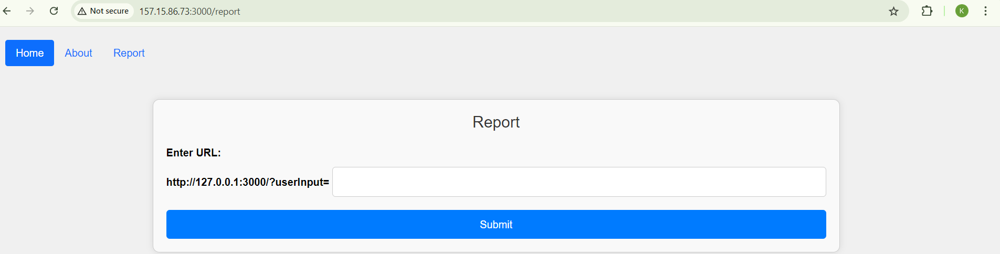
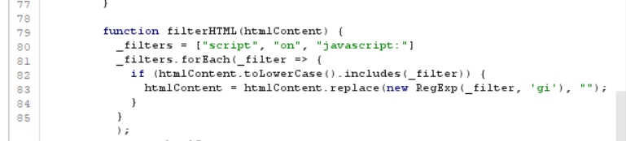
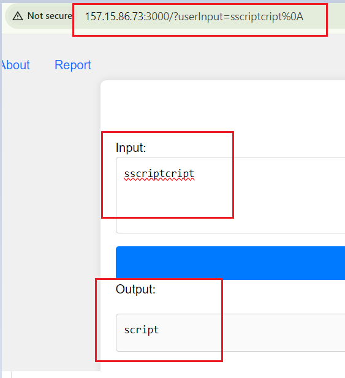
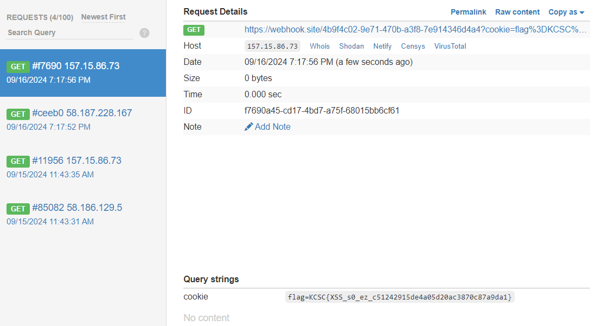

## x ec ec 



nhìn tên chall mình đã biết tác giả muốn làm gì ở bài này rùi, nên khá nhanh để mình xác định việc phải làm -> XSS

ứng dụng cho phép input HTML và render nó, ngoài ra còn có thêm feature `Report`


feature `Report` sẽ được admin với account local check


-> XSS Reflected

mình thử sai một số payload đơn giản như 
```
<script>alert(origin)</script>
javascript:alert(origin)
```
thì phát hiện bị filter đi `script, javascript:`, lúc sau mình dùng burp thì phát hiện nó filter thêm `on`



nhưng ngay sau đó mình phát hiện ra nó không filter đệ quy, tức là nếu mình input vào `sscriptcript` thì nó sẽ return về `script`
và những gì được render sẽ nằm trên parameter `userInput`



okey, exploit sẽ như sau:

1.input HTML cho nó render 
2.gửi link chứa parameter vừa render HTML cho admin để admin view

Chall này ban đầu mình khá mất thời gian, vì nghĩ là flag nằm ở `/flag.txt` nên cố gắng fetch nó ra webhook (khá may mắn vì server cho phép fetch ra ngoài webhook). Payload ban đầu mình dùng như sau:

```

```

nhưng hứng bên webhook không thấy nhả về flag, mình còn tưởng payload mình sai ở đâu đó khá lâu :<. Cũng đã thử thêm `../../../flag.txt` để xem nó có nằm trong folder sâu hơn không nhưng nohope. Sau đó mới nhận ra là có khả năng trên server không có file /flag.txt

Mình mới chuyển qua exploit cookie của admin. và đây là payload của mình:

```

```

gửi Report cho admin view sau đó ra webhook nhận Flag


FLAG:`KCSC{XSS_s0_ez_c51242915de4a05d20ac3870c87a9da1}`