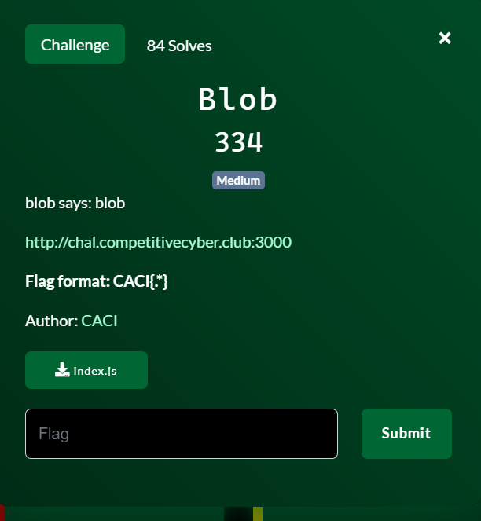
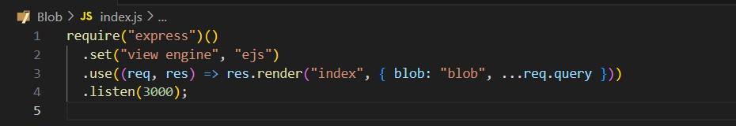
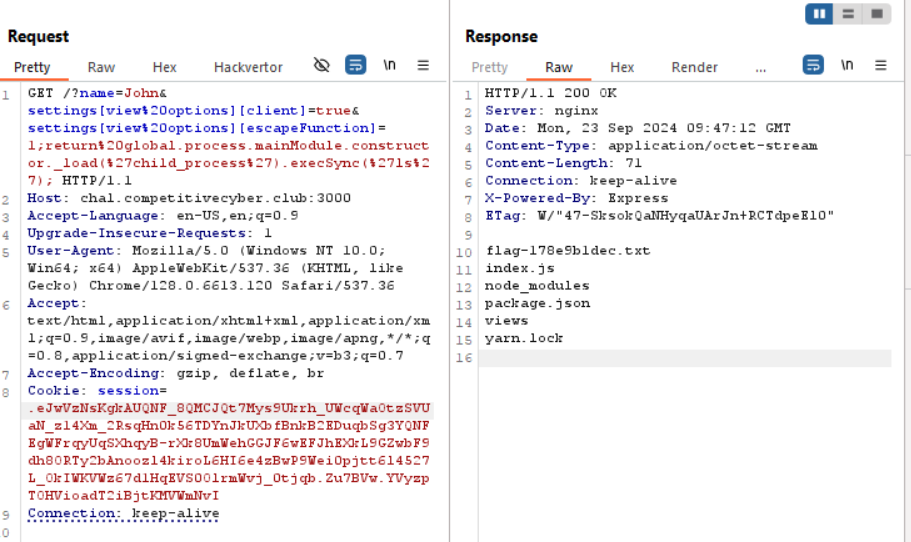
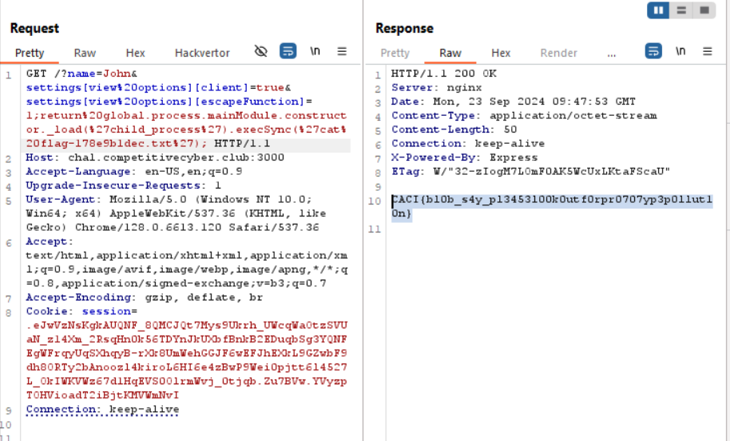

chall cung cấp source code vài dòng, ngang đánh đố =))

start chall lên và thấy ko có gì, view source có cái này

nó sử dụng lib `ejs` để tự động render các template. Đến đây mình nghĩ ngay tới SSTI

Research về ejs vulnerability mình tìm được cái [này](https://github.com/mde/ejs/issues/735)

tiến hành exploit thôi

lấy flag

FLAG: `CACI{bl0b_s4y_pl3453l00k0utf0rpr0707yp3p0llut10n}`

