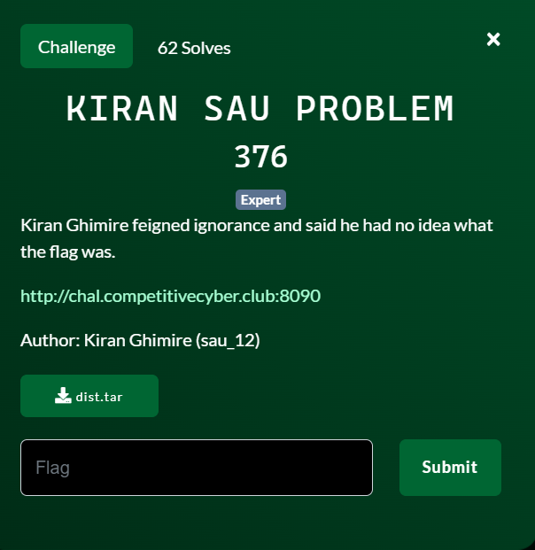
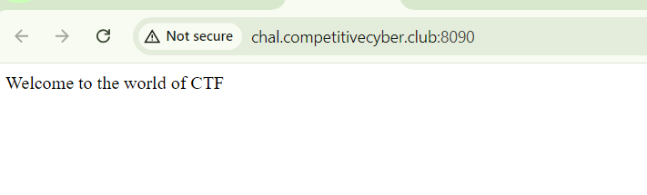
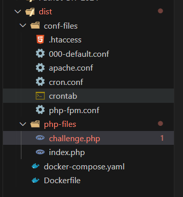
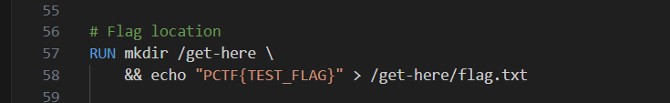
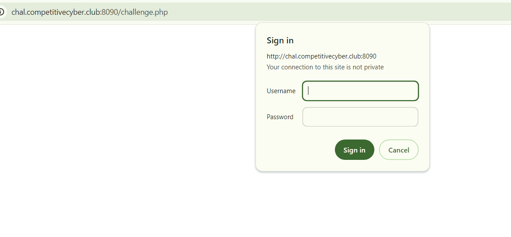
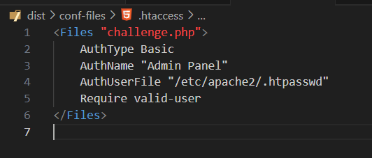
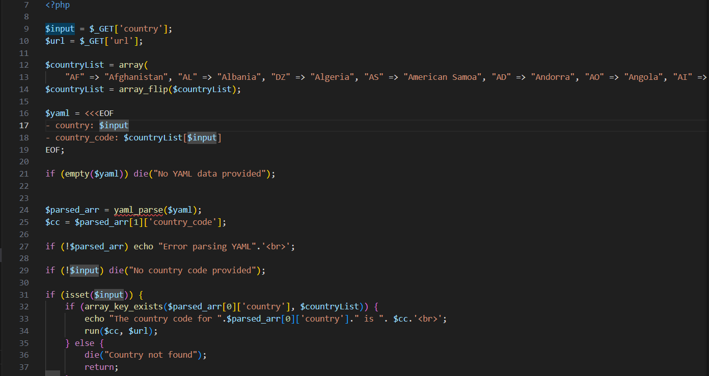
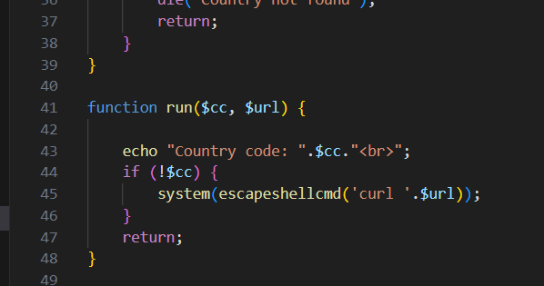
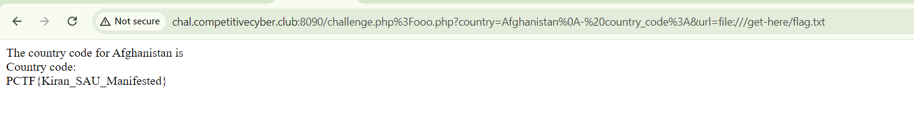

1 challenge hay đối với mình, tham gia giải này mình học được khá nhiều lỗi hay mà trước giờ chưa gặp, bổ X

start chall lên nó chỉ return về hello world ?? =))) 


đây là source code:


flag nằm ở /get-here/flag.txt



khi truy cập vào `challenge.php` bị nó block vào mồm bắt nhập username và password



thăm thú thêm source một tẹo mình biết được pass được lưu ở
`/etc/apache2/.htpasswd` nhưng không vô được, có lẽ nó có cơ chế chặn truy cập nào đó

lí do khi chúng ta truy cập vào `challengr.php` bị yêu cầu nhập xác thực là do file `.htaccess` được cấu hình thế này



research tìm kiếm lỗi về config file .htaccess mình tìm được tại [hacktrick](https://book.hacktricks.xyz/network-services-pentesting/pentesting-web/apache#acl-bypass)

ngon, vậy là có thể truy cập được vào `challengr.php` mà méo cần xác thực

view source của `challeng.php` tiếp



dòng 9, 10 nhận vào 2 parameter `country, url`

dòng 14 dùng `array_flip` để đảo ngược giá trị của `coutryList`, nghĩa là Key thành Value, mà Value thành Key

dòng 16 nhận biến `$yaml` được nhận vào 2 giá trị từ trước đó

dòng 24 dùng `yaml_parse` để chuyển chuỗi $yaml thành mảng PHP. giả sử chuỗi yaml là:
```
- country: Vietnam
- country_code: VN

thì sẽ chuyển thành

$parsed_arr = [
    0 => ['country' => 'Vietnam'],
    1 => ['country_code' => 'VN']
];

```

mục đích để nó truy vấn được tới index các phần tử ấy mà




dòng 44 nếu không có `$cc = $parsed_arr[1]['country_code'];` nó sẽ truyền $url vào `system` là một hàm insecure mà chỉ qua escapeshellcmd thì không ăn thua

oke, tổng hợp lại chúng ta đã bypass được xác thực challenge.php, giờ thì thêm 2 para `$input = $_GET['country'];` và `$url = $_GET['url'];` với điều kiện là làm thế nào để sau khi `yaml_parse` sẽ không có `$cc` trong mảng PHP


sau một hồi fuzz mình tìm ra được payload này:


`/challenge.php%3Fooo.php?country=Afghanistan%0A-%20country_code%3A&url=file:///get-here/flag.txt`

giải thích: khi sử dụng `%0A` sẽ tạo dòng mới khi đó tiếp tục cấp `-country_code` không có giá trị thì `yaml_parse` sẽ không chứa giá trị `country_code` trong PHP (dễ hiểu mà phải không ae :<)

và poww



FLAG: `PCTF{Kiran_SAU_Manifested}`


