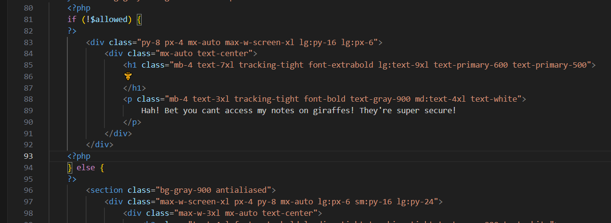

start chall lên không thấy gì đặc biệt, mình view source

đoạn này chứa mảng giá trị ip được cho phép, truyền vào trong `$allowed_ip`, giá trị ip được lấy qua header `X-Forwared-For`

đoạn code này check xem ip có trong `$allowed_ip` không, nếu có thì nhả ra flag -> bypass check ip khá đơn giản

expoit lấy flag

FLAG: `CACI{1_lik3_g1raff3s_4_l0t}`

